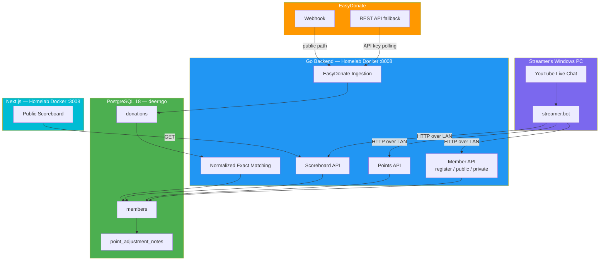

# Deerngo Bot — Viewer Relationship Management (VRM)

> **Project:** Deerngo Bot
> **Version:** 0.3 | **Status:** Draft
> **Last Updated:** 2026-08-02
>
> **Phase 1 change:** YouTube subscriber polling was removed after live verification showed that the YouTube API exposes only a limited subscriber subset. Viewers now explicitly join the VRM program with `:deer: register`.

---

## What is Deerngo Bot?

A **Viewer Relationship Management (VRM)** system for the [@Deer_NGO](https://www.youtube.com/@Deer_NGO) YouTube channel. It is a lightweight community points program for viewers who explicitly register during live chat.

**Core idea:**

```text
Viewer types :deer: register
  → streamer.bot sends the actual chat identity
  → Go backend creates an active member with 0 points
  → future qualifying EasyDonate donations earn 1 point per THB
```

A viewer's donation name must match their normalized registered YouTube handle:

```text
trim whitespace → remove leading @ → lowercase
```

No fuzzy matching is used in the revised MVP.

---

## Tech Stack

| Component | Technology | Notes |
|-----------|-----------|-------|
| **Automation Engine** | streamer.bot | Windows desktop app; receives chat commands and provides the actual chat identity |
| **Backend** | Go | Member API, donation ingestion, exact matching, points, scoreboard API |
| **Database** | PostgreSQL 18 | Existing homelab infrastructure |
| **Frontend** | React/Next.js | Public read-only scoreboard |
| **Donation Source** | EasyDonate | Webhook primary + REST API polling fallback |
| **Public Access** | Cloudflare Tunnel | Scoreboard and configured webhook route |

---

## Architecture



---

## Phase 1 Scope (Revised MVP)

| # | Feature | Description | Priority |
|---|---------|-------------|----------|
| 1 | **Member Register** | `:deer: register` creates a member from the actual streamer.bot chat identity | 🔴 |
| 2 | **Bot — Donate** | `:deer: donate` posts the EasyDonate link in live chat | 🔴 |
| 3 | **Bot — Points** | `:deer: point` shows exact points for public members or a 100-point range for private members | 🔴 |
| 4 | **Visibility** | `:deer: public` / `:deer: private` switch scoreboard visibility | 🔴 |
| 5 | **Donation Points** | EasyDonate webhook + API fallback; normalized exact donor-name matching; 1 THB = 1 point | 🔴 |
| 6 | **Web Scoreboard** | Shows only active, public members with points > 0; handle and points only | 🟡 |

### Explicitly Removed from Phase 1

- YouTube Data API subscriber polling
- Automatic subscriber registration
- YouTube OAuth client/refresh-token dependency
- Historical subscriber backfill
- `subscribers` table as a points source
- `pg_trgm` fuzzy name matching
- Automatic historical donation crediting
- Admin console

### Member Rules

| Rule | Behavior |
|------|----------|
| New registration | Active member, 0 points, public visibility enabled |
| Same-handle registration | Friendly already-registered response; no DB change |
| New handle for same user | Old member becomes inactive; old points stay; new active member starts at 0 |
| Active handle conflict | Reject registration; owner resolves manually |
| Pre-registration donation | Stored privately, never credited automatically |
| Matching | Normalized exact donor-name → active member handle |
| Private member | Keeps earning points; hidden from scoreboard; point command shows a 100-point range |
| Scoreboard | Active + public + points > 0 only |
| Display name | Not stored; public API exposes normalized handle only |

---

## Chat Commands

| Command | Registered? | Result |
|---------|:-----------:|--------|
| `:deer: register` | No | Creates member from actual chat identity |
| `:deer: donate` | No | Posts EasyDonate link |
| `:deer: point` | Yes | Exact points if public; 100-point band if private |
| `:deer: public` | Yes | Enables public scoreboard visibility |
| `:deer: private` | Yes | Hides member from scoreboard while keeping points active |

### Example Responses

```text
New member:
🦌 Registered! You start with 0 points. When you earn points, your normalized YouTube handle and score may appear on the public scoreboard.

Unregistered point query:
🦌 You are not registered yet. Use :deer: register first.

Private member with 563 points:
🦌 Your points are between 500–600.

Backend unavailable:
🦌 Registration is temporarily unavailable. Please try again later.
```

---

## Integration Points

### streamer.bot

| Capability | Use Case |
|-----------|----------|
| YouTube Chat Message trigger | Detect `:deer:` commands |
| YouTube user variables | Supply actual `userId` and current username/handle |
| HTTP Request action | Call Go backend over LAN |
| Send Chat Message action | Reply in YouTube chat |
| Action logs | Record trigger and result without secrets |

### EasyDonate

| Capability | Use Case |
|-----------|----------|
| Webhook | Primary donation event ingestion |
| REST API | Fallback reconciliation using a backend-only API key with donation-read scope |
| Webhook security | Use provider-confirmed mechanism; current public docs do not confirm HMAC |
| Idempotency | Use provider `referenceNo` |

---

## Data and Privacy Boundary

### Stored Privately

- Stable streamer.bot/YouTube user ID
- Normalized current handle
- Member status and visibility
- Registration time and point total
- Raw EasyDonate donor name, amount, time, reference, and message for reconciliation

### Publicly Exposed

Only active, public members with points greater than zero:

```text
rank
youtube_handle
total_points
```

The public API does not expose display names, stable user IDs, raw donor names, donation messages, inactive members, private members, or zero-point members.

> A YouTube handle, donor name, donation event, and score may be personal data under Thai PDPA. Public visibility is a separate disclosure purpose; a public handle is not automatically outside PDPA because it is visible on YouTube.

## Thai PDPA — Owner Responsibilities

> **Important:** This is an operational privacy checklist, not legal advice or a PDPA compliance certification. The channel owner should confirm the final position with qualified Thai privacy counsel. The Thai-language law/official Gazette text controls over unofficial translations.

The channel owner normally decides why and how Deerngo Bot processes member, donor, and score data. The owner is therefore likely the **Data Controller**. The developer/host may be a **Data Processor** only when acting on the owner's documented instructions and not reusing the data independently.

For planning, the owner should discuss these Thai PDPA areas with counsel: Sections 5–6 (scope/data/roles), 19–24 (consent and lawful bases), 23 and 25 (notice and indirect collection), 27 (use/disclosure), 30–36 (data-subject rights), 37 (security/breach), and 39–41 (records, processor arrangements, and DPO-related obligations). This section mapping is not a legal conclusion; the Thai-language Act/Gazette controls.

### Owner must do before public release

- [ ] Document separate purposes: registration, donation matching, points, public scoreboard, security logs, and backups.
- [ ] Publish a clear privacy notice covering the controller/contact, data collected, sources, purposes, recipients, hosting/transfer locations, retention, rights, and complaint/contact route.
- [ ] Decide and record the lawful basis for each purpose. Treat public handle + score publication as a separate optional purpose; prefer explicit opt-in or obtain a documented legitimate-interest assessment.
- [ ] Explain that `:deer: register` joins the points program and that public display is optional/controllable. A command alone is not automatically consent to every future use.
- [ ] Provide a practical privacy route for hide, withdrawal, correction, access, and deletion/erasure requests, including a contact method outside live chat.
- [ ] Define field-level retention/deletion rules for active members, inactive old handles, raw donor names/messages, logs, public projections/caches, exports, and backups.
- [ ] Record written developer/host processing instructions: no independent reuse, least privilege, security, subprocessors, incident escalation, rights assistance, retention, backup deletion, return/destruction, and hosting locations.
- [ ] Prepare a breach-response process. The developer/host should notify the owner immediately; the owner and counsel assess PDPC/data-subject notification duties.

### Owner must not do

- ❌ Do not publish raw EasyDonate donor names, messages, payment identifiers, or exact donation records on the scoreboard.
- ❌ Do not expose stable YouTube/streamer.bot user IDs publicly.
- ❌ Do not store YouTube display names when the MVP does not need them.
- ❌ Do not assume a public handle is automatically free from PDPA obligations.
- ❌ Do not treat lowercasing/removing `@` as anonymization.
- ❌ Do not use fuzzy matching to guess who donated.
- ❌ Do not transfer points automatically after a handle change.
- ❌ Do not edit production points without a backup, transaction, reason, and before/after correction record.
- ❌ Do not reuse the data for unrelated marketing/profiling without a new purpose/basis review and notice update.
- ❌ Do not keep raw donor names/messages forever without a documented need.
- ❌ Do not put personal data or secrets in GitHub issues, logs, screenshots, fixtures, or public documents.
- ❌ Do not claim the system is “PDPA compliant” solely because it has `:deer: private`.

### Minimum owner launch checklist

```text
Before launch:
  privacy notice approved
  purpose/lawful-basis decision documented
  public-display choice documented
  retention/deletion schedule approved
  hide/correction/access/removal route tested
  developer/host processing instructions recorded
  breach contact/process documented
  provider contract and security verified
  privacy/security tests passed
```

Full owner guidance is in:

`06_security/063_thai_pdpa_owner_checklist.md`

### Official starting sources

- [PDPC — Personal Data Protection Act, B.E. 2562 (2019)](https://www.pdpc.or.th/en/23134/)
- [PDPC — Consent guidance](https://www.pdpc.or.th/14/)
- [PDPC — Security Measures](https://www.pdpc.or.th/en/22758/)
- [PDPC — Breach notification criteria](https://www.pdpc.or.th/en/22783/)
- [PDPC — Erasure/destruction/de-identification criteria](https://www.pdpc.or.th/en/22864/)

> This section is a product safeguard, not legal advice. Confirm the final controller/processor, lawful-basis, notice, retention, international-transfer, rights, and breach position with Thai counsel.

---

## Repository and Deployment

| Repository | Content | Port |
|------------|---------|:----:|
| [`oat431/deerngo-bot`](https://github.com/oat431/deerngo-bot) | Go backend, migrations, integration contracts | 8008 |
| [`oat431/deerngo-web`](https://github.com/oat431/deerngo-web) | Next.js scoreboard | 3008 |

| Component | Location |
|-----------|----------|
| streamer.bot | Streamer's Windows PC |
| Go backend | Homelab Docker, `db-network` |
| PostgreSQL | Existing homelab PostgreSQL 18, `deerngo` database |
| Next.js | Homelab Docker, `db-network` |
| Cloudflare Tunnel | Homelab systemd service |

---

## Sprint Plan (Revised)

| Sprint | Stories | Focus |
|--------|---------|-------|
| Sprint 1 | US-001, US-002, US-010 | Member registration + donate command |
| Sprint 2 | US-011, US-012, US-020, US-021, US-022 | Visibility/point commands + EasyDonate ingestion + exact matching + points |
| Sprint 3 | US-030, US-031 | Public scoreboard and release hardening |

### Superseded Work

US-003 and its merged YouTube polling implementation are retained as historical technical work, but are no longer part of the active Phase 1 product scope. See `07_pm/072_MM06_dev-to-po-qa-youtube-subscriber-limit_20260801.md`.

---

## Spec Documents

| Document | Path | Version |
|----------|------|:-------:|
| Business Objectives | `01_requirement/011_business_objective.md` | 0.2 |
| User Stories | `01_requirement/012_user_stories.md` | 0.2 |
| Acceptance Criteria | `01_requirement/013_acceptance_criteria.md` | 0.2 |
| API Specification | `02_design/022_API_specification.md` | 0.2 |
| Database Schema | `02_design/023_database_schema_DDL.md` | 0.2 |
| ERD | `02_design/024_ERD.md` | 0.2 |
| Architecture Overview | `02_design/029_architecture_overview.md` | 0.2 |
| Thai PDPA Owner Checklist | `06_security/063_thai_pdpa_owner_checklist.md` | 0.1 |
| PDPA Owner Handoff | `07_pm/072_MM08_po-to-owner-pdpa-owner-readiness_20260802.md` | 1.0 |
| Scope Decision | `07_pm/072_MM06_dev-to-po-qa-youtube-subscriber-limit_20260801.md` | Final |

---

> **Original idea (Thai notes):** ไม่อยากทำยุ่งยากมาก — ผูกกะ streamer.bot, ให้ยูสพิมพ์คำสั่ง `:deer: donate` ขึ้นลิ้งโดเนท, `:deer: point` ขึ้นคะแนน, 1 บาท = 1 คะแนน, ชื่อ subscriber ต้องตรงกับชื่อ donate, แสดงผลในเว็บ
> **Current product decision:** Use explicit registered members, not automatic subscriber collection.
---
