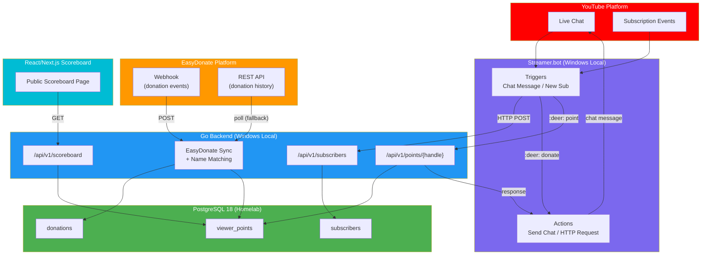

# Deerngo Bot — Viewer Relationship Management (VRM)

> **Project:** Deerngo Bot
> **Version:** 0.1 | **Status:** Draft
> **Last Updated:** 2026-07-29

---

## What is Deerngo Bot?

A **Viewer Relationship Management (VRM)** system for the [@Deer_NGO](https://www.youtube.com/@Deer_NGO) YouTube channel. Think of it as a lightweight CRM for live stream viewers — tracking contributions (subscriptions, donations) and rewarding engagement through a points system visible in live chat and on a public scoreboard.

**Core idea:** 1 THB donated = 1 point. Points are matched to YouTube handles via fuzzy name matching. Viewers can check their points in chat with `:deer: point`.

---

## Tech Stack

| Component | Technology | Notes |
|-----------|-----------|-------|
| **Automation Engine** | streamer.bot | Windows desktop app, handles YouTube events + chat commands |
| **Backend** | Go | Business logic, API, database interaction |
| **Database** | PostgreSQL 18 | Existing homelab infrastructure |
| **Frontend** | React/Next.js | Public scoreboard (read-only, no auth) |
| **Donation Source** | EasyDonate API | [easydonate.app/deerngo0](https://easydonate.app/deerngo0) — webhook + REST API |

---

## Architecture

---

## Phase 1 Scope (MVP)

### Features

| # | Feature | Description | Priority |
|---|---------|-------------|----------|
| 1 | **Register** | Auto-capture new YouTube subscribers to PostgreSQL via streamer.bot | 🔴 |
| 2 | **Bot — Donate** | `:deer: donate` → posts EasyDonate link in live chat | 🔴 |
| 3 | **Bot — Points** | `:deer: point` → shows viewer's points in live chat (1 THB = 1 pt) | 🔴 |
| 4 | **Web Scoreboard** | Public React page showing viewer points leaderboard | 🟡 |

### By the Numbers

| Metric | Value |
|--------|-------|
| Business Objectives | 4 |
| Epics | 4 (Register, Bot Commands, Points Engine, Scoreboard) |
| User Stories | 10 |
| Story Points | 34 |
| Acceptance Criteria | 46 (24 🔴 Must Have, 22 🟡 Should Have) |

### Sprint Plan

| Sprint | Stories | Focus |
|--------|---------|-------|
| Sprint 1 | US-001, US-002, US-010 | Subscriber registration + Donate command |
| Sprint 2 | US-011, US-012, US-020, US-021 | Point command + EasyDonate sync + Name matching |
| Sprint 3 | US-022, US-030, US-031 | Point query API + Scoreboard |

---

## Integration Points

### streamer.bot

| Capability | Port | Use Case |
|-----------|------|----------|
| HTTP Server | 7474 | `POST /DoAction` — trigger actions from Go backend |
| WebSocket Server | 8681 | Real-time bidirectional events |
| YouTube Triggers | — | Chat Message, New Subscriber (31 total) |
| User Global Variables | — | Per-user persistent state |
| Custom Webhook | — | External services can trigger actions |

### EasyDonate

| Capability | Use Case |
|-----------|----------|
| Webhook | Push donation events to Go backend (primary) |
| REST API | Poll donation history as fallback (60 req/min limit) |
| Auth | API key + OAuth 2.0 |

---

## Deployment

| Component | Location | Notes |
|-----------|----------|-------|
| streamer.bot | Local Windows PC | Same machine as streamer |
| Go Backend | Local Windows PC | Same machine as streamer.bot (localhost) |
| PostgreSQL 18 | Homelab | Existing infrastructure |
| React Frontend | Local Windows PC | Exposed via tunnel/port forwarding for public access |

---

## Future Phases (Not in Scope)

| Phase | Features |
|-------|----------|
| Phase 2 | Leaderboard, recognition (bot shouts top donors), milestones/tiers |
| Phase 3 | Point redemption, OBS overlay integration, advanced gamification |

---

## Spec Documents

| Document | Path | Status |
|----------|------|--------|
| Business Objectives | [011_business_objective.md](../external_spec/deerngo_bot/01_requirement/011_business_objective.md) | v0.1 Draft |
| User Stories | [012_user_stories.md](../external_spec/deerngo_bot/01_requirement/012_user_stories.md) | v0.1 Draft |
| Acceptance Criteria | [013_acceptance_criteria.md](../external_spec/deerngo_bot/01_requirement/013_acceptance_criteria.md) | v0.1 Draft |

---

> **Original idea (Thai notes):** ไม่อยากทำยุ่งยากมาก — ผูกกะ streamer.bot, ให้ยูสพิมพ์คำสั่ง `:deer: donate` ขึ้นลิ้งโดเนท, `:deer: point` ขึ้นคะแนน, 1 บาท = 1 คะแนน, ชื่อ subscriber ต้องตรงกับชื่อ donate, แสดงผลในเว็บ
