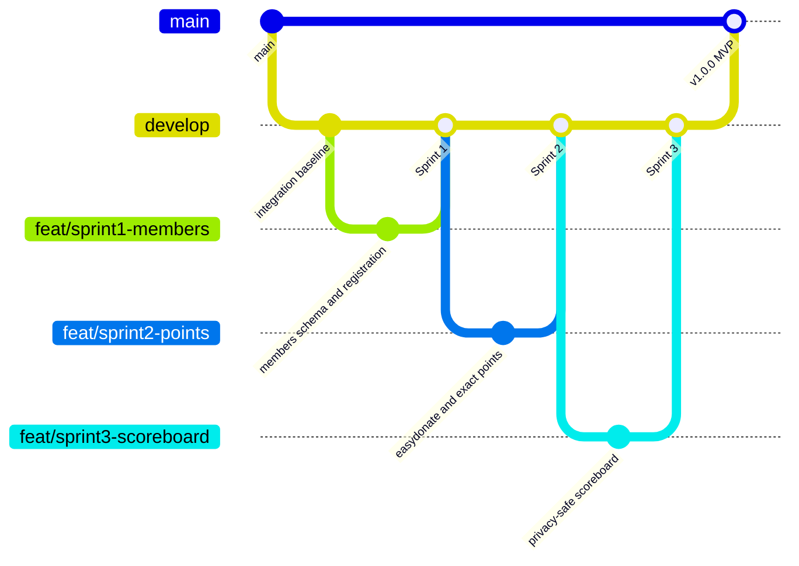
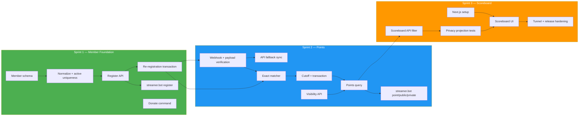

# Phase 1 Implementation Plan — Deerngo Bot

> **Project:** Deerngo Bot — Viewer Relationship Management (VRM)
> **Version:** 0.2 | **Status:** Draft
> **Last Updated:** 2026-08-02
>
> **Scope decision:** YouTube subscriber polling/automatic subscriber capture was removed from the active MVP after live API verification. Phase 1 now implements explicit viewer membership through streamer.bot.

---

## 1. Phase Objective

Deliver a working MVP that lets viewers explicitly register during live chat, receive donation/point commands through streamer.bot, earn 1 point per THB from future qualifying EasyDonate donations, and view an optional public contributor scoreboard.

**Success Criteria:**

- 10 active user stories
- 37 story points
- 62 active acceptance criteria: 43 🔴 Must Have, 19 🟡 Should Have
- All active acceptance criteria covered by QA test cases
- EasyDonate provider payload/security contract verified before production webhook deployment
- No YouTube display names exposed by the public API

---

## 2. Scope

### In Scope (Phase 1)

| Epic | Stories | Points | Priority |
|------|---------|:------:|:--------:|
| E-01 Member Registration | US-001, US-002 | 8 | 🔴 |
| E-02 Bot Commands | US-010, US-011, US-012 | 8 | 🔴 |
| E-03 Points Engine | US-020, US-021, US-022 | 13 | 🔴 |
| E-04 Scoreboard | US-030, US-031 | 8 | 🟡 |
| **Total** | **10 stories** | **37** | |

### Out of Scope / Superseded

| Feature | Reason |
|---------|--------|
| YouTube Data API subscriber polling | API exposes only a limited subset; explicit registration is the membership event |
| Automatic subscriber registration | Removed from Phase 1 |
| YouTube OAuth token storage | Not needed without polling |
| Historical subscriber backfill | Not supported by current product model |
| Fuzzy `pg_trgm` matching | Exact normalized matching is safer for points attribution |
| Automatic historical donation credit | Donation cutoff is registration time; owner may correct exceptional points manually |
| Admin console | Direct controlled DB correction for MVP; console later |
| Leaderboard tiers/ranks | Phase 2 gamification |
| Bot recognition/shout-outs | Phase 2 gamification |
| Point redemption | Phase 2+ |
| OBS overlay integration | Phase 2+ |

---

## 3. Sprint Plan

### Sprint 1: Foundation + Member Registration + Donate Command

| # | Task | Owner | Story | Depends On | Estimate |
|---|------|:-----:|-------|-----------|:--------:|
| 1.1 | Confirm current backend scaffold, branches, and migration tool | Dev | — | — | 1h |
| 1.2 | Add `members` and revised `donations` schema migration | Dev | US-002, US-020 | 1.1 | 3h |
| 1.3 | Add normalized-handle function and active uniqueness constraints | Dev | US-002 | 1.2 | 2h |
| 1.4 | Implement `POST /api/v1/members/register` | Dev | US-001, US-002 | 1.2, 1.3 | 4h |
| 1.5 | Implement same-handle idempotency and changed-handle transaction | Dev | US-001 | 1.4 | 3h |
| 1.6 | Configure streamer.bot `:deer: register` action using actual user ID/handle | Dev | US-001, US-012 | 1.4 | 2h |
| 1.7 | Configure streamer.bot `:deer: donate` action | Dev | US-010 | — | 1h |
| 1.8 | Docker Compose + homelab health check | DevOps | — | 1.1 | 2h |
| 1.9 | Run Sprint 1 member and donate tests | QA | — | 1.4–1.7 | 4h |

**Sprint 1 Total:** ~22h

**Sprint 1 Deliverables:**

- Go backend running on port 8008
- PostgreSQL migration with `members`, `donations`, and optional correction-note table
- Registration API and streamer.bot registration action
- Same-handle and changed-handle behavior verified
- `:deer: donate` command working
- No YouTube OAuth/poller dependency

---

### Sprint 2: Visibility + Donation Ingestion + Exact Points

| # | Task | Owner | Story | Depends On | Estimate |
|---|------|:-----:|-------|-----------|:--------:|
| 2.1 | Implement `PUT /api/v1/members/{youtube_user_id}/visibility` | Dev | US-012 | Sprint 1 | 2h |
| 2.2 | Implement EasyDonate webhook route with path-token fallback | Dev | US-020 | 1.2 | 4h |
| 2.3 | Verify actual EasyDonate payload, reference field, auth/signing behavior | Dev/DevOps | US-020 | 2.2 | 2h |
| 2.4 | Implement EasyDonate API fallback polling and 429 backoff | Dev | US-020 | 2.3 | 3h |
| 2.5 | Implement normalized exact active-member matcher | Dev | US-021 | 1.3, 2.2 | 3h |
| 2.6 | Implement donation-time cutoff and transactional point application | Dev | US-021 | 2.5 | 4h |
| 2.7 | Implement `GET /api/v1/members/{youtube_user_id}/points` | Dev | US-022 | 2.1, 2.6 | 3h |
| 2.8 | Configure streamer.bot `:deer: public`, `:deer: private`, `:deer: point` actions | Dev | US-011, US-012 | 2.1, 2.7 | 3h |
| 2.9 | Run Sprint 2 points, visibility, and ingestion tests | QA | — | 2.1–2.8 | 5h |

**Sprint 2 Total:** ~29h

**Sprint 2 Deliverables:**

- EasyDonate webhook primary and API fallback
- Provider payload/security assumptions verified or explicitly blocked
- Exact normalized matching; no fuzzy matching
- 1 THB = 1 point exactly once
- Registration timestamp cutoff
- Public/private visibility and banded private point response

---

### Sprint 3: Scoreboard + Privacy Hardening + Release

| # | Task | Owner | Story | Depends On | Estimate |
|---|------|:-----:|-------|-----------|:--------:|
| 3.1 | Implement `GET /api/v1/scoreboard` active/public/points>0 filter | Dev | US-031 | 2.7 | 3h |
| 3.2 | Add scoreboard pagination and deterministic ranking | Dev | US-031 | 3.1 | 2h |
| 3.3 | Verify public response excludes display name, user ID, donor name/message | Dev/QA | US-031 | 3.1 | 2h |
| 3.4 | Set up Next.js frontend | Dev | US-030 | — | 2h |
| 3.5 | Implement responsive scoreboard, loading, empty, and error states | Dev | US-030 | 3.1, 3.4 | 4h |
| 3.6 | Configure Cloudflare Tunnel for scoreboard and webhook route | DevOps | — | 2.2, 3.4 | 2h |
| 3.7 | Add privacy notice/removal wording to registration and scoreboard | PO/Dev | OBJ-04 | 3.3 | 2h |
| 3.8 | Define direct DB point-correction procedure and correction-note usage | PO/DevOps | R-005/R-008 | 1.2 | 2h |
| 3.9 | Run Sprint 3 tests and full active regression | QA | — | 3.1–3.8 | 6h |
| 3.10 | First live-stream smoke test with synthetic/approved test data | PO/Dev/QA | — | 3.9 | 2h |

**Sprint 3 Total:** ~27h

**Estimated Phase 1 Total:** ~78h, excluding unresolved EasyDonate provider support work.

**Sprint 3 Deliverables:**

- Public scoreboard
- Privacy-safe public projection
- Tunnel route configured
- Manual correction procedure documented
- Full active regression suite
- Live-stream smoke-test evidence

---

## 4. Repository & Branch Strategy

### Repositories

| Repo | Content | Language | Port | Sprint Ownership |
|------|---------|:--------:|:----:|-----------------|
| `oat431/deerngo-bot` | Go backend, migrations, member/donation/points APIs, streamer.bot integration docs | Go | 8008 | Sprints 1–3 |
| `oat431/deerngo-web` | Next.js public scoreboard | TypeScript | 3008 | Sprint 3 |

### Branch Strategy



### Branch Naming

| Type | Format | Example |
|------|--------|---------|
| Main | `main` | `main` |
| Integration | `develop` | `develop` |
| Feature | `feat/sprint{N}-{description}` | `feat/sprint1-members` |
| Bugfix | `fix/{description}` | `fix/duplicate-point-application` |
| Docs | `docs/{description}` | `docs/easydonate-contract` |

### PR Workflow

```bash
git checkout develop && git pull origin develop
git checkout -b feat/sprint1-members
# implement + test
git add .
git commit -m "feat(members): add explicit live-chat registration"
git push -u origin HEAD
gh pr create --base develop --title "feat: explicit member registration" --body "..."
# merge only after review and checks
gh pr merge --squash --delete-branch
```

Commit convention: `type(scope): short description`; use `feat`, `fix`, `test`, `docs`, `refactor`, `chore`, `ci`.

---

## 5. DevOps Tasks

| ID | Task | Priority | Sprint | Details |
|----|------|:--------:|:------:|---------|
| D-001 | Docker Compose for Go backend | 🔴 | 1 | Port 8008, joins `db-network` |
| D-002 | Database migration and backup checkpoint | 🔴 | 1 | Add members/donations tables; no automatic historical migration |
| D-003 | Configure LAN reachability from streamer.bot PC | 🔴 | 1 | Firewall and health check |
| D-004 | Configure public scoreboard route | 🔴 | 3 | Existing Cloudflare Tunnel |
| D-005 | Configure EasyDonate webhook route | 🔴 | 2–3 | Use provider-confirmed auth or secret path fallback |
| D-006 | Store EasyDonate API key/path token as deployment secrets | 🔴 | 2 | Never in Git/logs |
| D-007 | Document manual point-correction procedure | 🟡 | 3 | Transaction + backup + adjustment note |
| D-008 | Monitoring/log redaction | 🟡 | 3 | Do not log donor messages or secrets |
| D-009 | CI/CD | 🟢 | 2+ | Phase 2; manual deployment remains MVP |

### Deployment Model

```text
Developer pushes GitHub
  → review and merge to develop
  → manual Docker Compose deployment
  → database migration
  → health check
  → live smoke test
```

---

## 6. Dependency Diagram



---

## 7. Risk Register Summary

| ID | Risk | Level | Mitigation |
|----|------|:-----:|------------|
| R-002 | EasyDonate webhook has no confirmed signing/auth | 🟠 | Verify provider; path-token fallback, validation, idempotency |
| R-003 | Donor name mismatch | 🟠 | Publish exact naming rule; unmatched stays uncredited |
| R-005 | Manual point transfer after handle change | 🟠 | Inactive old row, new zero-point row, transactional correction note |
| R-006 | Public handle/score personal-data exposure | 🟠 | No display names; visibility commands; privacy notice/removal route |
| R-008 | Manual DB correction error | 🟠 | Backup, transaction, before/after/reason note |

Full register: `07_pm/071_risk_register.md`.

---

## 8. Definition of Done

Phase 1 is complete only when all are true:

- [ ] All 10 active user stories implemented or formally accepted/deferred according to priority
- [ ] All 62 active acceptance criteria verified: 43 🔴, 19 🟡
- [ ] Test cases cover every active acceptance criterion with no duplicate IDs
- [ ] Go backend runs on port 8008 in Docker
- [ ] Next.js frontend runs on port 3008 in Docker
- [ ] `members` and revised `donations` migrations apply successfully
- [ ] No automatic historical subscriber/points migration is performed
- [ ] `:deer: register` uses actual streamer.bot identity and ignores typed handles
- [ ] Same-handle and changed-handle re-registration behaviors pass
- [ ] `:deer: donate`, `:deer: point`, `:deer: public`, and `:deer: private` work in live chat
- [ ] EasyDonate payload and webhook security behavior are verified against the provider
- [ ] Duplicate `referenceNo` cannot double-count points
- [ ] Pre-registration, inactive, unmatched, and duplicate donations award no points
- [ ] Eligible donations apply 1 THB = 1 point exactly once
- [ ] Public scoreboard returns only active/public/points>0 handle+points data
- [ ] No YouTube display name or raw donor data appears in public responses/logs
- [ ] Manual point-correction procedure is documented and tested in a non-production DB
- [ ] Rate limiting, body limits, input validation, and secret redaction are active
- [ ] First live-stream smoke test passes
- [ ] PO and Deer_NGO approve go-live

---

## 9. Transition Criteria to Phase 2

Phase 2 can begin when:

1. The MVP DoD is complete.
2. The first live-stream test is accepted.
3. EasyDonate contract/security is verified.
4. No unresolved 🔴 defect remains.
5. Stakeholder approves actual points and scoreboard behavior.

### Proposed Phase 2 Scope

| Feature | Description |
|---------|-------------|
| Admin console | Secure point corrections, member status, audit view |
| Handle-change workflow | Guided transfer/retirement rather than direct DB work |
| Point ledger | Replace summary-only corrections with auditable adjustments |
| Leaderboard tiers | Point thresholds and ranks |
| Bot recognition | Top-donor/milestone chat messages |
| Point redemption | Spend points on rewards |
| OBS overlay | Stream overlay integration |
| CI/CD | GitHub Actions → Docker deployment |

---

## 10. Action Items

| Action ID | Action | Owner | Sprint | Priority | Status |
|-----------|--------|:-----:|:------:|:--------:|:------:|
| PLAN-001 | Confirm repo scaffolds and default branches | PO/Dev | Before Sprint 1 | 🔴 | ⬜ |
| PLAN-002 | Implement members/donations migration | Dev | 1 | 🔴 | ⬜ |
| PLAN-003 | Implement registration/re-registration behavior | Dev | 1 | 🔴 | ⬜ |
| PLAN-004 | Configure streamer.bot registration/donate actions | Dev | 1 | 🔴 | ⬜ |
| PLAN-005 | Verify EasyDonate payload and webhook security | Dev/DevOps | 2 | 🔴 | ⬜ |
| PLAN-006 | Implement exact matching and transactional points | Dev | 2 | 🔴 | ⬜ |
| PLAN-007 | Configure visibility and point actions | Dev | 2 | 🔴 | ⬜ |
| PLAN-008 | Implement public scoreboard and privacy filter | Dev | 3 | 🔴 | ⬜ |
| PLAN-009 | Document manual point correction | PO/DevOps | 3 | 🟡 | ⬜ |
| PLAN-010 | Run active regression and live smoke test | QA/PO | 3 | 🔴 | ⬜ |

---

## 11. Document References

| Document | Path | Version |
|----------|------|:-------:|
| Business Objectives | `01_requirement/011_business_objective.md` | 0.2 |
| User Stories | `01_requirement/012_user_stories.md` | 0.2 |
| Acceptance Criteria | `01_requirement/013_acceptance_criteria.md` | 0.2 |
| API Specification | `02_design/022_API_specification.md` | 0.2 |
| Database Schema | `02_design/023_database_schema_DDL.md` | 0.2 |
| ERD | `02_design/024_ERD.md` | 0.2 |
| Software Architecture | `02_design/025_software_architecture_document.md` | 0.2 |
| Architecture Overview | `02_design/029_architecture_overview.md` | 0.2 |
| Risk Register | `07_pm/071_risk_register.md` | 0.2 |
| Scope Decision | `07_pm/072_MM06_dev-to-po-qa-youtube-subscriber-limit_20260801.md` | Final |

---

> **Status:** Revised Phase 1 plan ready for backlog update. Work is blocked only on implementation and EasyDonate provider-contract verification, not on the retired YouTube polling path.
> **Cross-persona coordination:** Dev implements; DevOps deploys/verifies provider/infrastructure; QA tests; PO validates; Deer_NGO approves go-live.
