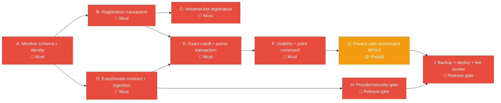

# Phase 1 Implementation Plan — Deerngo Bot

> **Project:** Deerngo Bot — Viewer Relationship Management (VRM)
> **Version:** 0.4 | **Status:** Draft
> **Last Updated:** 2026-08-02
> **Based on:** `07_pm/072_MM07_po-to-dev-qa-member-registration-mvp_20260802.md`
>
> **Scope decision:** YouTube subscriber polling and automatic subscriber capture were removed from the active MVP after live API verification. Phase 1 implements explicit viewer membership through streamer.bot.

---

## 1. Phase Objective

Deliver a working MVP that lets viewers explicitly register during live chat, use donation/point/visibility commands through streamer.bot, earn 1 point per THB from future qualifying EasyDonate donations, and view an optional public contributor scoreboard.

**Success Criteria:**

- 10 active user stories: 8 🔴 Must Have, 2 🟡 Should Have
- 37 story points
- 62 active acceptance criteria: 43 🔴 Must Have, 19 🟡 Should Have
- Active criteria mapped to `TC-M001`–`TC-M062`
- EasyDonate provider payload/authentication contract verified before production webhook deployment
- No YouTube display names exposed by the public API
- First approved live-stream smoke test passes

---

## 2. Scope

### In Scope — Phase 1

| Initiative | Name | Stories | Points | Priority | Depends On |
|-----------|------|---------|:------:|:--------:|------------|
| A | Explicit Member Registration | US-001, US-002 | 8 | 🔴 | streamer.bot identity |
| B | Bot Commands and Visibility | US-010, US-011, US-012 | 8 | 🔴 | A and backend health |
| C | EasyDonate Ingestion | US-020 | 5 | 🔴 | database schema; provider contract |
| D | Exact Member Points | US-021, US-022 | 8 | 🔴 | A, C |
| E | Public Scoreboard | US-030, US-031 | 8 | 🟡 | B, D |
| **Total** | | **10 stories** | **37** | | |

**OUT of scope:**

- YouTube Data API subscriber polling
- YouTube OAuth/client-token dependency
- Automatic subscriber registration
- Historical subscriber backfill
- `subscribers` as a membership or points source
- `viewer_points` as the active points summary table
- Fuzzy `pg_trgm` matching
- Automatic historical donation credit
- Admin console
- Leaderboard tiers, recognition, point redemption, OBS overlay
- Automatic CI/CD production deployment

### Product Rules to Preserve

- streamer.bot supplies the real chat author identity; typed handles are ignored.
- New member starts with 0 points and `public_visibility=true`.
- Same-handle registration does not mutate the member.
- New handle creates an inactive old member and a new active member with 0 points; old points remain for manual correction.
- Only active members participate in matching/point queries/scoreboard.
- Match with trim + one leading `@` removal + lowercase; no fuzzy matching.
- A donation qualifies only when `donation_time >= member.registered_at`.
- A qualifying donation adds 1 point per THB exactly once.
- Private members keep earning points but receive a 100-point band in public chat.
- Scoreboard returns only active + public + `total_points > 0` handle/points data.

---

## 3. PO Decisions

| Decision | ID | Choice | Rationale |
|----------|-----|--------|-----------|
| Membership source | DEC-MM07-001 | Explicit `:deer: register`; no subscriber polling | YouTube API exposed only 172 of 1,310 subscribers in live verification |
| Trusted identity | DEC-MM07-002 | Use actual streamer.bot user ID/current handle | Prevent handle impersonation/self-claiming |
| Starting balance | DEC-MM07-003 | New member starts at 0 | Clear MVP cutover; no automatic historical attribution |
| Handle change | DEC-MM07-004 | Inactivate old row; create new 0-point active row; manual correction later | Avoid alias/admin-console complexity in MVP |
| Match rule | DEC-MM07-005 | Normalized exact active-handle match | Avoid fuzzy false positives and wrong point ownership |
| Donation cutoff | DEC-MM07-006 | `donation_time >= registered_at` | Processing/webhook delay must not grant old points |
| Visibility | DEC-MM07-007 | `public`/`private`; private member receives 100-point band | Preserve participation while reducing exact public exposure |
| Public fields | DEC-MM07-008 | Rank, normalized handle, total points only | Data minimization |
| EasyDonate auth | DEC-MM07-009 | Verify provider; path-token fallback if no signing/auth | Do not implement an unverified HMAC assumption |
| Admin console | DEC-MM07-010 | Defer to Phase 2 | Keep MVP small; controlled DB procedure for exceptions |
| Deployment | DEC-MM07-011 | Manual Docker Compose deployment for Phase 1 | Preserve operational control during schema/provider change |

---

## 4. Execution Order



### Sprint Allocation

| Sprint | Initiative | What Ships | Owner |
|--------|-----------|------------|-------|
| Sprint 1 | A | `members`/`donations` schema, normalization, active uniqueness, registration/re-registration API, `:deer: register`, `:deer: donate` | Dev + DevOps |
| Sprint 1 | QA gate | TC-M001–TC-M017 for registration and donate behavior | QA |
| Sprint 2 | B/C/D | Visibility API, EasyDonate webhook/API fallback, provider contract verification, exact matcher, cutoff, exactly-once points, point API/actions | Dev + DevOps |
| Sprint 2 | QA gate | TC-M018–TC-M050 and provider/security gate | QA |
| Sprint 3 | E | Privacy-safe scoreboard API/UI, pagination, CORS, response allowlist, tunnel | Dev + frontend |
| Sprint 3 | Release gate | Manual correction procedure, active full regression, backup, deployment, live smoke test | QA + DevOps + PO |

**Effort baseline:** approximately 78 hours across the three sprints, excluding unresolved provider-support work and live-stream scheduling.

---

## 5. Initiative Details

### Initiative A: Explicit Member Registration

> **Priority:** 🔴 Must Have

| Deliverable | Description |
|------------|-------------|
| `members` migration | `member_id`, actual `youtube_user_id`, normalized handle, status, visibility, registration time, total points |
| Active uniqueness | One active record per user ID and normalized handle |
| Registration API | `POST /api/v1/members/register` |
| Idempotency | Same user/handle returns current member without mutation |
| Handle change | Atomic old inactive/new active zero-point records; no automatic transfer |
| streamer.bot action | Sends real identity; ignores typed handle |

**Exit checks:** AC-001a–g and AC-002a–f; TC-M001–TC-M013 pass. No active YouTube polling/OAuth dependency remains.

### Initiative B: Bot Commands and Visibility

> **Priority:** 🔴 Must Have

| Deliverable | Description |
|------------|-------------|
| Donate command | Posts `https://easydonate.app/deerngo0` |
| Visibility API | `PUT /api/v1/members/{youtube_user_id}/visibility` |
| Point API | Visibility-aware exact/banded response |
| streamer.bot actions | `register`, `public`, `private`, `point`, `donate` |
| Failure handling | Friendly fallback when backend unavailable; no internal details |

**Exit checks:** AC-010a–d, AC-011a–f, AC-012a–g; TC-M014–TC-M030 pass.

### Initiative C: EasyDonate Ingestion

> **Priority:** 🔴 Must Have; also a release gate

| Deliverable | Description |
|------------|-------------|
| Webhook route | `POST /api/v1/webhooks/easydonate/{path_token}` |
| Provider verification | Confirm actual fields, auth/signing, retry behavior using a safe provider event |
| Fallback sync | API-key polling with provider rate-limit/backoff handling |
| Idempotency | Unique `referenceNo`; duplicate event cannot create duplicate points |
| Privacy | Raw donor name/message retained privately and redacted from logs/public API |

**Exit checks:** AC-020a–g; TC-M031–TC-M037; [TECH-001 / Issue #18](https://github.com/oat431/deerngo-bot/issues/18) resolved or explicitly blocks release.

### Initiative D: Exact Member Points

> **Priority:** 🔴 Must Have

| Deliverable | Description |
|------------|-------------|
| Normalization | trim, remove leading `@`, lowercase |
| Exact matcher | Active handle only; no punctuation removal/fuzzy matching |
| Cutoff | `donation_time >= registered_at` |
| Transaction | Lock donation/check `points_applied_at`; increment member total once |
| Point query | Identity-based endpoint; private 100-point bands |
| Manual correction | Old inactive/new active records retained for owner correction |

**Exit checks:** AC-021a–g and AC-022a–f; TC-M038–TC-M050 pass.

### Initiative E: Privacy-Safe Public Scoreboard

> **Priority:** 🟡 Should Have; production release gate

| Deliverable | Description |
|------------|-------------|
| Scoreboard API | Filter active/public/points>0; deterministic ranking and pagination |
| Public projection | Rank, normalized handle, total points, safe pagination metadata only |
| Frontend | Responsive Next.js page; no login |
| States | Loading, empty, error, retry, refresh |
| Privacy gate | No display name, user ID, donor name, message, private/inactive/zero-point data |
| Owner notice | Registration/public-display and removal/visibility wording approved |

**Exit checks:** AC-030a–f and AC-031a–f; TC-M051–TC-M062 pass; privacy notice approved. Manual correction procedure: [TECH-002 / Issue #19](https://github.com/oat431/deerngo-bot/issues/19).

---

## 6. New Ports, Domains, and Integration Routes

| Service/Route | Port/URL | Purpose | Initiative |
|--------------|----------|---------|------------|
| Go backend | `:8008` | Member, visibility, points, scoreboard, webhook API | A–E |
| Next.js frontend | `:3008` | Public scoreboard | E |
| PostgreSQL | `:5432` internal | `members`, `donations`, correction notes | A/C/D |
| streamer.bot | Windows local | Live chat triggers and actual identity | A/B |
| Scoreboard hostname | Existing configured Cloudflare hostname | Public read-only scoreboard | E |
| EasyDonate webhook | Configured HTTPS route with secret path token or provider auth | Donation push | C |
| EasyDonate API | Provider endpoint | Fallback donation reconciliation | C |

No new public port is required. Public exposure must be limited to the scoreboard and intentionally configured webhook route.

---

## 7. Action Items

| ID | Action | Owner | Priority | Depends On | Status |
|----|--------|-------|:--------:|------------|:------:|
| PLAN-001 | Confirm backend/frontend scaffold and migration command | Dev | 🔴 | — | ⬜ |
| PLAN-002 | Implement `members`/`donations` schema and indexes | Dev | 🔴 | PLAN-001 | ⬜ |
| PLAN-003 | Implement registration/re-registration transaction | Dev | 🔴 | PLAN-002 | ⬜ |
| PLAN-004 | Configure streamer.bot register/donate actions | Dev | 🔴 | PLAN-003 | ⬜ |
| PLAN-005 | Verify EasyDonate real test payload/auth/retry contract | Dev/DevOps | 🔴 | Provider dashboard access | ⬜ |
| PLAN-006 | Implement webhook/API fallback and idempotency | Dev | 🔴 | PLAN-005 | ⬜ |
| PLAN-007 | Implement exact matching/cutoff/exactly-once points | Dev | 🔴 | PLAN-002, PLAN-006 | ⬜ |
| PLAN-008 | Implement visibility and point actions | Dev | 🔴 | PLAN-003, PLAN-007 | ⬜ |
| PLAN-009 | Implement scoreboard API/UI and privacy allowlist | Dev/frontend | 🟡 | PLAN-008 | ⬜ |
| PLAN-010 | Test manual point-correction procedure in test DB | PO/DevOps | 🔴 | PLAN-002 | ⬜ |
| PLAN-011 | Complete Thai PDPA owner checklist: notice, purpose/lawful-basis, public display, retention, rights/removal, roles, breach process | PO/Owner | 🔴 | PLAN-009 | ⬜ |
| PLAN-012 | Run active regression `TC-M001`–`TC-M062` plus privacy/security gates | QA | 🔴 | PLAN-004–PLAN-011 | ⬜ |
| PLAN-013 | Backup, deploy, provider smoke, and first live-stream test | DevOps/PO/QA | 🔴 | PLAN-012 | ⬜ |

---

## 8. Definition of Done

Phase 1 is complete only when all are true:

- [ ] All 10 active user stories implemented or formally accepted/deferred by priority.
- [ ] All 62 active acceptance criteria verified: 43 🔴 and 19 🟡.
- [ ] `TC-M001`–`TC-M062` are executed with real results; no duplicate test IDs.
- [ ] Go backend runs on port 8008 in Docker.
- [ ] Next.js frontend runs on port 3008 in Docker.
- [ ] `members` and revised `donations` migrations apply successfully in test and deployment environments.
- [ ] No automatic subscriber/points migration is performed.
- [ ] Registration uses actual streamer.bot identity and ignores typed handles.
- [ ] Same-handle and changed-handle behavior passes, including rollback safety.
- [ ] `:deer: register`, `:deer: donate`, `:deer: point`, `:deer: public`, and `:deer: private` work in approved chat tests.
- [ ] EasyDonate payload and webhook security behavior are verified against the provider.
- [ ] Duplicate `referenceNo` cannot double-count points.
- [ ] Pre-registration, inactive, unmatched, and duplicate donations award no points.
- [ ] Eligible donations apply 1 THB = 1 point exactly once.
- [ ] Public scoreboard returns only active/public/points>0 handle+points data.
- [ ] No display name, user ID, raw donor name/message, private, inactive, or zero-point data appears publicly or in logs.
- [ ] Manual point-correction procedure is tested in a non-production database and recorded.
- [ ] Rate limiting, body limits, validation, CORS, and secret redaction are active.
- [ ] Privacy notice/removal behavior is approved by the channel owner.
- [ ] First live-stream smoke test passes.
- [ ] PO and Deer_NGO approve go-live.

---

## 9. Release Gates and Evidence

| Gate | Required Evidence | Owner | Blocks Release? |
|------|-------------------|-------|:---------------:|
| Requirements | Versioned stories/ACs and MM07 handoff | PO | Yes |
| Database | Migration output, constraints, backup evidence | Dev/DevOps | Yes |
| Provider contract | Real safe EasyDonate sample and auth decision, no secrets | Dev/DevOps | Yes |
| Security | Security tests, redacted logs, response allowlist | QA/Dev | Yes |
| Manual correction | Test DB before/after/correction note evidence | PO/DevOps | Yes |
| Functional QA | TC-M001–TC-M062 execution report | QA | Yes |
| UI/UAT | Scoreboard states, mobile/accessibility, privacy review | QA/PO | Yes |
| Live smoke | Approved streamer.bot chat test and backend evidence | PO/Dev/QA | Yes |

Specification completion is not the same as implementation completion. The release gate requires real execution evidence.

---

## 10. Transition Criteria to Phase 2

Phase 2 can begin when:

1. Phase 1 DoD and all release gates are complete.
2. The first live-stream test is accepted.
3. EasyDonate contract/security is verified.
4. No unresolved 🔴 defect remains.
5. Stakeholder approves actual points and scoreboard behavior.
6. The owner decides whether operational manual corrections justify an admin console.

### Proposed Phase 2 Scope

| Feature | Description |
|---------|-------------|
| Admin console | Secure point corrections, member status, and audit view |
| Handle-change workflow | Guided transfer/retirement instead of direct DB work |
| Point ledger | Auditable adjustment/event ledger replacing summary-only corrections |
| Leaderboard tiers | Point thresholds and ranks |
| Bot recognition | Top-donor/milestone chat messages |
| Point redemption | Spend points on rewards |
| OBS overlay | Stream overlay integration |
| CI/CD | GitHub Actions → controlled Docker deployment |

---

## 11. Repository and Branch Strategy

### Repositories

| Repository | Content | Language | Port | Sprint Ownership |
|------------|---------|----------|:----:|-----------------|
| `oat431/deerngo-bot` | Go backend, migrations, member/donation/points APIs, streamer.bot integration docs | Go | 8008 | Sprints 1–3 |
| `oat431/deerngo-web` | Next.js public scoreboard | TypeScript | 3008 | Sprint 3 |

### Branches

```text
main      → production-ready only
develop   → integration branch
feat/sprint1-members
feat/sprint2-points
feat/sprint3-scoreboard
fix/<description>
docs/<description>
```

### PR Workflow

```bash
git checkout develop && git pull origin develop
git checkout -b feat/sprint1-members
# implement and test
git add .
git commit -m "feat(members): add explicit live-chat registration"
git push -u origin HEAD
gh pr create --base develop --title "feat: explicit member registration" --body-file <review-body>
# merge only after review and checks
gh pr merge --squash --delete-branch
```

Use Conventional Commits. For GitHub issue bodies containing multiline Markdown, use `--body-file`; do not place secrets or real donor data in issues.

---

## 12. Document References

| Document | Path | Version |
|----------|------|:-------:|
| Business Objectives | `01_requirement/011_business_objective.md` | 0.2 |
| User Stories | `01_requirement/012_user_stories.md` | 0.2 |
| Acceptance Criteria | `01_requirement/013_acceptance_criteria.md` | 0.2 |
| API Specification | `02_design/022_API_specification.md` | 0.2 |
| Database Schema | `02_design/023_database_schema_DDL.md` | 0.2 |
| ERD | `02_design/024_ERD.md` | 0.2 |
| Software Architecture | `02_design/025_software_architecture_document.md` | 0.2 |
| Architecture Overview | `02_design/029_architecture_overview.md` | 0.2 |
| Test Plan | `04_testing/041_test_plan.md` | 0.2 |
| Test Cases | `04_testing/042_test_cases.md` | 0.2 |
| Regression Suite | `04_testing/044_regression_test_suite.md` | 0.2 |
| Coverage Report | `04_testing/045_coverage_report.md` | 0.2 |
| Risk Register | `07_pm/071_risk_register.md` | 0.2 |
| Thai PDPA Owner Checklist | `06_security/063_thai_pdpa_owner_checklist.md` | 0.1 |
| PO Handoff | `07_pm/072_MM07_po-to-dev-qa-member-registration-mvp_20260802.md` | 1.0 |
| PDPA Owner Handoff | `07_pm/072_MM08_po-to-owner-pdpa-owner-readiness_20260802.md` | 1.0 |
| Backlog | `oat431/deerngo-bot`, `oat431/deerngo-web` | Updated |

---

> **Status:** Revised implementation plan ready for Dev/DevOps/QA execution. The active plan is blocked only by implementation, provider-contract verification, privacy approval, and real test execution—not by the retired YouTube polling path.
> **Cross-persona coordination:** Dev implements; DevOps deploys and verifies infrastructure/provider behavior; QA tests; PO validates; Deer_NGO approves go-live.
> **Template Standard:** Based on PMBOK v8, ISO/IEC/IEEE 29148.
---
