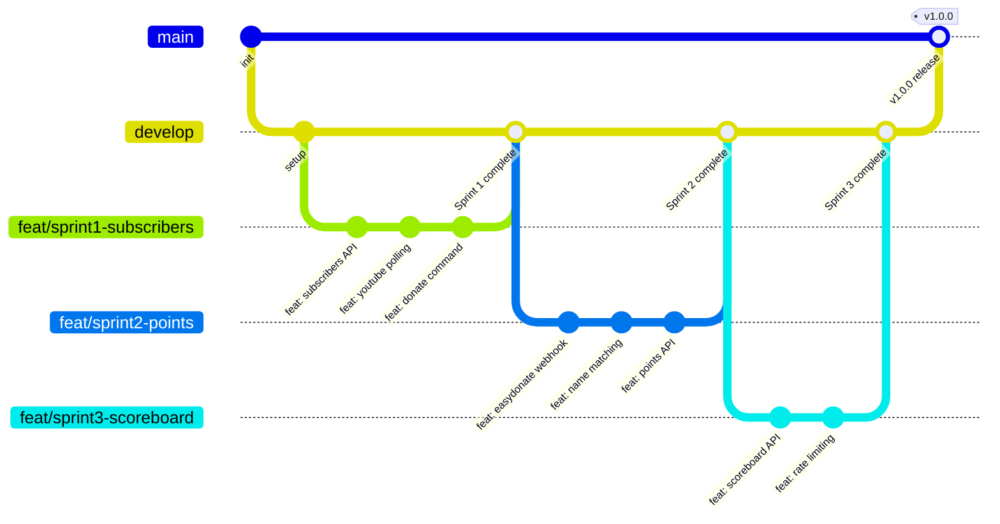
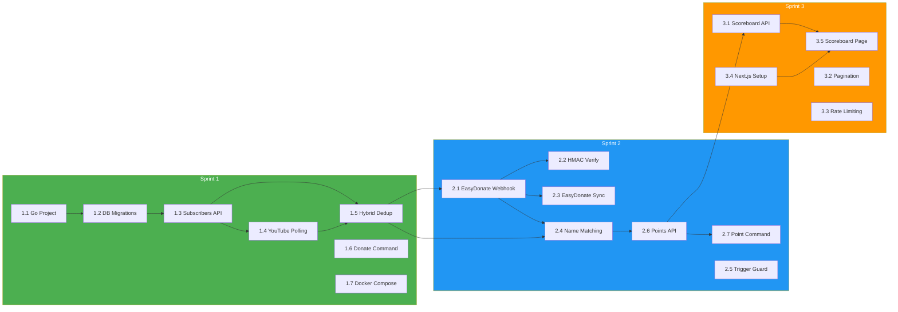

# Phase 1 Implementation Plan — Deerngo Bot

> **Project:** Deerngo Bot — Viewer Relationship Management (VRM)
> **Version:** 0.1 | **Status:** Draft
> **Last Updated:** 2026-07-30

---

## 1. Phase Objective

> Deliver the Deerngo Bot Phase 1 MVP: a Go backend that captures YouTube subscribers (hybrid), processes EasyDonate donations, calculates points (1 THB = 1 pt), serves a React/Next.js scoreboard, and integrates with streamer.bot for live chat commands.

**Success Criteria:** All 54 acceptance criteria pass, 59 test cases green, 3 sprints delivered.

---

## 2. Scope

### In Scope (Phase 1)

| Epic | Stories | Points | Priority |
|------|---------|:------:|:--------:|
| E-01 Register | US-001, US-002, US-003 | 12 | 🔴 |
| E-02 Bot Commands | US-010, US-011, US-012 | 8 | 🔴 |
| E-03 Points Engine | US-020, US-021, US-022 | 13 | 🔴 |
| E-04 Scoreboard | US-030, US-031 | 8 | 🟡 |

### Out of Scope (Phase 2+)

| Feature | Reason |
|---------|--------|
| Leaderboard tiers/ranks | Phase 2 gamification |
| Bot recognition (auto-shout top donors) | Phase 2 gamification |
| Point redemption | Phase 2+ |
| OBS overlay integration | Phase 2+ |

---

## 3. Sprint Plan

### Sprint 1: Foundation + Subscriber Registration + Donate Command

| # | Task | Owner | Story | Depends On | Estimate |
|---|------|:-----:|-------|-----------|:--------:|
| 1.1 | Set up Go project structure (Fiber v3 + sqlx) | Dev | — | — | 2h |
| 1.2 | Database migrations (golang-migrate) — 4 tables | Dev | — | 1.1 | 2h |
| 1.3 | Implement `POST /api/v1/subscribers` endpoint | Dev | US-002 | 1.2 | 3h |
| 1.4 | Implement YouTube API Polling Scheduler | Dev | US-003 | 1.3 | 4h |
| 1.5 | Implement subscriber upsert logic (hybrid dedup) | Dev | US-001 | 1.3, 1.4 | 2h |
| 1.6 | Configure streamer.bot `:deer: donate` action | Dev | US-010 | — | 1h |
| 1.7 | Docker Compose setup (Go + PostgreSQL) | DevOps | — | 1.1 | 2h |
| 1.8 | Cloudflare Tunnel config for `deerngo-viewer-score.panomete.com` | DevOps | — | — | 1h |
| 1.9 | Run Sprint 1 test cases (TC-001 → TC-022) | QA | — | 1.1 → 1.6 | 3h |

**Sprint 1 Total:** ~20h
**Sprint 1 Deliverables:**
- ✅ Go backend running on port 8008
- ✅ PostgreSQL `deerngo` database with 4 tables
- ✅ Subscriber registration API (real-time + polling)
- ✅ `:deer: donate` command working in live chat
- ✅ Docker Compose for homelab deployment

---

### Sprint 2: Points Engine + Bot Commands

| # | Task | Owner | Story | Depends On | Estimate |
|---|------|:-----:|-------|-----------|:--------:|
| 2.1 | Implement EasyDonate webhook endpoint (`POST /api/v1/webhooks/easydonate`) | Dev | US-020 | 1.2 | 3h |
| 2.2 | Implement HMAC-SHA256 webhook verification | Dev | DEF-S005 | 2.1 | 2h |
| 2.3 | Implement EasyDonate Sync Scheduler (polling fallback) | Dev | US-020 | 2.1 | 3h |
| 2.4 | Implement Name Matching Engine (pg_trgm fuzzy match) | Dev | US-021 | 2.1 | 4h |
| 2.5 | Implement `sync_viewer_points()` trigger guard (DEF-S003 fix) | Dev | DEF-S003 | 1.2 | 1h |
| 2.6 | Implement `GET /api/v1/points/{handle}` endpoint | Dev | US-022 | 2.4 | 2h |
| 2.7 | Configure streamer.bot `:deer: point` action (HTTP → Go API) | Dev | US-011, US-012 | 2.6 | 2h |
| 2.8 | Document HMAC key rotation procedure | DevOps | DEF-S005 | — | 1h |
| 2.9 | Run Sprint 2 test cases (TC-023 → TC-046) | QA | — | 2.1 → 2.7 | 4h |

**Sprint 2 Total:** ~22h
**Sprint 2 Deliverables:**
- ✅ EasyDonate webhook receiving donations
- ✅ Name matching engine (fuzzy, pg_trgm)
- ✅ Point calculation (1 THB = 1 pt)
- ✅ `:deer: point` command working in live chat
- ✅ HMAC key rotation documented

---

### Sprint 3: Scoreboard + Polish + Hardening

| # | Task | Owner | Story | Depends On | Estimate |
|---|------|:-----:|-------|-----------|:--------:|
| 3.1 | Implement `GET /api/v1/scoreboard` endpoint (exclude 0-point) | Dev | US-031 | 2.4 | 2h |
| 3.2 | Add pagination to scoreboard API (max 100, DEF-S002 fix) | Dev | DEF-S002 | 3.1 | 1h |
| 3.3 | Implement rate limiting middleware (100/min default, 200/min webhook) | Dev | DEF-S004 | — | 2h |
| 3.4 | Set up Next.js frontend project | Dev | US-030 | — | 2h |
| 3.5 | Implement scoreboard page (fetch from API, responsive) | Dev | US-030 | 3.1, 3.4 | 4h |
| 3.6 | UX/UI wireframes for scoreboard (026) | UX/UI | — | — | 3h |
| 3.7 | UX/UI style guide (028) | UX/UI | — | — | 2h |
| 3.8 | Cloudflare Tunnel config for frontend | DevOps | — | 3.4 | 1h |
| 3.9 | Run Sprint 3 test cases (TC-047 → TC-059) | QA | — | 3.1 → 3.5 | 3h |
| 3.10 | Run regression test suite (all 59 TCs) | QA | — | 3.9 | 4h |

**Sprint 3 Total:** ~24h
**Sprint 3 Deliverables:**
- ✅ Scoreboard API (paginated, 0-point excluded)
- ✅ React/Next.js scoreboard page (public, responsive)
- ✅ Rate limiting active
- ✅ All 59 test cases passing
- ✅ Regression suite green

---

## 4. Repository & Branch Strategy

### Repositories

| Repo | Content | Language | Port |
|------|---------|:--------:|:----:|
| `deerngo-bot` | Go backend (API, business logic, database, schedulers) | Go | 8008 |
| `deerngo-web` | Next.js frontend (scoreboard) | TypeScript | 3008 |

### Branch Strategy



### Branch Naming Convention

| Type | Format | Example |
|------|--------|---------|
| Main | `main` | `main` |
| Develop | `develop` | `develop` |
| Feature | `feat/{sprint}-{description}` | `feat/sprint1-subscribers-api` |
| Bugfix | `fix/{description}` | `fix/trigger-double-count` |
| Hotfix | `hotfix/{description}` | `hotfix/webhook-signature` |
| Docs | `docs/{description}` | `docs/hmac-key-rotation` |

### Sprint Branches

| Sprint | Branch Name (deerngo-bot) | Branch Name (deerngo-web) |
|--------|--------------------------|---------------------------|
| Sprint 1 | `feat/sprint1-subscribers` | `feat/sprint1-project-setup` |
| Sprint 2 | `feat/sprint2-points` | — (no frontend work) |
| Sprint 3 | `feat/sprint3-scoreboard-api` | `feat/sprint3-scoreboard-ui` |

### PR Workflow

```bash
# 1. Start from develop
git checkout develop && git pull origin develop

# 2. Create feature branch
git checkout -b feat/sprint1-subscribers-api

# 3. Make changes, commit with conventional commits
git add .
git commit -m "feat(subscribers): add POST /api/v1/subscribers endpoint

- Implement subscriber registration with upsert
- Add YouTube handle validation
- Add source field for tracking (streamer_bot / youtube_api)

Closes #1"

# 4. Push and create PR
git push -u origin HEAD
gh pr create --base develop --title "feat: subscribers API (Sprint 1)" --body "..."

# 5. Merge when green
gh pr merge --squash --delete-branch
```

### Commit Message Convention

```
type(scope): short description

Longer explanation if needed. Wrap at 72 characters.

Closes #issue-number
```

| Type | When to Use |
|------|-------------|
| `feat` | New feature |
| `fix` | Bug fix |
| `refactor` | Code restructuring (no behavior change) |
| `docs` | Documentation only |
| `test` | Adding/updating tests |
| `chore` | Build, deps, config changes |

---

## 5. DevOps Tasks

### Infrastructure Setup

| # | Task | Priority | Sprint | Details |
|---|------|:--------:|:------:|---------|
| D-001 | Create Docker Compose for Go backend | 🔴 | 1 | Port 8008, joins `db-network` |
| D-002 | Create Docker Compose for Next.js frontend | 🔴 | 3 | Port 3008, joins `db-network` |
| D-003 | Configure Cloudflare Tunnel for scoreboard | 🔴 | 1 | `deerngo-viewer-score.panomete.com` |
| D-004 | Configure Cloudflare Tunnel for frontend | 🔴 | 3 | Same tunnel, different hostname |
| D-005 | Document HMAC key rotation procedure | 🟡 | 2 | Key gen, sharing, rotation steps |
| D-006 | Set up `deerngo` database in PostgreSQL | 🔴 | 1 | Already done — verify connection |
| D-007 | Add Prometheus scrape config (optional) | 🟢 | 3 | If monitoring needed |

### Deployment Model

```
Developer pushes to GitHub
  → Docker Compose builds locally (no CI/CD for Phase 1)
  → docker compose up -d
  → Health check
  → Manual verification
```

> **Note:** Phase 1 uses manual deployment. CI/CD (GitHub Actions) deferred to Phase 2.

---

## 6. Dependency Diagram



---

## 7. Risk Register

| ID | Risk | Probability | Impact | Mitigation | Owner |
|----|------|:-----------:|:------:|-----------|:-----:|
| R-001 | YouTube API quota exhaustion | Low | High | Poll every 15 min (96 calls/day, limit 10K) | Dev |
| R-002 | EasyDonate webhook unreliable | Medium | Medium | Fallback to polling scheduler | Dev |
| R-003 | Fuzzy matching false positives | Medium | High | Log all matches, manual review queue | Dev |
| R-004 | streamer.bot LAN connection unstable | Low | Medium | Retry logic, health check | Dev |
| R-005 | Cloudflare Tunnel downtime | Low | Low | Status page monitoring | DevOps |
| R-006 | DEF-S003 trigger double-count | Medium | High | Guard clause in trigger (Sprint 2) | Dev |

---

## 8. Definition of Done

Phase 1 is complete when ALL of the following are true:

- [ ] All 11 user stories implemented
- [ ] All 54 acceptance criteria pass
- [ ] All 59 test cases green
- [ ] Go backend running on port 8008 (Docker)
- [ ] Next.js frontend running on port 3008 (Docker)
- [ ] PostgreSQL `deerngo` database with 4 tables + triggers
- [ ] `:deer: donate` command works in live chat
- [ ] `:deer: point` command works in live chat
- [ ] Scoreboard accessible at `deerngo-viewer-score.panomete.com`
- [ ] EasyDonate webhook receiving donations
- [ ] YouTube API polling capturing subscribers 24/7
- [ ] Rate limiting active (100/min default, 200/min webhook)
- [ ] HMAC webhook verification working
- [ ] Key rotation procedure documented
- [ ] All 6 spec gaps resolved (DEF-S001 → DEF-S006)

---

## 9. Transition Criteria to Phase 2

Phase 2 can begin when:

1. All Definition of Done criteria are met
2. PO confirms MVP acceptance
3. First live stream test completed successfully
4. Stakeholder (Deer_NGO) approves go-live

### Phase 2 Scope (Proposed)

| Feature | Description |
|---------|-------------|
| Leaderboard tiers | Point thresholds → viewer ranks |
| Bot recognition | Auto-shout top donors in chat |
| Point redemption | Viewers spend points on rewards |
| OBS overlay | Scoreboard as stream overlay |
| CI/CD pipeline | GitHub Actions → Docker deploy |

---

## 10. Action Items

| Action ID | Action | Owner | Sprint | Priority | Status |
|-----------|--------|:-----:|:------:|:--------:|:------:|
| PLAN-001 | Set up Go project + Docker Compose | Dev | 1 | 🔴 | ⬜ |
| PLAN-002 | Run database migrations | Dev | 1 | 🔴 | ⬜ |
| PLAN-003 | Implement Sprint 1 stories | Dev | 1 | 🔴 | ⬜ |
| PLAN-004 | Configure streamer.bot actions | Dev | 1-2 | 🔴 | ⬜ |
| PLAN-005 | Implement Sprint 2 stories | Dev | 2 | 🔴 | ⬜ |
| PLAN-006 | Document HMAC key rotation | DevOps | 2 | 🟡 | ⬜ |
| PLAN-007 | Implement Sprint 3 stories | Dev | 3 | 🔴 | ⬜ |
| PLAN-008 | Set up Next.js frontend | Dev | 3 | 🔴 | ⬜ |
| PLAN-009 | Cloudflare Tunnel config | DevOps | 1,3 | 🔴 | ⬜ |
| PLAN-010 | Run regression tests | QA | 3 | 🔴 | ⬜ |

---

## 11. Documents Reference

| Document | Path | What It Provides |
|----------|------|------------------|
| Business Objectives | `01_requirement/011_business_objective.md` | Success metrics, KPIs |
| User Stories | `01_requirement/012_user_stories.md` | 11 stories, 41 points |
| Acceptance Criteria | `01_requirement/013_acceptance_criteria.md` | 54 ACs, 32🔴/22🟡 |
| API Specification | `02_design/022_API_specification.md` | Endpoint contracts |
| Database Schema | `02_design/023_database_schema_DDL.md` | DDL, triggers, indexes |
| Software Architecture | `02_design/025_software_architecture_document.md` | Component design |
| Test Plan | `04_testing/041_test_plan.md` | Test strategy |
| Test Cases | `04_testing/042_test_cases.md` | 59 test cases |
| Defect Report | `04_testing/043_defect_report.md` | 6 spec gaps (3 resolved) |

---

## Related Documents

| Document | Relationship |
|----------|-------------|
| [[MM01_po-to-designer]] | PO → Designer handoff |
| [[MM02_designer-to-dev-uxpo]] | Designer → Dev/UX handoff |
| [[MM04_qa-to-po]] | QA spec gaps → PO decisions |
| [[Deer Ngo Bot Overview]] | Project overview |

---

> **Status:** Phase 1 plan ready. 3 sprints, ~66h total effort. All spec gaps resolved. Ready for Dev to start Sprint 1.
> **Cross-persona coordination:** Dev implements. DevOps supports infra. QA tests. PO validates.
