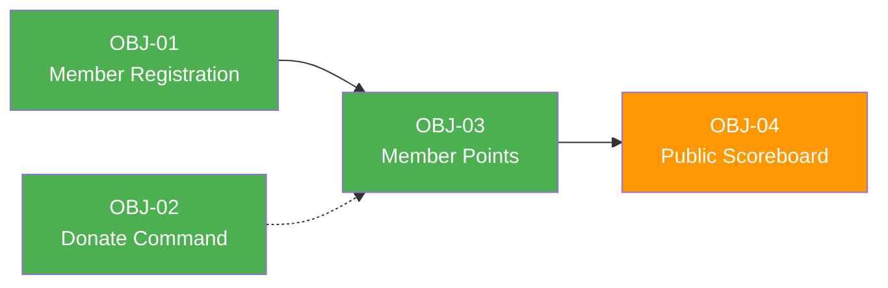

# Business Objectives

> **Project:** Deerngo Bot — Viewer Relationship Management (VRM)
> **Version:** 0.3 | **Status:** Draft
> **Last Updated:** 2026-08-02
>
> **Scope change:** The former YouTube subscriber-polling approach was removed after live verification showed that the API exposes only a limited subscriber subset. Phase 1 now uses explicit viewer membership through `:deer: register`.

---

## Document Control

| Field | Value |
|-------|-------|
| Document Owner | PO |
| Sponsor | Deer_NGO (YouTube Creator) |
| Business Analyst | PO |

### Revision History

| Version | Date | Author | Change Description |
|---------|------|--------|--------------------|
| 0.1 | 2026-07-29 | PO | Initial subscriber-based objectives |
| 0.2 | 2026-08-02 | PO | Replaced subscriber capture with explicit member registration and privacy-aware scoring |

---

## 1. Executive Summary

| Field | Detail |
|-------|--------|
| Purpose | Build a Viewer Relationship Management (VRM) system for the Deer_NGO YouTube channel that lets viewers explicitly join a points program and participate in donation-based community engagement |
| Expected Outcome | Registered viewers can earn points from future qualifying donations, check their status in chat, and optionally appear on a public contributor scoreboard |
| Number of Objectives | 4 |
| Strategic Theme | Community Building, Viewer Engagement & Privacy-Aware Participation |
| Target Completion | Phase 1 MVP — TBD |

### Product Boundary

Deerngo Bot is a lightweight VRM system for live-stream viewers. It is **not** a complete YouTube subscriber analytics system. YouTube subscriber data is not used to create members, award points, or populate the public scoreboard in Phase 1.

**Phase 1 identity flow:**

```text
Viewer types :deer: register during live chat
  → streamer.bot supplies actual chat identity
  → Go backend creates an active member with 0 points
  → future qualifying EasyDonate donations may earn points
```

**Tech Stack:**
- **Automation Engine:** streamer.bot (Windows desktop, local)
- **Backend:** Go service (homelab Docker)
- **Database:** PostgreSQL 18 (existing homelab)
- **Frontend:** React/Next.js (public scoreboard)
- **Donation Source:** EasyDonate webhook + REST API fallback
- **YouTube Channel:** @Deer_NGO

---

## 2. Strategic Alignment

### 2.1 Organizational Strategy Map

```text
Vision: Build an engaged and respectful YouTube live-stream community
  └── Strategic Theme: Community Building & Privacy-Aware Participation
        └── Strategic Goal: Make contribution and participation easy, clear, and voluntary
              ├── OBJ-01: Enable explicit viewer membership
              ├── OBJ-02: Enable chat-based donation promotion
              ├── OBJ-03: Implement donation-driven points for active members
              └── OBJ-04: Provide a privacy-aware public contributor scoreboard
```

### 2.2 Strategy Traceability

| Strategic Theme | Strategic Goal | Business Objective | Contribution |
|----------------|---------------|-------------------|-------------|
| Community Building | Make participation easy | OBJ-01 | Viewers explicitly join the VRM program through live chat |
| Community Building | Reduce donation friction | OBJ-02 | Viewers can find the donation page directly in chat |
| Engagement | Reward qualifying contribution | OBJ-03 | 1 THB = 1 point for registered active members |
| Privacy-aware participation | Make public visibility understandable and controllable | OBJ-04 | Only eligible public contributors are shown; private members remain hidden |

### 2.3 Balanced Scorecard Perspective

| Perspective | Objective Count | Objectives |
|------------|----------------|-----------|
| 💰 **Financial** | 1 | OBJ-02 |
| 👥 **Customer / Community** | 2 | OBJ-03, OBJ-04 |
| ⚙️ **Internal Process** | 1 | OBJ-01 |
| 📚 **Learning & Growth** | 0 | — |

---

## 3. Business Objectives

### 3.1 Objective Register

| ID | Objective | Specific | Measurable | Achievable | Relevant | Time-Bound | Priority |
|----|-----------|----------|-----------|-----------|----------|-----------|----------|
| OBJ-01 | Enable explicit viewer membership | Let viewers register through `:deer: register` using the actual streamer.bot chat identity | 100% of valid registration requests create or identify the correct active member within 5 seconds | streamer.bot supplies user ID/handle; Go API persists membership | Foundation for points and voluntary participation | Phase 1 | 🔴 |
| OBJ-02 | Enable chat-based donation promotion | `:deer: donate` posts the EasyDonate link in live chat | 100% response rate when streamer.bot is online; response under 2 seconds | streamer.bot command/action | Reduces donation friction | Phase 1 | 🔴 |
| OBJ-03 | Implement member-based donation points | Award 1 point per THB only for active members and donations at/after registration with normalized exact name match | 100% idempotent point application for eligible donations | EasyDonate webhook + API fallback + exact matching | Core VRM mechanic | Phase 1 | 🔴 |
| OBJ-04 | Provide privacy-aware public scoreboard | Show only active, public, points-greater-than-zero members using normalized handles | Data freshness under 60 seconds; no private donor/display-name fields exposed | Read-only API + Next.js frontend | Enables community recognition without exposing unnecessary data | Phase 1 | 🟡 |

### 3.2 Detailed Objective Cards

#### OBJ-01: Enable Explicit Viewer Membership

| Field | Detail |
|-------|--------|
| **Statement** | Enable viewers to explicitly register for the VRM program through `:deer: register` during live chat |
| **Specific** | streamer.bot supplies the actual chat author's YouTube user ID and current handle. The backend creates an active member with 0 points, `public_visibility=true`, and no stored YouTube display name |
| **Measurable** | Registration success rate = valid requests that create or identify the correct active member / valid requests |
| **Achievable** | Does not depend on incomplete YouTube subscriber-list polling |
| **Relevant** | Establishes an explicit, understandable membership event |
| **Time-Bound** | Phase 1 MVP |
| **Owner** | Dev |
| **Priority** | 🔴 Must Have |
| **Baseline** | 0 active members |
| **Target** | 100% valid registration requests succeed or return the correct existing-member result |
| **Unit** | % registration success |
| **Source** | Stakeholder requirement and MM06 change decision |

#### OBJ-02: Enable Chat-Based Donation Promotion

| Field | Detail |
|-------|--------|
| **Statement** | Viewers can type `:deer: donate` in live chat to receive the EasyDonate link |
| **Specific** | streamer.bot matches the command and posts the configured EasyDonate URL |
| **Measurable** | 100% response rate while streamer.bot is online; under 2 seconds |
| **Achievable** | streamer.bot command trigger and send-message action |
| **Relevant** | Reduces donation friction |
| **Time-Bound** | Phase 1 MVP |
| **Owner** | Dev |
| **Priority** | 🔴 Must Have |

#### OBJ-03: Implement Member-Based Donation Points

| Field | Detail |
|-------|--------|
| **Statement** | Award 1 point per THB to an active member when the normalized EasyDonate donor name exactly matches the active member handle and the donation occurred at/after registration |
| **Specific** | EasyDonate webhook is primary; API polling is fallback. Store donation privately, normalize donor name, match only active members, enforce `donation_time >= registered_at`, and apply points once |
| **Measurable** | 100% idempotent point application for eligible donations; no points for pre-registration, inactive, unmatched, or duplicate donations |
| **Achievable** | Exact matching is simpler and safer than fuzzy matching for the MVP |
| **Relevant** | Core VRM engagement mechanic |
| **Time-Bound** | Phase 1 MVP |
| **Owner** | Dev |
| **Priority** | 🔴 Must Have |

#### OBJ-04: Provide Privacy-Aware Public Scoreboard

| Field | Detail |
|-------|--------|
| **Statement** | Provide a public scoreboard showing only active members who are public and have points greater than zero |
| **Specific** | Return normalized handle and point total only. Exclude inactive/private/zero-point members, YouTube display names, raw donor names, and donation messages |
| **Measurable** | Data freshness under 60 seconds; public API contains no excluded fields |
| **Achievable** | Read-only backend endpoint + Next.js page |
| **Relevant** | Supports community recognition while minimizing public data exposure |
| **Time-Bound** | Phase 1 MVP |
| **Owner** | Dev |
| **Priority** | 🟡 Should Have |

---

## 4. KPI Framework

| ID | KPI | Description | Formula | Unit | Frequency | Data Source | Owner |
|----|-----|-------------|---------|------|-----------|-------------|-------|
| KPI-01 | Registration Success Rate | Valid registrations that create/identify the correct active member | Successful valid requests / valid requests × 100 | % | Per stream | streamer.bot logs + PostgreSQL | Dev |
| KPI-02 | Donate Command Response Rate | `:deer: donate` commands answered while bot is online | Responses / commands × 100 | % | Per stream | streamer.bot logs | Dev |
| KPI-03 | Point Query Response Rate | Point requests that receive the correct visibility-aware response | Correct responses / requests × 100 | % | Per stream | streamer.bot logs + API logs | Dev |
| KPI-04 | Eligible Donation Point Accuracy | Eligible donations that apply exactly once to the correct member | Correct applications / eligible donations × 100 | % | Daily | EasyDonate + PostgreSQL | Dev |
| KPI-05 | Public Data Compliance | Public scoreboard responses containing only approved fields | Compliant responses / sampled responses × 100 | % | Per release | API tests | Dev/QA |
| KPI-06 | Scoreboard Data Freshness | Time from accepted donation to updated scoreboard | P95 processing delay | seconds | Continuous | Donation/API timestamps | Dev |

---

## 5. Baseline & Target Measurements

### 5.1 Baseline Measurements

| ID | Metric | Baseline Value | Measurement Date | Measurement Method | Confidence |
|----|--------|---------------|-----------------|-------------------|-----------|
| OBJ-01 | Active members registered | 0 | 2026-08-02 | New member system does not exist yet | High |
| OBJ-02 | Donate link sharing | Manual | 2026-07-29 | Observation | High |
| OBJ-03 | Points tracked | 0 | 2026-07-29 | New points system does not exist yet | High |
| OBJ-04 | Public scoreboard | None | 2026-07-29 | New scoreboard does not exist yet | High |

### 5.2 Target Measurements

| ID | Metric | Target Value | Target Date | Rationale | Stretch Goal |
|----|--------|-------------|-------------|-----------|-------------|
| OBJ-01 | Registration success rate | 100% | Phase 1 | Explicit membership is the new foundation | — |
| OBJ-02 | Command response rate | 100% while bot online | Phase 1 | Reliable chat automation | <1s latency |
| OBJ-03 | Eligible point accuracy | 100% | Phase 1 | Trust in the points system | <30s sync |
| OBJ-04 | Scoreboard freshness and field compliance | <60s and 100% approved fields | Phase 1 | Community value with privacy minimization | <1s page load |

### 5.3 Measurement Plan

| ID | Metric | Data Collection Method | Tool / System | Responsible | Collection Frequency | Reporting Format |
|----|--------|----------------------|---------------|-------------|--------------------|--------------------|
| OBJ-01 | Registration success | Compare valid commands with API results | streamer.bot + PostgreSQL | Dev | Per stream | Query report |
| OBJ-02 | Response rate | Log analysis | streamer.bot | Dev | Per stream | Manual check |
| OBJ-03 | Point accuracy | Reconcile EasyDonate records and member totals | EasyDonate + PostgreSQL | Dev/QA | Daily | Query report |
| OBJ-04 | Public data/freshness | API contract and browser checks | QA + browser tools | QA | Per release | Test report |

---

## 6. Objective Dependencies

| Dependent Objective | Depends On | Relationship | Impact if Blocked |
|--------------------|-----------|-------------|-------------------|
| OBJ-03 | OBJ-01 | Points require an active member registration | Donations remain uncredited |
| OBJ-04 | OBJ-03 | Scoreboard reads member point totals | No contributor data to show |
| OBJ-02 | — | Independent streamer.bot command | Donation link command unavailable |



### External Dependencies

| ID | Dependency | Type | Affected Objectives | Mitigation |
|----|-----------|------|-------------------|-----------|
| DEP-01 | streamer.bot running and connected during live | External | OBJ-01, OBJ-02, OBJ-03 | Registration is live-only; show retry message when backend is unavailable |
| DEP-02 | EasyDonate webhook/API availability | External | OBJ-03 | Webhook primary + API polling fallback + idempotency |
| DEP-03 | Public webhook exposure | External | OBJ-03 | Cloudflare Tunnel; unpredictable webhook path; strict validation |
| DEP-04 | PostgreSQL 18 availability | Internal | All | Existing homelab service and backups |

---

## 7. Risk to Objectives

| ID | Objective | Risk | Probability | Impact | Risk Level | Mitigation | Owner |
|----|-----------|------|------------|--------|-----------|-----------|-------|
| OR-01 | OBJ-03 | EasyDonate API rate limit or provider contract change | Medium | Medium | 🟡 | 60 req/min limit; backoff; verify current payload and scopes | Dev |
| OR-02 | OBJ-03 | Donor name does not match member handle | High | Medium | 🟡 | Publish naming rule; exact normalized match; retain unmatched privately | Owner/Dev |
| OR-03 | OBJ-03 | Wrong member receives points due handle conflict | Low | High | 🟠 | Active-handle uniqueness; reject conflicting registration | Dev |
| OR-04 | OBJ-04 | Public handle/score is personal data or member wants removal | Medium | High | 🟠 | Apply the Thai PDPA owner checklist: notice, purpose/lawful-basis decision, optional public-display decision, retention/deletion, rights/removal route, controller/processor instructions, breach process | Owner/Dev |
| OR-05 | OBJ-01 | streamer.bot is offline during registration | Medium | Medium | 🟡 | No false success; viewer retries during next live stream | Dev |
| OR-06 | OBJ-03 | Manual point corrections create data inconsistency | Medium | High | 🟠 | Transactional DB procedure and correction note; admin console later | Owner/Dev |

---

## 8. Objective Tracking

| ID | Objective | Status | % Complete | Last Updated | Notes |
|----|-----------|--------|-----------|-------------|-------|
| OBJ-01 | Enable explicit viewer membership | ⏳ In Progress | 25% | 2026-08-02 | New scope approved; implementation pending |
| OBJ-02 | Enable chat-based donation promotion | ⏳ In Progress | 50% | 2026-08-02 | Existing command issue remains active |
| OBJ-03 | Implement member-based donation points | ⬜ Not Started | 0% | 2026-08-02 | Requires member schema and EasyDonate contract update |
| OBJ-04 | Provide privacy-aware public scoreboard | ⬜ Not Started | 0% | 2026-08-02 | Depends on member-based points |

### Review Cadence

| Review Type | Frequency | Participants | Purpose |
|------------|-----------|-------------|---------|
| Feature Demo | Per sprint | PO, Dev | Validate working behavior |
| KPI Review | Weekly | PO, Dev | Track reliability and privacy behavior |
| Phase Review | End of Phase 1 | PO, Stakeholder | Assess MVP acceptance and go-live readiness |

---

## Related Documents

| Document | Relationship |
|----------|-------------|
| [[012_user_stories]] | Stories implement these objectives |
| [[013_acceptance_criteria]] | Criteria verify objective achievement |
| [[072_MM06_dev-to-po-qa-youtube-subscriber-limit_20260801]] | Scope-change decision |
| [[071_risk_register]] | Project-level risks |

---

> **Template Standard:** Based on BABOK v3 (Strategy Analysis), PMBOK v8 (Initiating), ISO/IEC/IEEE 29148
> **Project:** Deerngo Bot — Viewer Relationship Management (VRM)
