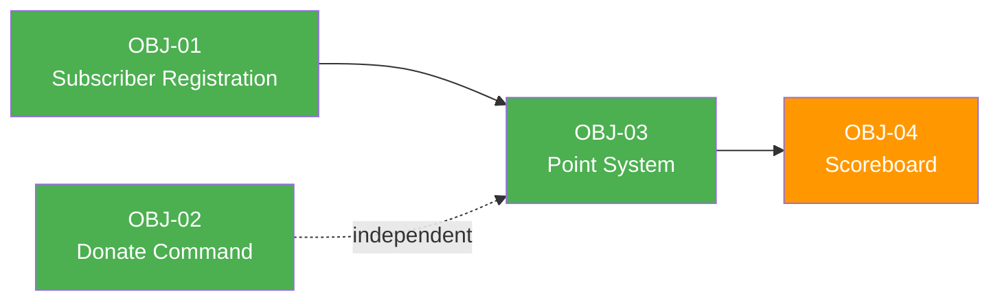

# Business Objectives

> **Project:** Deerngo Bot — Viewer Relationship Management (VRM)
> **Version:** 0.1 | **Status:** Draft
> **Last Updated:** 2026-07-29

---

## Document Control

| Field            | Value                      |
| ---------------- | -------------------------- |
| Document Owner   | PO                         |
| Sponsor          | Deer_NGO (YouTube Creator) |
| Business Analyst | PO                         |

### Revision History

| Version | Date | Author | Change Description |
|---------|------|--------|--------------------|
| 0.1 | 2026-07-29 | PO | Initial draft from stakeholder grill session |

---

## 1. Executive Summary

| Field                | Detail                                                                                                                                                                         |
| -------------------- | ------------------------------------------------------------------------------------------------------------------------------------------------------------------------------ |
| Purpose              | Build a Viewer Relationship Management (VRM) system for the Deer_NGO YouTube channel to foster community engagement through donation-based point tracking and chat interaction |
| Expected Outcome     | Viewers are recognized for their contributions via a points system, driving community belonging and healthy competition                                                        |
| Number of Objectives | 4                                                                                                                                                                              |
| Strategic Theme      | Community Building & Viewer Engagement                                                                                                                                         |
| Target Completion    | Phase 1 MVP — TBD                                                                                                                                                              |

### What is Deerngo Bot?

Deerngo Bot is a **Viewer Relationship Management (VRM)** system — a lightweight CRM for live stream viewers. It tracks viewer contributions (subscriptions, donations) and rewards engagement through a points system visible in live chat and on a public scoreboard.

**Tech Stack:**
- **Automation Engine:** streamer.bot (Windows desktop, local)
- **Backend:** Go service (local Windows machine)
- **Database:** PostgreSQL 18 (existing homelab)
- **Frontend:** React/Next.js (public scoreboard)
- **Donation Source:** EasyDonate API (easydonate.app/deerngo0)
- **YouTube Channel:** @Deer_NGO

---

## 2. Strategic Alignment

### 2.1 Organizational Strategy Map

```
Vision: Build the most engaged YouTube live streaming community
  └── Strategic Theme: Community Building
        └── Strategic Goal: Increase viewer retention and loyalty
              ├── OBJ-01: Automate viewer registration
              ├── OBJ-02: Enable chat-based donation promotion
              ├── OBJ-03: Implement donation-driven point system
              └── OBJ-04: Provide public community scoreboard
```

### 2.2 Strategy Traceability

| Strategic Theme | Strategic Goal | Business Objective | Contribution |
|----------------|---------------|-------------------|-------------|
| Community Building | Increase viewer retention | OBJ-01 | Captures subscriber data for relationship tracking |
| Community Building | Increase viewer retention | OBJ-02 | Lowers friction for donations via chat command |
| Community Building | Drive engagement through rewards | OBJ-03 | Core VRM mechanic — points for donations |
| Community Building | Foster competition & belonging | OBJ-04 | Public visibility drives competitive engagement |

### 2.3 Balanced Scorecard Perspective

| Perspective | Objective Count | Objectives |
|------------|----------------|-----------|
| 💰 **Financial** | 1 | OBJ-02 (donation promotion) |
| 👥 **Customer** | 2 | OBJ-03, OBJ-04 (viewer engagement) |
| ⚙️ **Internal Process** | 1 | OBJ-01 (automation) |
| 📚 **Learning & Growth** | 0 | — |

---

## 3. Business Objectives

### 3.1 Objective Register

| ID | Objective | Specific | Measurable | Achievable | Relevant | Time-Bound | Priority |
|----|-----------|----------|-----------|-----------|----------|-----------|----------|
| OBJ-01 | Automate subscriber registration | Capture new YouTube subscribers to PostgreSQL in real-time via streamer.bot | 100% of new subscribers captured within 5 seconds | streamer.bot has native YouTube subscription trigger | Foundation for all VRM features | Phase 1 | 🔴 |
| OBJ-02 | Enable chat-based donation promotion | `:deer: donate` command posts EasyDonate link in live chat | 100% command response rate, <2s latency | streamer.bot chat command trigger + send message action | Lowers donation friction | Phase 1 | 🔴 |
| OBJ-03 | Implement donation-driven point system | `:deer: point` shows viewer's points; 1 THB = 1 point via EasyDonate API | Points accurate to real donations, <5s sync delay | EasyDonate API available, fuzzy name matching | Core VRM mechanic | Phase 1 | 🔴 |
| OBJ-04 | Provide public community scoreboard | React/Next.js page showing viewer points leaderboard | Page loads <2s, updates within 60s of new donation | Simple read-only API + static frontend | Community visibility | Phase 1 | 🟡 |

### 3.2 Detailed Objective Cards

#### OBJ-01: Automate Subscriber Registration

| Field          | Detail                                                                                                     |
| -------------- | ---------------------------------------------------------------------------------------------------------- |
| **Statement**  | Automatically capture every new YouTube subscriber's data into PostgreSQL within 5 seconds of subscription |
| **Specific**   | streamer.bot fires on YouTube subscription event, calls Go backend API, backend upserts subscriber record  |
| **Measurable** | 100% capture rate (compare streamer.bot logs vs DB count)                                                  |
| **Achievable** | streamer.bot has native YouTube subscription triggers with HTTP Request sub-action                         |
| **Relevant**   | Foundation for all viewer relationship tracking                                                            |
| **Time-Bound** | Phase 1 MVP                                                                                                |
| **Owner**      | Dev                                                                                                        |
| **Priority**   | 🔴 Must Have                                                                                               |
| **Baseline**   | 0 subscribers tracked                                                                                      |
| **Target**     | 100% of new subscribers tracked                                                                            |
| **Unit**       | % capture rate                                                                                             |
| **Source**     | Stakeholder requirement (Deer_NGO)                                                                         |

#### OBJ-02: Enable Chat-Based Donation Promotion

| Field | Detail |
|-------|--------|
| **Statement** | Viewers can type `:deer: donate` in live chat to trigger the bot to post the EasyDonate link |
| **Specific** | streamer.bot monitors chat for `:deer: donate` command, responds with EasyDonate URL |
| **Measurable** | 100% command response rate, <2s response latency |
| **Achievable** | streamer.bot chat message trigger + send message action |
| **Relevant** | Reduces friction for donations — viewers don't need to search for the link |
| **Time-Bound** | Phase 1 MVP |
| **Owner** | Dev |
| **Priority** | 🔴 Must Have |
| **Baseline** | Manual link sharing |
| **Target** | Automated instant response |
| **Unit** | Response rate %, latency seconds |
| **Source** | Stakeholder requirement (Deer_NGO) |

#### OBJ-03: Implement Donation-Driven Point System

| Field | Detail |
|-------|--------|
| **Statement** | Every 1 THB donated via EasyDonate equals 1 point, matched to YouTube handle via fuzzy name matching, queryable via `:deer: point` in chat |
| **Specific** | Backend polls EasyDonate API (or receives webhooks), matches donation names to YouTube handles, accumulates points. `:deer: point` command queries and displays points in chat |
| **Measurable** | Points accuracy (match real donations), sync delay <60s |
| **Achievable** | EasyDonate API available with donation history, stats, and search endpoints |
| **Relevant** | Core VRM mechanic — the primary engagement driver |
| **Time-Bound** | Phase 1 MVP |
| **Owner** | Dev |
| **Priority** | 🔴 Must Have |
| **Baseline** | 0 points tracked |
| **Target** | 100% donation-to-point accuracy |
| **Unit** | % accuracy, sync delay seconds |
| **Source** | Stakeholder requirement (Deer_NGO) |

#### OBJ-04: Provide Public Community Scoreboard

| Field | Detail |
|-------|--------|
| **Statement** | Public React/Next.js webpage showing viewer points leaderboard, accessible via internet |
| **Specific** | Frontend fetches from Go API, displays ranked list of viewers by points |
| **Measurable** | Page load <2s, data freshness <60s |
| **Achievable** | Simple read-only API + static frontend, exposed via tunnel/port forwarding |
| **Relevant** | Public visibility drives competitive engagement and community belonging |
| **Time-Bound** | Phase 1 MVP |
| **Owner** | Dev |
| **Priority** | 🟡 Should Have |
| **Baseline** | No public scoreboard |
| **Target** | Live scoreboard accessible to anyone |
| **Unit** | Page load time, data freshness |
| **Source** | Stakeholder requirement (Deer_NGO) |

---

## 4. KPI Framework

### 4.1 KPI Register

| ID | KPI | Description | Formula | Unit | Frequency | Data Source | Owner |
|----|-----|-------------|---------|------|-----------|-------------|-------|
| KPI-01 | Subscriber Capture Rate | % of new subscribers captured in DB | (Captured / Total New Subs) × 100 | % | Per stream | streamer.bot logs + PostgreSQL | Dev |
| KPI-02 | Donate Command Response Rate | % of `:deer: donate` commands answered | (Responded / Total Commands) × 100 | % | Per stream | streamer.bot logs | Dev |
| KPI-03 | Point Query Response Rate | % of `:deer: point` commands answered | (Responded / Total Commands) × 100 | % | Per stream | streamer.bot logs | Dev |
| KPI-04 | Donation-to-Point Accuracy | % of donations correctly matched to points | (Matched Donations / Total Donations) × 100 | % | Daily | EasyDonate API + PostgreSQL | Dev |
| KPI-05 | Scoreboard Page Load Time | Time to load public scoreboard | P95 load time | seconds | Continuous | Web vitals | Dev |

### 4.2 KPI Dashboard Mockup

| KPI | Current | Target | Status | Trend |
|-----|---------|--------|--------|-------|
| Subscriber Capture Rate | — | 100% | ⬜ Not Started | — |
| Donate Command Response | — | 100% | ⬜ Not Started | — |
| Point Query Response | — | 100% | ⬜ Not Started | — |
| Donation-to-Point Accuracy | — | 100% | ⬜ Not Started | — |
| Scoreboard Load Time | — | <2s | ⬜ Not Started | — |

### 4.3 Leading vs Lagging Indicators

| Type | KPI | What It Predicts / Confirms |
|------|-----|----------------------------|
| **Leading** | Donate Command Response Rate | Predicts donation conversion |
| **Leading** | Point Query Response Rate | Predicts viewer engagement |
| **Lagging** | Donation-to-Point Accuracy | Confirms system reliability |
| **Lagging** | Subscriber Capture Rate | Confirms data completeness |

---

## 5. Baseline & Target Measurements

### 5.1 Baseline Measurements

| ID | Metric | Baseline Value | Measurement Date | Measurement Method | Confidence |
|----|--------|---------------|-----------------|-------------------|-----------|
| OBJ-01 | Subscribers tracked | 0 | 2026-07-29 | No system exists | High |
| OBJ-02 | Donate link sharing | Manual | 2026-07-29 | Observation | High |
| OBJ-03 | Points tracked | 0 | 2026-07-29 | No system exists | High |
| OBJ-04 | Public scoreboard | None | 2026-07-29 | No system exists | High |

### 5.2 Target Measurements

| ID | Metric | Target Value | Target Date | Rationale | Stretch Goal |
|----|--------|-------------|-------------|-----------|-------------|
| OBJ-01 | Subscriber capture rate | 100% | Phase 1 | Complete automation | — |
| OBJ-02 | Command response rate | 100% | Phase 1 | Reliable automation | <1s latency |
| OBJ-03 | Point accuracy | 100% | Phase 1 | Trust in system | <30s sync |
| OBJ-04 | Scoreboard load time | <2s | Phase 1 | Good UX | <1s |

### 5.3 Measurement Plan

| ID | Metric | Data Collection Method | Tool / System | Responsible | Collection Frequency | Reporting Format |
|----|--------|----------------------|---------------|-------------|--------------------|--------------------|
| OBJ-01 | Capture rate | Log comparison | streamer.bot + PostgreSQL | Dev | Per stream | Manual check |
| OBJ-02 | Response rate | Log analysis | streamer.bot logs | Dev | Per stream | Manual check |
| OBJ-03 | Point accuracy | Donation reconciliation | EasyDonate API + PostgreSQL | Dev | Daily | Query report |
| OBJ-04 | Load time | Web vitals | Browser DevTools | Dev | On deploy | Manual check |

---

## 6. Objective Dependencies

### 6.1 Inter-Objective Dependencies

| Dependent Objective | Depends On | Relationship | Impact if Blocked |
|--------------------|-----------|-------------|-------------------|
| OBJ-03 | OBJ-01 | Points require subscriber data to match YouTube handles | Cannot match donations to viewers |
| OBJ-04 | OBJ-03 | Scoreboard displays point data | No data to display |
| OBJ-02 | — | Independent (chat command only) | — |

### 6.2 Dependency Diagram



### 6.3 External Dependencies

| ID | Dependency | Type | Affected Objectives | Mitigation |
|----|-----------|------|-------------------|-----------|
| DEP-01 | streamer.bot running and configured | External | OBJ-01, OBJ-02, OBJ-03 | Already running — configure triggers |
| DEP-02 | EasyDonate API availability | External | OBJ-03 | Polling fallback, cache last known state |
| DEP-03 | YouTube API access | External | OBJ-01 | streamer.bot handles this natively |
| DEP-04 | PostgreSQL 18 availability | Internal | All | Already running in homelab |

---

## 7. Risk to Objectives

### 7.1 Objective Risk Matrix

| ID | Objective | Risk | Probability | Impact | Risk Level | Mitigation | Owner |
|----|-----------|------|------------|--------|-----------|-----------|-------|
| OR-01 | OBJ-03 | EasyDonate API rate limit (60 req/min) | Medium | Medium | 🟡 | Polling interval ≥1s, batch queries | Dev |
| OR-02 | OBJ-03 | Fuzzy name matching fails (donation name ≠ YouTube handle) | Medium | High | 🟠 | Manual mapping fallback, configurable match rules | Dev |
| OR-03 | OBJ-01 | streamer.bot subscription event misses | Low | High | 🟡 | Log monitoring, periodic sync as backup | Dev |
| OR-04 | OBJ-04 | Local machine offline = scoreboard down | Medium | Medium | 🟡 | Consider cloud deployment for Phase 2 | Dev |

### 7.2 Risk Heat Map

| Impact \ Probability | Low | Medium | High |
|---------------------|-----|--------|------|
| **High** | 🟢 | 🟠 OR-02 | 🔴 |
| **Medium** | 🟢 | 🟡 OR-01, OR-04 | 🟠 |
| **Low** | 🟢 | 🟢 | 🟡 |

> **Legend:** 🔴 Critical | 🟠 High | 🟡 Medium | 🟢 Low

---

## 8. Objective Tracking

### 8.1 Objective Status Summary

| ID | Objective | Status | % Complete | Last Updated | Notes |
|----|-----------|--------|-----------|-------------|-------|
| OBJ-01 | Automate subscriber registration | ⬜ Not Started | 0% | 2026-07-29 | |
| OBJ-02 | Enable chat-based donation promotion | ⬜ Not Started | 0% | 2026-07-29 | |
| OBJ-03 | Implement donation-driven point system | ⬜ Not Started | 0% | 2026-07-29 | |
| OBJ-04 | Provide public community scoreboard | ⬜ Not Started | 0% | 2026-07-29 | |

### 8.2 Review Cadence

| Review Type | Frequency | Participants | Purpose |
|------------|-----------|-------------|---------|
| Feature Demo | Per sprint | PO, Dev | Validate working features |
| KPI Review | Weekly | PO, Dev | Track system reliability |
| Phase Review | End of Phase 1 | PO, Stakeholder | Assess Phase 1 completeness, plan Phase 2 |

---

## Related Documents

| Document | Relationship |
|----------|-------------|
| [[012_user_stories]] | User stories implement these objectives |
| [[013_acceptance_criteria]] | ACs verify objective achievement |
| [[014_stakeholder_analysis]] | Stakeholders identified for each objective |

---

> **Template Standard:** Based on BABOK v3 (Strategy Analysis), PMBOK v8 (Initiating), ISO/IEC/IEEE 29148
> **Project:** Deerngo Bot — Viewer Relationship Management (VRM)
