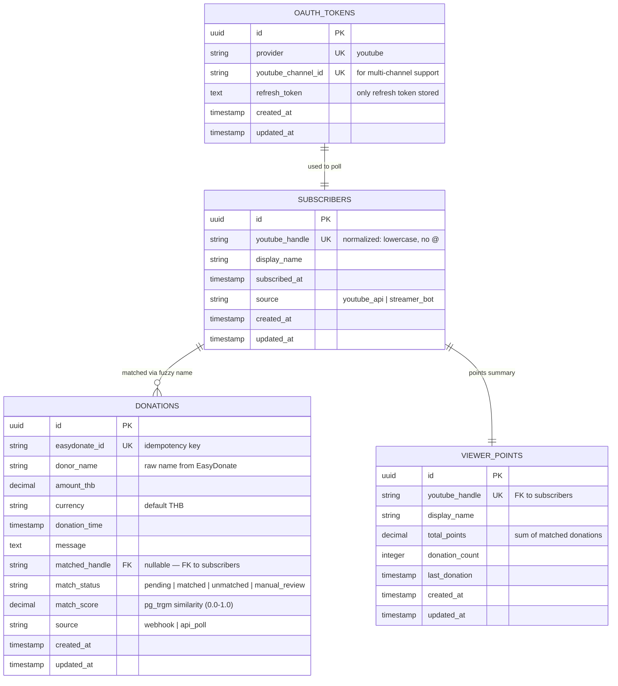
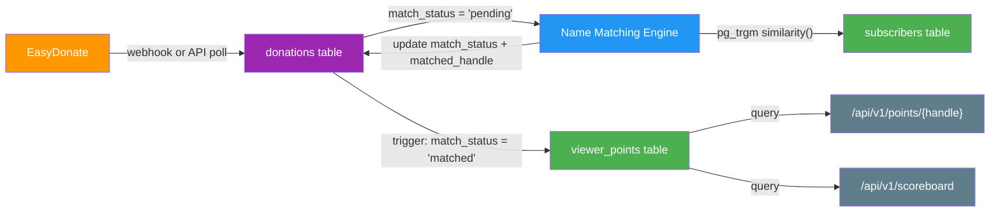

# ERD (Entity-Relationship Diagram)

> **Project:** Deerngo Bot — Viewer Relationship Management (VRM)
> **Version:** 0.1 | **Status:** Draft
> **Last Updated:** 2026-07-29

---

## Document Control

| Field | Value |
|-------|-------|
| Document Owner | SA / Designer Persona |
| Database | PostgreSQL 18 |

### Revision History

| Version | Date | Author | Change Description |
|---------|------|--------|--------------------|
| 0.1 | 2026-07-29 | SA | Initial ERD — 4 entities |

---

## 1. Purpose

> This document defines the entity-relationship model for Deerngo Bot — the logical data structures, relationships, and constraints. The physical implementation is in [[023_database_schema_DDL]].

---

## 2. ERD Diagram

---

## 3. Entity Definitions

### 3.1 Subscribers

> YouTube subscriber records captured via hybrid approach (YouTube API polling + streamer.bot real-time).

| Attribute | Type | Constraints | Description |
|-----------|------|-----------|-------------|
| id | UUID | PK, auto-generated | Unique identifier |
| youtube_handle | VARCHAR(100) | UNIQUE, NOT NULL | Normalized YouTube handle (lowercase, no @) |
| display_name | VARCHAR(255) | NOT NULL | Display name from YouTube |
| subscribed_at | TIMESTAMP WITH TIME ZONE | NOT NULL | When the viewer subscribed |
| source | VARCHAR(20) | NOT NULL, CHECK IN ('youtube_api', 'streamer_bot') | Capture source |
| created_at | TIMESTAMP WITH TIME ZONE | DEFAULT NOW() | Record creation time |
| updated_at | TIMESTAMP WITH TIME ZONE | DEFAULT NOW() | Last update time |

### 3.2 Donations

> Donation records from EasyDonate. Each donation goes through the name matching engine.

| Attribute | Type | Constraints | Description |
|-----------|------|-----------|-------------|
| id | UUID | PK, auto-generated | Unique identifier |
| easydonate_id | VARCHAR(100) | UNIQUE, NOT NULL | EasyDonate's unique donation ID (idempotency key) |
| donor_name | VARCHAR(255) | NOT NULL | Raw donor name from EasyDonate |
| amount_thb | DECIMAL(12,2) | NOT NULL, > 0 | Donation amount in THB |
| currency | VARCHAR(3) | NOT NULL, DEFAULT 'THB' | Currency code |
| donation_time | TIMESTAMP WITH TIME ZONE | NOT NULL | When the donation was made |
| message | TEXT | NULLABLE | Donation message (if any) |
| matched_handle | VARCHAR(100) | FK → subscribers.youtube_handle, NULLABLE | Matched YouTube handle |
| match_status | VARCHAR(20) | NOT NULL, DEFAULT 'pending' | Matching status |
| match_score | DECIMAL(5,4) | NULLABLE | Similarity score from pg_trgm (0.0–1.0) |
| source | VARCHAR(20) | NOT NULL, DEFAULT 'webhook' | Ingestion source |
| created_at | TIMESTAMP WITH TIME ZONE | DEFAULT NOW() | Record creation time |
| updated_at | TIMESTAMP WITH TIME ZONE | DEFAULT NOW() | Last update time |

### 3.3 Viewer Points

> Materialized summary of points per viewer. Updated by trigger when donations are matched.

| Attribute | Type | Constraints | Description |
|-----------|------|-----------|-------------|
| id | UUID | PK, auto-generated | Unique identifier |
| youtube_handle | VARCHAR(100) | UNIQUE, FK → subscribers.youtube_handle, NOT NULL | YouTube handle |
| display_name | VARCHAR(255) | NOT NULL | Display name (synced from subscribers) |
| total_points | DECIMAL(12,2) | NOT NULL, DEFAULT 0, ≥ 0 | Sum of matched donation amounts |
| donation_count | INTEGER | NOT NULL, DEFAULT 0, ≥ 0 | Number of matched donations |
| last_donation | TIMESTAMP WITH TIME ZONE | NULLABLE | Most recent donation timestamp |
| created_at | TIMESTAMP WITH TIME ZONE | DEFAULT NOW() | Record creation time |
| updated_at | TIMESTAMP WITH TIME ZONE | DEFAULT NOW() | Last update time |

### 3.4 OAuth Tokens

> OAuth 2.0 refresh tokens for YouTube Data API access. Only refresh token persisted — access tokens regenerated at runtime.

| Attribute | Type | Constraints | Description |
|-----------|------|-----------|-------------|
| id | UUID | PK, auto-generated | Unique identifier |
| provider | VARCHAR(50) | UNIQUE (with youtube_channel_id), NOT NULL | Provider name ('youtube') |
| youtube_channel_id | VARCHAR(100) | UNIQUE (with provider), NOT NULL | YouTube channel ID for multi-channel support |
| refresh_token | TEXT | NOT NULL | OAuth refresh token (long-lived) |
| created_at | TIMESTAMP WITH TIME ZONE | DEFAULT NOW() | Record creation time |
| updated_at | TIMESTAMP WITH TIME ZONE | DEFAULT NOW() | Last update time |

---

## 4. Relationship Rules

| Relationship | Cardinality | Delete Rule | Description |
|-------------|-----------|------------|-------------|
| Subscribers → Donations | 1:N | SET NULL | If subscriber deleted, matched_handle becomes NULL (donation preserved) |
| Subscribers → Viewer Points | 1:1 | CASCADE | If subscriber deleted, their points record is deleted |
| Donations → Viewer Points | N:1 (via trigger) | — | Trigger updates viewer_points when donation is matched |

---

## 5. Data Flow: Donation → Points

---

## 6. Indexes Summary

| Table | Index | Columns | Type | Purpose |
|-------|-------|---------|------|---------|
| subscribers | uk_subscribers_handle | youtube_handle | Unique | Upsert key |
| subscribers | idx_subscribers_handle_trgm | youtube_handle | GIN (trgm) | Fuzzy matching |
| donations | uk_donations_easydonate | easydonate_id | Unique | Idempotency |
| donations | idx_donations_donor_trgm | donor_name | GIN (trgm) | Fuzzy matching |
| donations | idx_donations_match_status | match_status | B-tree | Filtering unmatched |
| donations | idx_donations_time | donation_time | B-tree | Date sorting |
| viewer_points | uk_viewer_points_handle | youtube_handle | Unique | One per viewer |
| viewer_points | idx_viewer_points_total | total_points | B-tree | Scoreboard ranking |
| oauth_tokens | uk_oauth_provider_channel | provider, youtube_channel_id | Unique | One per channel |

---

## 7. Data Constraints Summary

| Constraint | Table | Rule | Description |
|-----------|-------|------|-------------|
| Positive amount | donations | CHECK (amount_thb > 0) | Donation must be positive |
| Valid match status | donations | CHECK IN (...) | Only defined statuses |
| Valid source | donations | CHECK IN ('webhook', 'api_poll') | Only defined sources |
| Non-negative points | viewer_points | CHECK (total_points >= 0) | Points cannot go negative |
| Non-empty handle | subscribers | CHECK (LENGTH > 0) | Handle must not be empty |

---

## Related Documents

| Document | Relationship |
|----------|-------------|
| [[023_database_schema_DDL]] | Physical schema implementing this ERD |
| [[021_architecture_decision_records]] | ADR-002 (PostgreSQL), ADR-006 (pg_trgm) |
| [[022_API_specification]] | API endpoints that use these entities |
| [[013_acceptance_criteria]] | ACs that verify data integrity |

---

> **Template Standard:** Based on SWEBOK v4, DMBOK v2
> **Usage:** The ERD is the *logical* data model. The [[023_database_schema_DDL]] is the *physical* implementation.
