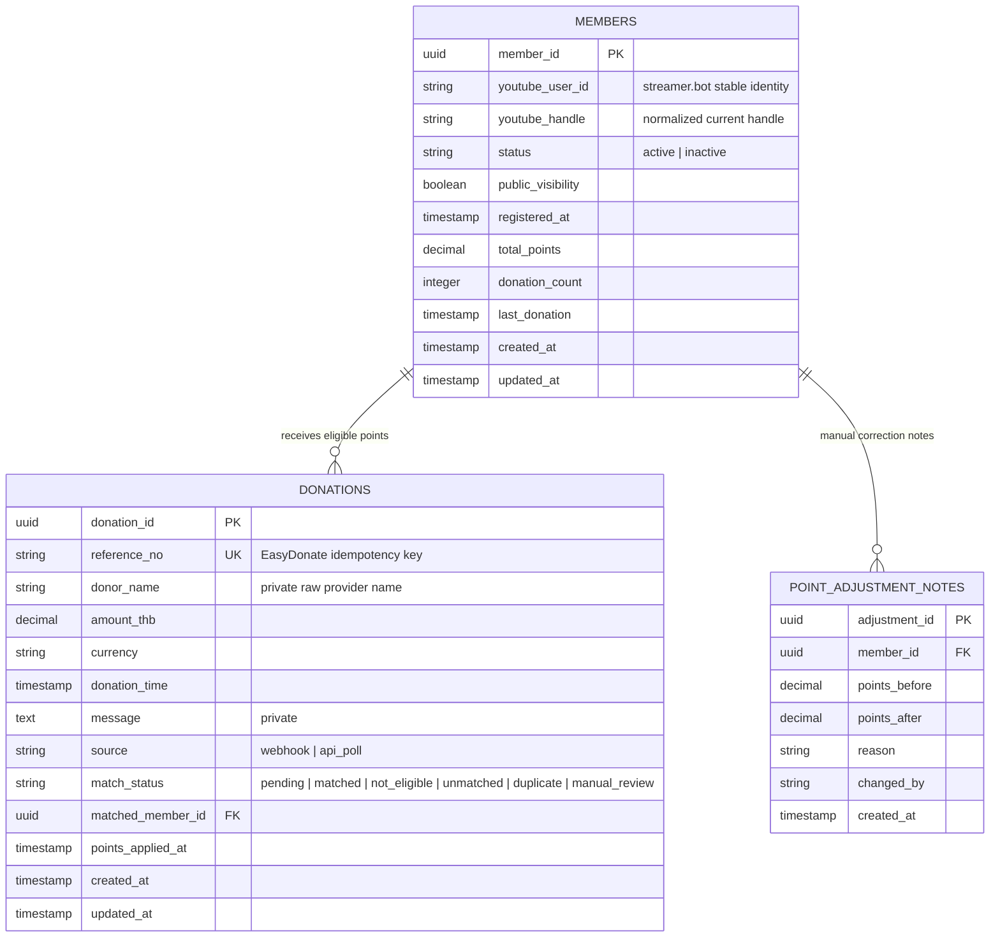
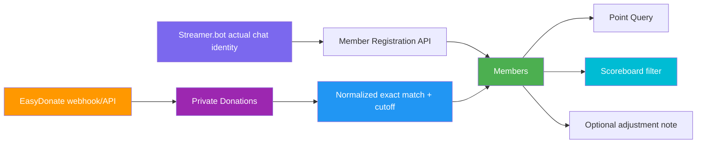

# ERD (Entity-Relationship Diagram)

> **Project:** Deerngo Bot — Viewer Relationship Management (VRM)
> **Version:** 0.2 | **Status:** Draft
> **Last Updated:** 2026-08-02
>
> **Scope change:** Explicit `members` replace the former subscriber-observation model for Phase 1.

---

## 1. Purpose

This document defines the logical data model for member registration, private donation ingestion, member points, and optional manual point adjustment notes.

## 2. ERD Diagram



---

## 3. Entity Definitions

### 3.1 Members

> A viewer who explicitly uses `:deer: register`. This is the membership and points-eligibility source.

| Attribute | Type | Constraints | Description |
|-----------|------|-------------|-------------|
| `member_id` | UUID | PK | Record identity; changes on new-handle re-registration |
| `youtube_user_id` | VARCHAR(255) | Required; unique among active members | Stable identity supplied by streamer.bot |
| `youtube_handle` | VARCHAR(100) | Required; unique among active members | Current normalized handle; no leading `@` |
| `status` | VARCHAR(20) | `active` or `inactive` | Inactive records retained for manual correction |
| `public_visibility` | BOOLEAN | Default TRUE | `:deer: public` / `:deer: private` |
| `registered_at` | TIMESTAMP | Required | Cutoff for future donation eligibility |
| `total_points` | DECIMAL | >= 0 | Points summary, starts at 0 |
| `donation_count` | INTEGER | >= 0 | Eligible matched donation count |
| `last_donation` | TIMESTAMP | Nullable | Latest eligible donation |
| `created_at` / `updated_at` | TIMESTAMP | Defaults | Record lifecycle |

No YouTube display name is stored.

### 3.2 Donations

> Private EasyDonate events retained for idempotency, reconciliation, and matching.

| Attribute | Type | Constraints | Description |
|-----------|------|-------------|-------------|
| `donation_id` | UUID | PK | Internal donation identity |
| `reference_no` | VARCHAR(100) | UNIQUE, NOT NULL | EasyDonate provider idempotency key |
| `donor_name` | VARCHAR(255) | NOT NULL | Raw donor name; private |
| `amount_thb` | DECIMAL | > 0 | Donation amount |
| `currency` | VARCHAR(3) | Default THB | Expected currency |
| `donation_time` | TIMESTAMP | Required | Cutoff comparison uses this value |
| `message` | TEXT | Nullable | Private provider message |
| `source` | VARCHAR(20) | webhook/api_poll | Ingestion route |
| `match_status` | VARCHAR(30) | Check constraint | Matching/application state |
| `matched_member_id` | UUID | Nullable FK | Member receiving points |
| `points_applied_at` | TIMESTAMP | Nullable | Idempotency marker |
| `created_at` / `updated_at` | TIMESTAMP | Defaults | Record lifecycle |

### 3.3 Point Adjustment Notes

> Optional lightweight audit record for owner/back-office direct database corrections. It is not an admin console.

| Attribute | Type | Constraints | Description |
|-----------|------|-------------|-------------|
| `adjustment_id` | UUID | PK | Adjustment record |
| `member_id` | UUID | FK → members | Corrected member |
| `points_before` | DECIMAL | Required | Before correction |
| `points_after` | DECIMAL | Required | After correction |
| `reason` | TEXT | Required | Why correction occurred |
| `changed_by` | VARCHAR(255) | Required | Owner/back-office identifier |
| `created_at` | TIMESTAMP | Default | Audit timestamp |

---

## 4. Relationship Rules

| Relationship | Cardinality | Delete Rule | Description |
|-------------|-------------|-------------|-------------|
| Members → Donations | 1:N | SET NULL | Donation preserved if member record is removed |
| Members → Point Adjustment Notes | 1:N | RESTRICT | Correction history must not disappear accidentally |
| Members → Members | — | — | Re-registration creates a new active row and inactivates the old row; no automatic point transfer |

### Active Uniqueness Rules

- Only one active member may use a given `youtube_user_id`.
- Only one active member may use a given normalized handle.
- An inactive member may retain the old handle and old points privately.
- A conflicting active handle registration is rejected.

---

## 5. Data Flow: Registration and Points



---

## 6. Public Projection Rules

The scoreboard projection includes only:

```sql
status = 'active'
AND public_visibility = TRUE
AND total_points > 0
```

Public fields:

```text
rank
youtube_handle
total_points
```

Never expose:

```text
youtube_user_id
donor_name
message
registered_at
inactive members
private members
zero-point members
```

---

## Related Documents

| Document | Relationship |
|----------|-------------|
| [[023_database_schema_DDL]] | Physical schema implementing this ERD |
| [[022_API_specification]] | API endpoints using this model |
| [[012_user_stories]] | Member and points requirements |
| [[013_acceptance_criteria]] | Data-integrity and privacy criteria |
| [[072_MM06_dev-to-po-qa-youtube-subscriber-limit_20260801]] | Approved scope change |

---

> **Template Standard:** Based on SWEBOK v4 and DMBOK v2
> **Usage:** This logical model supersedes the previous subscriber/viewer_points ERD for active Phase 1 implementation.
> **Note:** Historical schema documents may retain the old model for audit context; new code must use this model.
---

