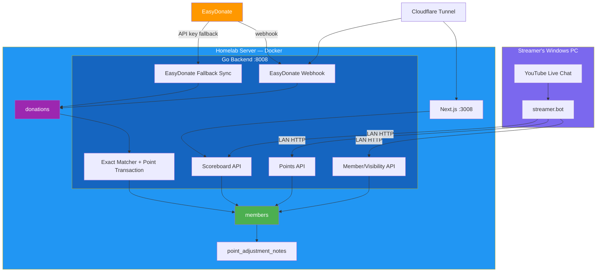
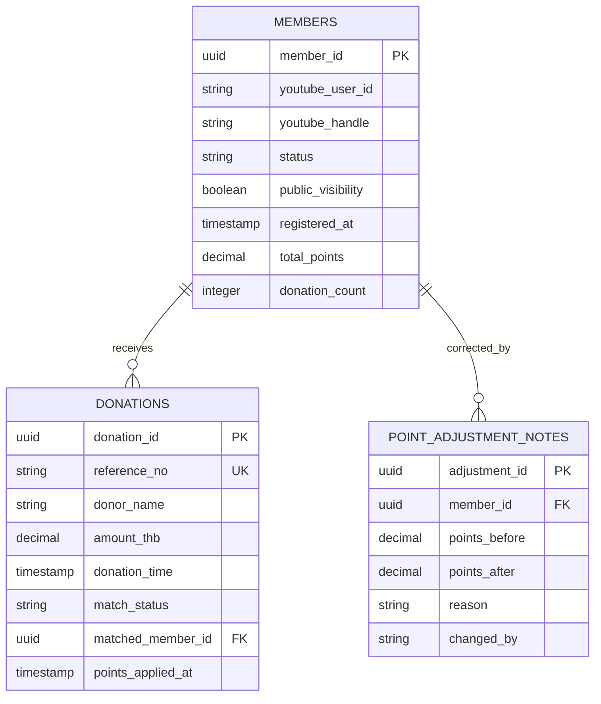
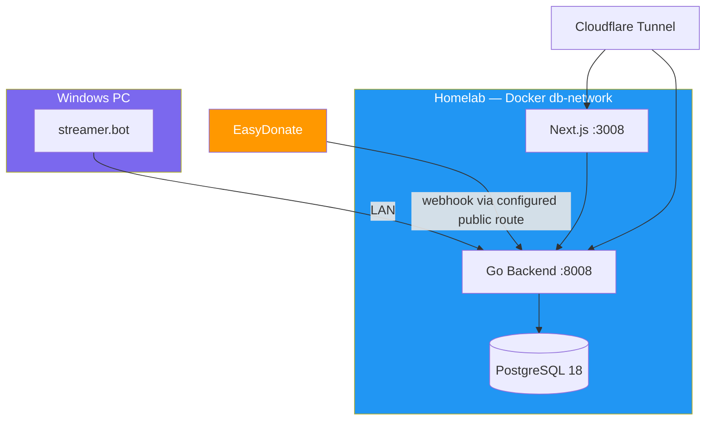

# Software Architecture Document (SAD)

> **Project:** Deerngo Bot — Viewer Relationship Management (VRM)
> **Version:** 0.2 | **Status:** Draft
> **Last Updated:** 2026-08-02
>
> **Scope change:** Explicit member registration replaces automatic YouTube subscriber capture. YouTube polling/OAuth is not active Phase 1 scope.

---

## 1. Introduction

### 1.1 Purpose

This document describes the current software architecture for member registration, EasyDonate donation ingestion, normalized exact matching, points, visibility, and the public scoreboard.

### 1.2 Scope

Phase 1 MVP includes:

- `:deer: register` from live chat using streamer.bot's actual identity
- `:deer: public` / `:deer: private`
- `:deer: point` exact/banded responses
- `:deer: donate`
- EasyDonate webhook primary + API fallback
- Active member exact matching and 1 THB = 1 point
- Public scoreboard filtered by active/public/points>0

Phase 1 excludes:

- YouTube subscriber polling
- YouTube OAuth storage
- Automatic subscriber import
- Fuzzy matching
- Admin console

---

## 2. Architecture Overview

### 2.1 Architectural Style

| Aspect | Choice | Rationale |
|--------|-------|-----------|
| Overall Style | Modular monolith | Small MVP, one Go deployment, clear internal layers |
| Communication | REST + goroutines | REST for integrations; goroutine for EasyDonate fallback sync |
| Data Management | PostgreSQL 18 | Transactions and constraints for member/point integrity |
| Deployment | Homelab Docker + Windows streamer.bot | Existing infrastructure and runtime requirements |

### 2.2 High-Level Architecture



---

## 3. Component Design

### 3.1 Member Service

| Aspect | Detail |
|--------|--------|
| Responsibility | Register/identify members, handle re-registration, visibility changes |
| Dependencies | `members` table |
| API | `POST /api/v1/members/register`, `PUT /api/v1/members/{userId}/visibility` |
| Key Logic | Actual streamer.bot identity, normalized handle, active uniqueness, old inactive/new active on handle change |

### 3.2 Donation Service

| Aspect | Detail |
|--------|--------|
| Responsibility | Receive private donation events and reconcile API data |
| Dependencies | `donations` table, EasyDonate client |
| API | `POST /api/v1/webhooks/easydonate/{path_token}` |
| Key Logic | Provider payload validation, reference idempotency, exact provider contract verification |

### 3.3 Matching and Points Service

| Aspect | Detail |
|--------|--------|
| Responsibility | Match eligible donations to active members and increment points exactly once |
| Dependencies | `members`, `donations`, optional adjustment notes |
| Schedule | After ingestion or on a short configurable worker interval |
| Key Logic | Normalize donor name; exact active-handle match; donation cutoff; transaction/lock; `members.total_points` update |

### 3.4 Points Query Service

| Aspect | Detail |
|--------|--------|
| Responsibility | Return exact or banded points and public scoreboard projection |
| API | `GET /api/v1/members/{youtube_user_id}/points`, `GET /api/v1/scoreboard` |
| Key Logic | Active-member check, visibility-aware response, 100-point private band, public data minimization |

### 3.5 EasyDonate Fallback Sync

| Aspect | Detail |
|--------|--------|
| Responsibility | Reconcile missed webhook donations |
| Dependencies | EasyDonate REST API, backend API key, `donations` |
| Schedule | Every 5 minutes, configurable |
| Key Logic | Bearer API key, provider donation-read scope, 429 backoff, `referenceNo` idempotency |

---

## 4. Data Architecture



### 4.1 Storage and Privacy

| Data | Store | Public? | Retention |
|------|-------|:-------:|-----------|
| Member identity/handle/status | `members` | Current handle only if eligible/public | Project-defined |
| YouTube display name | Not stored | No | — |
| Raw donor name/message | `donations` | No | Define reconciliation retention |
| Donation reference/amount/time | `donations` | No | Reconciliation/records policy |
| Points | `members.total_points` | Public only when eligible/public | Project-defined |
| Manual corrections | `point_adjustment_notes` | No | Audit policy |

---

## 5. Security Architecture

| Layer | Mechanism |
|-------|-----------|
| Internal streamer.bot calls | LAN restriction, actual identity payload, rate limiting |
| Webhook | Unpredictable path token until EasyDonate signing is confirmed; strict validation; body limit; rate limiting; reference idempotency |
| EasyDonate API | Backend-only Bearer API key with donation-read scope |
| Public scoreboard | Read-only filtered projection; no private/raw fields |
| Database | Parameterized sqlx queries and transactional point updates |
| Secrets | Environment/deployment secret store; never logs or Git |
| Privacy | No display-name storage; public/private visibility; correction/removal workflow |

Do not implement HMAC-specific code unless EasyDonate provides and confirms the signature contract.

---

## 6. Deployment Architecture



Only the scoreboard and the intentionally configured webhook route are public. Internal member/points routes are LAN integration routes.

---

## 7. Project Structure

```text
deerngo-bot/
├── cmd/server/main.go
├── internal/
│   ├── handler/
│   │   ├── members.go
│   │   ├── visibility.go
│   │   ├── points.go
│   │   ├── scoreboard.go
│   │   └── easydonate_webhook.go
│   ├── service/
│   │   ├── member.go
│   │   ├── donation.go
│   │   ├── matching.go
│   │   └── points.go
│   ├── repository/
│   │   ├── member.go
│   │   ├── donation.go
│   │   └── adjustment_note.go
│   ├── scheduler/
│   │   └── easydonate_sync.go
│   ├── client/
│   │   └── easydonate.go
│   └── middleware/
├── migrations/
└── README.md
```

---

## Related Documents

| Document | Path |
|----------|------|
| User Stories | `01_requirement/012_user_stories.md` |
| Acceptance Criteria | `01_requirement/013_acceptance_criteria.md` |
| API Specification | `02_design/022_API_specification.md` |
| Database Schema | `02_design/023_database_schema_DDL.md` |
| ERD | `02_design/024_ERD.md` |
| Architecture Overview | `02_design/029_architecture_overview.md` |
| Scope Decision | `07_pm/072_MM06_dev-to-po-qa-youtube-subscriber-limit_20260801.md` |

---

> **Template Standard:** Based on SWEBOK v4 and ISO/IEC/IEEE 42010
> **Usage:** Current software architecture for the revised member-based Phase 1 MVP.
