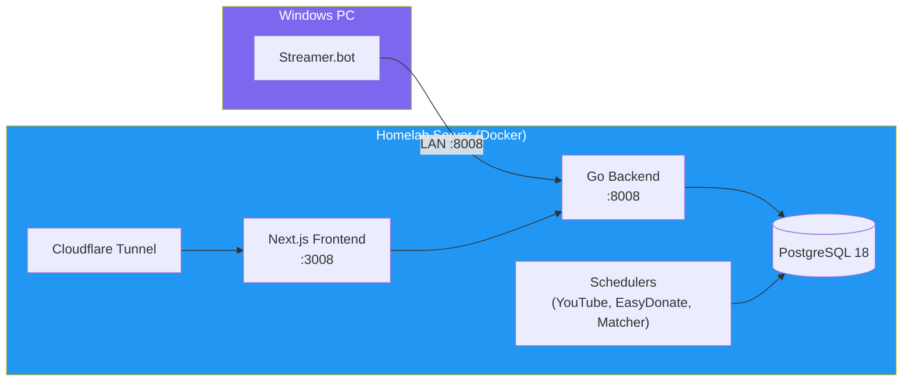
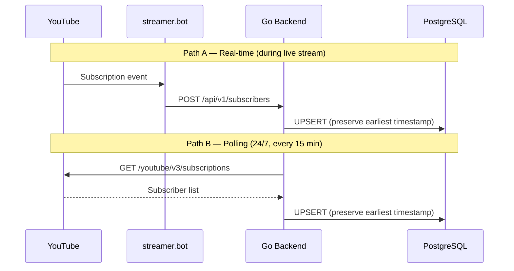
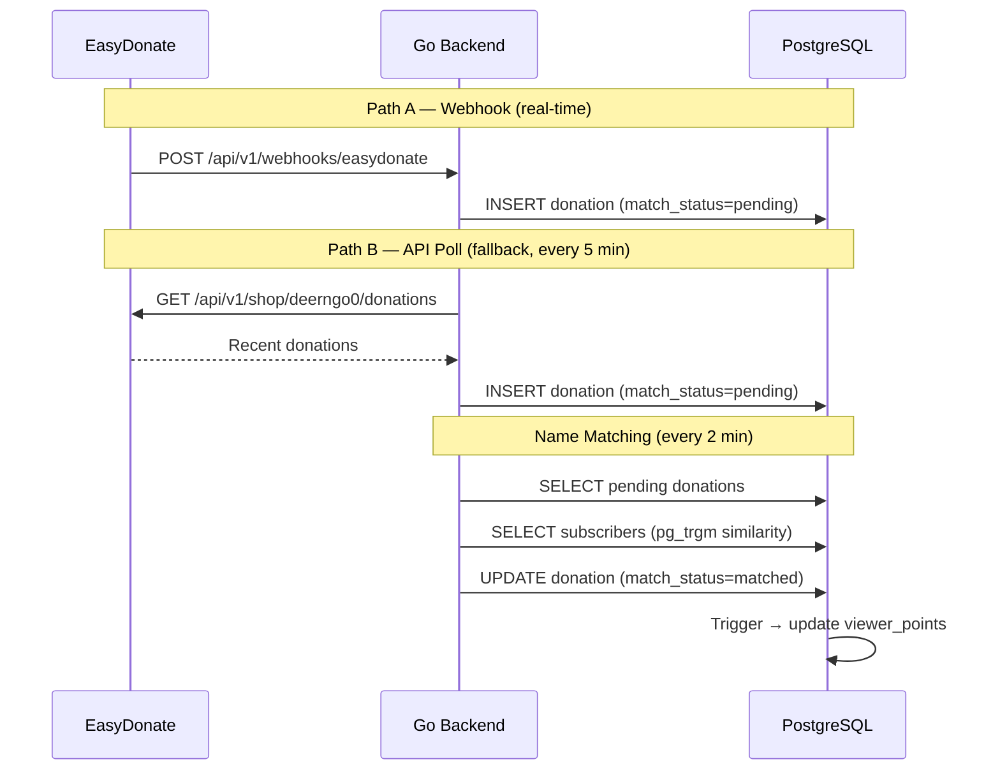
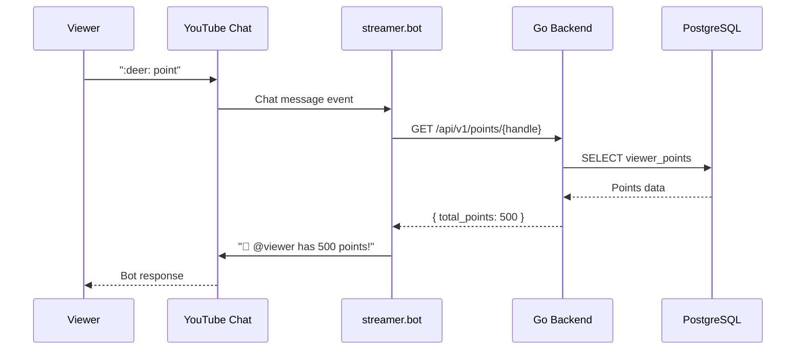

# Architecture Overview

> **Project:** Deerngo Bot — Viewer Relationship Management (VRM)
> **Version:** 0.1 | **Status:** Draft
> **Last Updated:** 2026-07-29

---

## 1. Purpose

> This document provides a high-level overview of the Deerngo Bot architecture — the "map" for all stakeholders. For detailed design, see [[025_software_architecture_document]]. For decision rationale, see [[021_architecture_decision_records]].

---

## 2. What is Deerngo Bot?

A **Viewer Relationship Management (VRM)** system for the @Deer_NGO YouTube channel. It tracks viewer contributions (subscriptions, donations) and rewards engagement through a points system visible in live chat and on a public scoreboard.

**Core idea:** 1 THB donated = 1 point. Points are matched to YouTube handles via fuzzy name matching.

---

## 3. Architecture at a Glance

---

## 4. Component Map

| Component | Technology | Port | Location | Purpose |
|-----------|-----------|------|----------|---------|
| **Go Backend** | Go 1.24+ / Fiber v3 / sqlx | :8008 | Homelab (Docker, `db-network`) | REST API + background schedulers |
| **React Frontend** | Next.js / Tailwind / DaisyUI | :3008 | Homelab (Docker, `db-network`) | Public scoreboard |
| **PostgreSQL 18** | PostgreSQL | :5432 | Homelab (Docker, `db-network`) | Data storage (`deerngo` DB) |
| **Streamer.bot** | Windows app | :7474, :8681 | Local Windows PC | YouTube chat automation |
| **Cloudflare Tunnel** | cloudflared (systemd) | — | Homelab Server | Public internet access |

---

## 5. Data Flow

### 5.1 Subscriber Capture (Hybrid)

### 5.2 Donation → Points

### 5.3 Chat Command Flow

---

## 6. Port Map

| Port | Service                | Protocol | Location                       | Access                                        |
| ---- | ---------------------- | -------- | ------------------------------ | --------------------------------------------- |
| 3008 | Next.js Frontend       | HTTP     | Homelab (Docker)               | Cloudflare Tunnel → public                    |
| 5432 | PostgreSQL 18          | TCP      | Homelab (Docker, `db-network`) | Internal only                                 |
| 7474 | streamer.bot HTTP      | HTTP     | Windows PC (localhost)         | Local only                                    |
| 8008 | Go Backend API         | HTTP     | Homelab (Docker)               | LAN (streamer.bot) + Docker network (Next.js) |
| 8681 | streamer.bot WebSocket | WS       | Windows PC (localhost)         | Local only                                    |

---

## 7. Tech Stack Summary

| Layer | Technology | Version | Purpose |
|-------|-----------|---------|---------|
| Backend Language | Go | 1.24+ | Business logic, API, schedulers |
| Web Framework | Fiber | v3 | HTTP routing, middleware |
| Database Driver | sqlx | latest | PostgreSQL access (extends database/sql) |
| Database | PostgreSQL | 18 | Data storage |
| Fuzzy Matching | pg_trgm | built-in | Name similarity in SQL |
| Frontend Framework | Next.js | 15+ | React SSR/SSG |
| CSS Framework | Tailwind CSS | 4+ | Utility-first styling |
| Component Library | DaisyUI | 5+ | Pre-built Tailwind components |
| Automation | streamer.bot | latest | YouTube chat automation |
| Public Access | Cloudflare Tunnel | existing | TLS, DDoS, CDN |

---

## 8. Sprint Plan

| Sprint | Stories | Focus |
|--------|---------|-------|
| Sprint 1 | US-001, US-002, US-003, US-010 | Subscriber registration (hybrid) + Donate command |
| Sprint 2 | US-011, US-012, US-020, US-021 | Point command + EasyDonate sync + Name matching |
| Sprint 3 | US-022, US-030, US-031 | Point query API + Scoreboard |

---

## 9. Key Metrics

| Metric | Target | Measurement |
|--------|--------|-------------|
| Subscriber Capture Rate | 100% | Compare YouTube API subscriber count vs DB count |
| Command Response Latency | <2s | streamer.bot logs |
| Donation-to-Point Accuracy | 100% | Reconcile EasyDonate donations vs points |
| Scoreboard Page Load | <2s | Browser DevTools |
| Data Freshness | <60s | Time from donation to scoreboard update |

---

## 10. Future Phases (Not in Scope)

| Phase | Features |
|-------|----------|
| Phase 2 | Leaderboard recognition (bot shouts top donors), milestones/tiers |
| Phase 3 | Point redemption, OBS overlay integration, advanced gamification |

---

## Related Documents

| Document | Relationship |
|----------|-------------|
| [[021_architecture_decision_records]] | Why these decisions were made |
| [[022_API_specification]] | API contracts |
| [[023_database_schema_DDL]] | Database schema |
| [[024_ERD]] | Data model |
| [[025_software_architecture_document]] | Detailed architecture |
| [[011_business_objective]] | Business objectives |
| [[012_user_stories]] | User stories |
| [[013_acceptance_criteria]] | Acceptance criteria |

---

> **Template Standard:** Based on SWEBOK v4, ISO/IEC/IEEE 42010
> **Usage:** This is the *entry point* — the "map" for all stakeholders. For implementation details, see [[025_software_architecture_document]].
