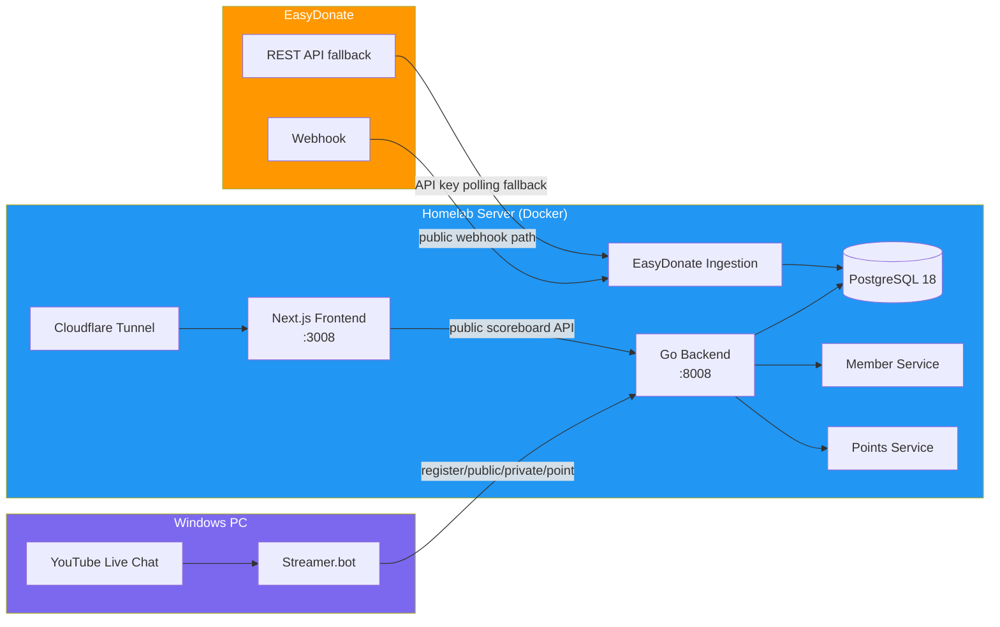
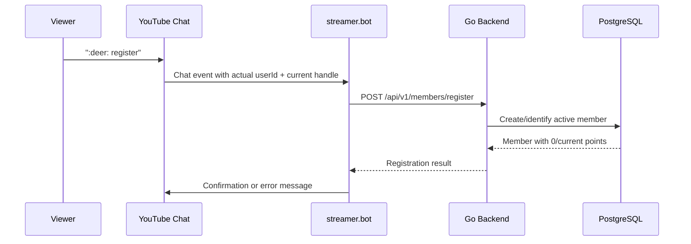
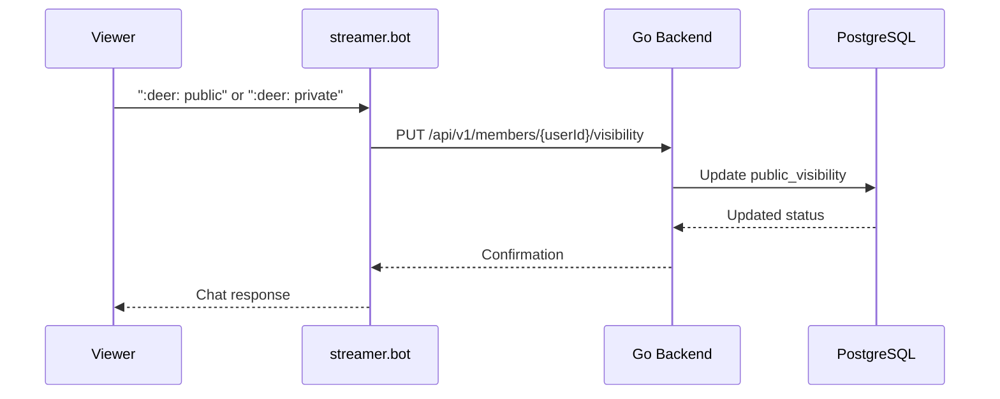
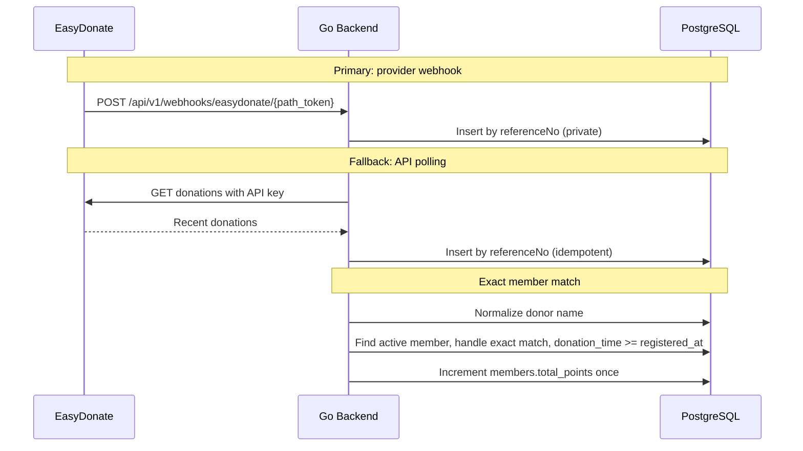
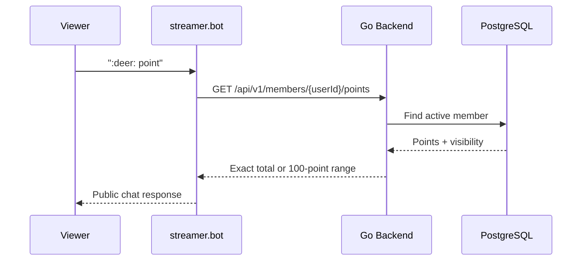
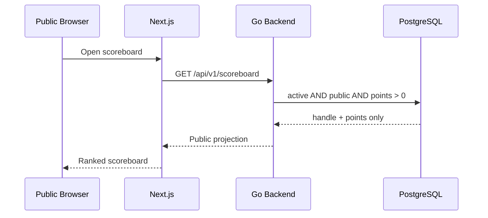

# Architecture Overview

> **Project:** Deerngo Bot — Viewer Relationship Management (VRM)
> **Version:** 0.2 | **Status:** Draft
> **Last Updated:** 2026-08-02
>
> **Scope change:** Phase 1 uses explicit `:deer: register` membership. YouTube subscriber polling and OAuth are no longer active MVP components.

---

## 1. Purpose

This document provides the high-level architecture map for the current Deerngo Bot MVP: live-chat member registration, EasyDonate donation ingestion, exact member matching, points, and a privacy-aware public scoreboard.

## 2. Architecture at a Glance



---

## 3. Component Map

| Component | Technology | Port | Location | Purpose |
|-----------|-----------|------|----------|---------|
| **Go Backend** | Go / Fiber / sqlx | :8008 | Homelab Docker | Member API, donation ingestion, points, scoreboard |
| **Next.js Frontend** | Next.js / Tailwind / DaisyUI | :3008 | Homelab Docker | Public contributor scoreboard |
| **PostgreSQL 18** | PostgreSQL | :5432 | Homelab Docker | Members, private donations, points |
| **Streamer.bot** | Windows app | :7474, :8681 | Local Windows PC | Live chat commands and actual chat identity |
| **EasyDonate** | Webhook + REST API | HTTPS | External | Donation events and fallback reconciliation |
| **Cloudflare Tunnel** | cloudflared | — | Homelab systemd | Public web and configured webhook access |

---

## 4. Data Flows

### 4.1 Member Registration



### 4.2 Visibility Commands



### 4.3 Donation to Points



### 4.4 Chat Point Query



### 4.5 Public Scoreboard



---

## 5. Port Map

| Port | Service | Location | Access |
|------|---------|----------|--------|
| 3008 | Next.js frontend | Homelab Docker | Cloudflare Tunnel → public |
| 5432 | PostgreSQL | Homelab Docker | Internal only |
| 7474 | streamer.bot HTTP | Windows PC | Local integration only |
| 8008 | Go backend | Homelab Docker | LAN from streamer.bot + Docker network |
| 8681 | streamer.bot WebSocket | Windows PC | Local integration only |

## 6. Current Technology Summary

| Layer | Technology | Purpose |
|-------|-----------|---------|
| Backend | Go + Fiber + sqlx | API and business logic |
| Database | PostgreSQL 18 | Member/donation/points persistence |
| Frontend | Next.js + Tailwind + DaisyUI | Public scoreboard |
| Live automation | streamer.bot | Identity and chat commands |
| Donations | EasyDonate webhook + API fallback | Donation ingestion |
| Public access | Cloudflare Tunnel | HTTPS exposure |

## 7. Privacy and Data Boundaries

### Stored Privately

- Stable streamer.bot/YouTube user ID
- Normalized current handle
- Active/inactive membership status
- Registration timestamp
- Point totals and donation counts
- Raw EasyDonate donor name, reference, amount, time, and message for reconciliation

### Publicly Exposed

Only active, public members with points greater than zero:

```text
rank
youtube_handle
total_points
```

No YouTube display name, stable user ID, raw donor name, donation message, private member, inactive member, or zero-point member is returned by the scoreboard API.

## 8. Sprint Plan

| Sprint | Stories | Focus |
|--------|---------|-------|
| Sprint 1 | US-001, US-002, US-010 | Member registration + donate command |
| Sprint 2 | US-011, US-012, US-020, US-021, US-022 | Visibility/point commands + EasyDonate ingestion + exact matching + points |
| Sprint 3 | US-030, US-031 | Public scoreboard and release hardening |

## 9. Superseded Components

| Component | Status | Reason |
|-----------|--------|--------|
| YouTube subscriber polling | Removed from active MVP | API exposed only a limited subscriber subset |
| YouTube OAuth token storage | Removed from active MVP | No YouTube polling in current design |
| `subscribers` table | Superseded | Explicit members are the source of eligibility |
| `viewer_points` table | Superseded | `members.total_points` is the MVP summary |
| `pg_trgm` fuzzy matching | Removed from active MVP | Normalized exact match is safer and simpler |
| HMAC EasyDonate assumption | Unverified | Current provider docs do not confirm HMAC/signature header |

---

## Related Documents

| Document | Relationship |
|----------|-------------|
| [[021_architecture_decision_records]] | Decision rationale; update required |
| [[022_API_specification]] | Current API contracts |
| [[023_database_schema_DDL]] | Current physical data model |
| [[024_ERD]] | Current logical data model |
| [[011_business_objective]] | Current business objectives |
| [[012_user_stories]] | Current user stories |
| [[013_acceptance_criteria]] | Current criteria |
| [[072_MM06_dev-to-po-qa-youtube-subscriber-limit_20260801]] | Scope-change decision |

---

> **Template Standard:** Based on SWEBOK v4 and ISO/IEC/IEEE 42010
> **Usage:** Current entry point for the member-based Phase 1 architecture.
