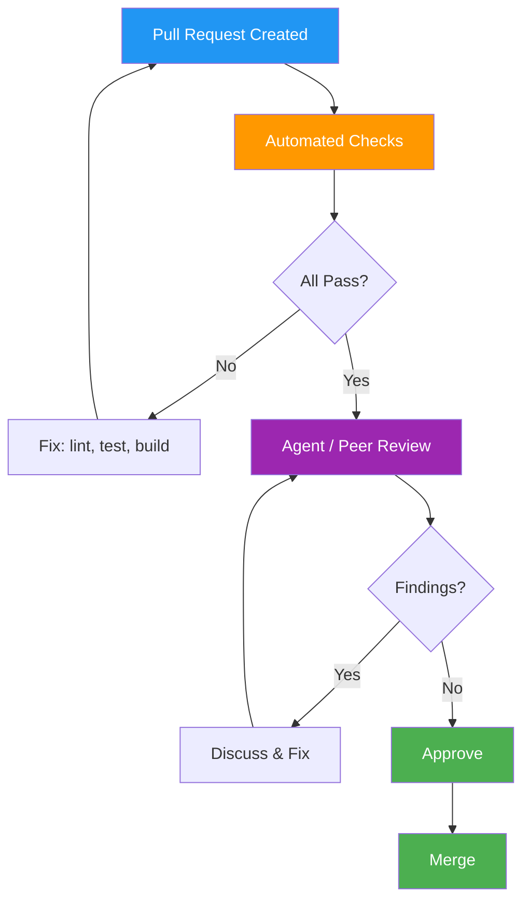

# Code Review Records — Deerngo Bot Backend (Go)

> **Project:** Deerngo Bot — VRM | **Repo:** `deerngo-bot` (backend)
> **Version:** 0.1 | **Status:** Draft
> **Last Updated:** 2026-07-30

---

## 1. Purpose

> Code review records for the Deerngo Bot Go backend. Code review is **quality gate #1**. Every PR gets reviewed. Review agents use the checklist below to ensure consistent, thorough reviews.

---

## 2. Code Review Process



---

## 3. Review Standards

| Aspect | Standard |
|--------|---------|
| PR Size | < 400 lines changed |
| Reviewers | Minimum 1 (agent or human) |
| Response Time | < 24 hours |
| Tests | Required for all feature/fix changes |
| Automated Checks | Must pass: `golangci-lint`, `go test`, `go build` |
| Commit Hygiene | Conventional Commits per [[034_SHARED_commit_messages_changelog]] |

---

## 4. Review Checklist — Go Backend

### 4.1 Automated Checks (Must Pass)

| # | Check | Command | Category |
|---|-------|---------|---------|
| 1 | Formatting | `gofmt -d .` (no diff) | Style |
| 2 | Imports grouped | `goimports -d .` (stdlib / external / internal) | Style |
| 3 | Linting | `golangci-lint run` (no errors) | Style |
| 4 | Tests pass | `go test ./...` | Testing |
| 5 | Build succeeds | `go build ./...` | Build |
| 6 | No vulnerabilities | `govulncheck ./...` | Security |

### 4.2 Manual Review Checklist

| # | Check | Category | What to Look For |
|---|-------|---------|-----------------|
| 7 | Error handling | Reliability | All errors checked, wrapped with `fmt.Errorf("...: %w", err)`, no swallowed errors |
| 8 | Context propagation | Reliability | `context.Context` passed through all layers, used for cancellation |
| 9 | SQL injection | Security | All queries use sqlx named parameters or `?` placeholders — NO string concatenation |
| 10 | Secret handling | Security | No hardcoded secrets — all from env vars via `config.go` |
| 11 | Resource cleanup | Reliability | `defer rows.Close()`, `defer resp.Body.Close()` — no leaks |
| 12 | Goroutine leaks | Reliability | Goroutines have exit conditions (`ctx.Done()`, channels) |
| 13 | Error wrapping | Maintainability | Errors wrapped with context: `fmt.Errorf("upserting subscriber: %w", err)` |
| 14 | Naming | Style | Follows [[035_BE_coding_standards]] — PascalCase exported, camelCase unexported |
| 15 | Test coverage | Testing | New code has tests — ≥ 80% on service layer |
| 16 | Table-driven tests | Testing | Multiple input/output cases use `[]struct{}` pattern |
| 17 | API contract | Documentation | Endpoint changes match [[022_SHARED_API_specification]] |
| 18 | DB schema | Documentation | New queries match [[023_BE_database_schema_DDL]] |
| 19 | Scheduler safety | Reliability | Schedulers handle errors gracefully, don't crash on single failure |
| 20 | Fiber handler pattern | Style | Handlers delegate to service layer — no business logic in handlers |

### 4.3 Sprint-Specific Checks

| Sprint | Focus | Extra Checks |
|--------|-------|-------------|
| Sprint 1 | Subscribers + Donate | Upsert logic preserves earliest timestamp; streamer.bot payload validation |
| Sprint 2 | Points + Matcher | pg_trgm threshold is configurable; anonymous donations flagged as unmatched |
| Sprint 3 | Scoreboard | `WHERE total_points > 0` filter present; pagination works correctly |

---

## 5. Review Metrics

| Metric | Target | Current |
|--------|--------|---------|
| PRs reviewed per sprint | > 5 | — |
| Avg time to first review | < 24h | — |
| Findings per PR | < 5 | — |
| Critical/blocking findings | 0 | — |
| Review coverage | 100% | — |
| Rework rate (> 2 rounds) | < 20% | — |

---

## 6. Common Findings — Go

| Finding | Frequency | Prevention |
|---------|:---:|-----------|
| Missing error check after DB call | High | Checklist #7 |
| `context.Context` not propagated | Medium | Checklist #8 |
| SQL string concatenation | Low | Checklist #9 — use sqlx |
| Goroutine without exit condition | Medium | Checklist #12 |
| Missing `defer rows.Close()` | Medium | Checklist #11 |
| Business logic in handler | Medium | Checklist #20 |
| No test for error path | Medium | Checklist #15 |

---

## 7. Review Record Template

```markdown
### Review #001 — [Feature / Fix Summary]

| Field | Detail |
|-------|--------|
| **PR** | [#N](link) |
| **Author** | Dev / Agent |
| **Reviewer** | Review Agent / Human |
| **Date** | YYYY-MM-DD |
| **Type** | feat / fix / refactor / chore |
| **Lines Changed** | +XX / -YY |
| **Sprint** | Sprint N |

**Findings:**

| # | Severity | Category | Description | Resolution |
|---|:---:|---------|-------------|-----------|
| 1 | 🔴 | Security | Hardcoded DB password in config.go | Extracted to env var |
| 2 | 🟡 | Testing | Missing test for duplicate easydonate_id | Added test |
| 3 | 🟢 | Style | Variable name too short (`h` → `handle`) | Renamed |

**Outcome:** ✅ Approved / 🔄 Changes Requested / ❌ Rejected

**Lessons Learned:** [One takeaway to prevent recurrence]
```

### Severity Legend

| Level | Meaning | Example |
|:---:|---------|---------|
| 🔴 | **Critical** — blocks merge | Security vulnerability, data loss risk, SQL injection |
| 🟡 | **Important** — fix before merge | Missing tests, swallowed errors, missing context |
| 🟢 | **Nit** — non-blocking | Variable naming, minor style, optional refactor |

---

## Related Documents

| Document | Path |
|----------|------|
| Coding Standards | `03_construction/035_BE_coding_standards.md` |
| Commit Messages | `03_construction/034_SHARED_commit_messages_changelog.md` |
| API Specification | `02_design/022_SHARED_API_specification.md` |
| DB Schema | `02_design/023_BE_database_schema_DDL.md` |

---

> **Template Standard:** Based on SWEBOK v4, ISO/IEC 20246
> **Usage:** Review agents use the checklist for every PR. Track metrics. Capture significant findings.
