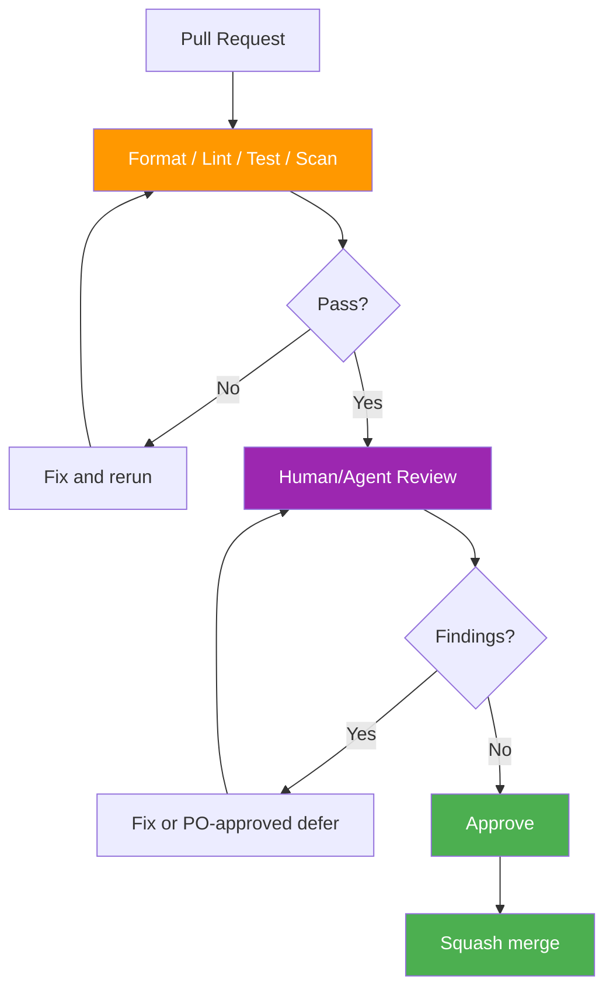

# Code Review Records — Deerngo Bot Backend (Go)

> **Project:** Deerngo Bot — VRM | **Repo:** `deerngo-bot` (backend)
> **Version:** 0.2 | **Status:** Draft
> **Last Updated:** 2026-08-02
>
> Every PR is reviewed against the active member-based contract. Historical subscriber/poller code must not be reintroduced without an approved scope change.

## 1. Review Process



## 2. Review Standards

| Aspect | Standard |
|--------|---------|
| PR Size | Prefer <400 changed lines |
| Reviewers | Minimum one reviewer |
| Tests | Required for all behavior changes |
| Automated | `gofmt`, `go vet`, linter, tests, build, vulnerability scan |
| Contract | API/DDL/AC updated together |
| Secrets | No credentials/provider payloads in code or logs |

## 3. Automated Checklist

| # | Check | Command |
|---|-------|---------|
| 1 | Formatting | `gofmt -d .` |
| 2 | Lint | `golangci-lint run` |
| 3 | Tests | `go test -race ./...` |
| 4 | Build | `go build ./...` |
| 5 | Vulnerabilities | `govulncheck ./...` |
| 6 | Migration tests | Apply/rollback in isolated PostgreSQL |
| 7 | Diff sanity | `git diff --check` |

## 4. Manual Checklist — Active MVP

### Domain and Data

- [ ] Member registration trusts actual streamer.bot identity, not typed handle.
- [ ] Handle normalization is trim + one leading `@` removal + lowercase only.
- [ ] Active user and active handle uniqueness are enforced in DB.
- [ ] Same-handle registration is idempotent.
- [ ] Changed-handle registration is atomic: old inactive/points preserved, new active/0 points.
- [ ] No display-name field is introduced.
- [ ] Inactive members cannot be matched/queried/shown normally.
- [ ] Donation cutoff uses actual donation timestamp.
- [ ] Exact matching only; no fuzzy/`pg_trgm` attribution.
- [ ] Duplicate/concurrent donation processing cannot double-count.
- [ ] Manual correction path records before/after/reason/operator.

### API and Security

- [ ] Error shapes match API specification.
- [ ] Webhook provider contract is verified; no assumed HMAC.
- [ ] Path-token fallback is random, secret, validated, rate-limited, and body-limited if needed.
- [ ] EasyDonate API key is backend-only.
- [ ] Public scoreboard response contains only rank/handle/points/pagination metadata.
- [ ] CORS is explicit; internal routes are not wildcard-enabled.
- [ ] Logs redact keys, path tokens, donor data, display names, and full payloads.

### Maintainability

- [ ] Handlers delegate business logic to services.
- [ ] Repositories use parameterized sqlx queries.
- [ ] Context cancellation/row closure/HTTP response body closure are correct.
- [ ] Tests cover happy/error/concurrency/privacy cases.
- [ ] Documentation links point to current versioned files.

## 5. Sprint Focus

| Sprint | Focus | Extra Checks |
|--------|-------|--------------|
| Sprint 1 | Members + donate | Schema, normalization, registration transaction, action identity |
| Sprint 2 | Points + ingestion | Provider contract, cutoff, exact match, exactly-once, visibility |
| Sprint 3 | Scoreboard/release | Allowlist, pagination, privacy, manual correction, deployment gate |

## 6. Review Record Template

```markdown
### Review #NNN — [Feature/Fix]

| Field | Detail |
|-------|--------|
| PR | [link] |
| Author | |
| Reviewer | |
| Date | |
| Story/Issue | |
| Sprint | |

| # | Severity | Category | Finding | Resolution |
|---|:--------:|----------|---------|------------|

Outcome: ✅ Approved / 🔄 Changes Requested / ❌ Rejected / ⏸️ Blocked
```

## Related Documents

| Document | Path |
|----------|------|
| Coding Standards | `03_construction/035_BE_coding_standards.md` |
| Security Standards | `06_security/062_coding_standards_security.md` |
| API Specification | `02_design/022_API_specification.md` |
| DB Schema | `02_design/023_database_schema_DDL.md` |
| Commit Guidance | `03_construction/034_SHARED_commit_messages_changelog.md` |
| Scope Handoff | `07_pm/072_MM07_po-to-dev-qa-member-registration-mvp_20260802.md` |

---

> **Template Standard:** Based on SWEBOK v4 and ISO/IEC 20246
> **Usage:** Mandatory review checklist for the revised member-based MVP.
---
