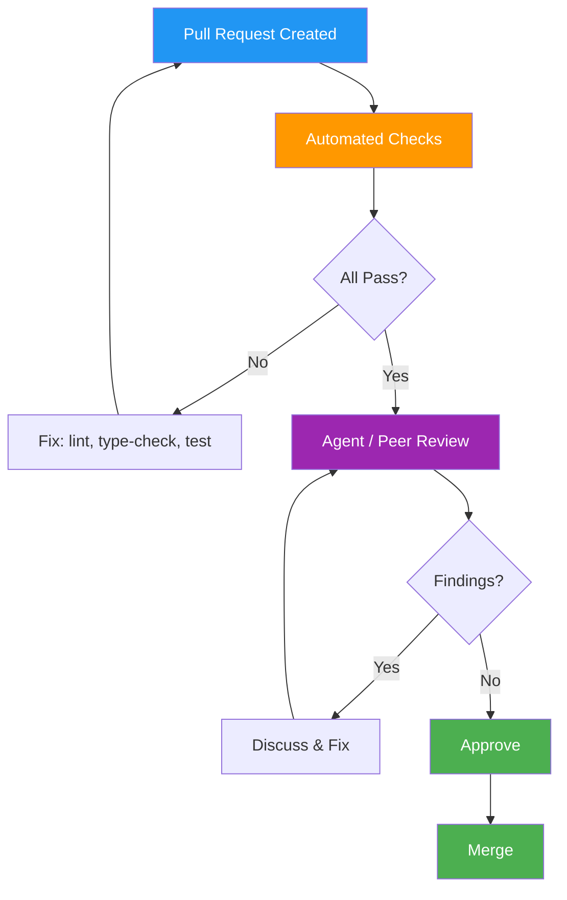

# Code Review Records — Deerngo Bot Frontend (Next.js)

> **Project:** Deerngo Bot — VRM | **Repo:** `deerngo-web` (frontend)
> **Version:** 0.1 | **Status:** Draft
> **Last Updated:** 2026-07-30

---

## 1. Purpose

> Code review records for the Deerngo Bot Next.js frontend. Code review is **quality gate #1**. Every PR gets reviewed. Review agents use the checklist below to ensure consistent, thorough reviews.

---

## 2. Code Review Process



---

## 3. Review Standards

| Aspect | Standard |
|--------|---------|
| PR Size | < 400 lines changed |
| Reviewers | Minimum 1 (agent or human) |
| Response Time | < 24 hours |
| Tests | Required for all feature/fix changes |
| Automated Checks | Must pass: `next lint`, `tsc --noEmit`, `vitest` |
| Commit Hygiene | Conventional Commits per [[034_SHARED_commit_messages_changelog]] |

---

## 4. Review Checklist — Next.js Frontend

### 4.1 Automated Checks (Must Pass)

| # | Check | Command | Category |
|---|-------|---------|---------|
| 1 | Linting | `next lint` (no errors) | Style |
| 2 | Type checking | `tsc --noEmit` (no errors) | Type Safety |
| 3 | Tests pass | `vitest` (all green) | Testing |
| 4 | Build succeeds | `npm run build` | Build |
| 5 | Formatting | `prettier --check .` (no diff) | Style |

### 4.2 Manual Review Checklist

| # | Check | Category | What to Look For |
|---|-------|---------|-----------------|
| 6 | No `any` type | Type Safety | Use `unknown`, generics, or proper types — ESLint enforces |
| 7 | Server vs Client components | Architecture | `'use client'` directive only where needed (interactivity, hooks) |
| 8 | Data fetching | Performance | SWR for client data, server components for initial load — NO `useEffect` + `fetch` |
| 9 | DaisyUI components | Style | Use pre-built components (`table`, `badge`, `alert`) — no reinventing |
| 10 | Tailwind utilities | Style | No custom CSS files — all styling via Tailwind classes |
| 11 | Responsive design | UX | Mobile-first — test at `sm:`, `md:`, `lg:` breakpoints |
| 12 | Error handling | Reliability | Error boundaries, fallback UI for API failures |
| 13 | Loading states | UX | Loading skeletons/spinners while data fetches |
| 14 | Empty states | UX | "No contributors yet" when data is empty |
| 15 | Accessibility | UX | Semantic HTML, `aria-label` on interactive elements, keyboard navigable |
| 16 | API contract | Documentation | Response types match [[022_SHARED_API_specification]] |
| 17 | Component naming | Style | PascalCase, descriptive — `ScoreboardRow` not `Row` |
| 18 | Prop types | Type Safety | All props explicitly typed via `interface` |
| 19 | No inline styles | Style | All styling via Tailwind — no `style={{}}` |
| 20 | Image optimization | Performance | Use `next/image` for images, specify width/height |

### 4.3 Wireframe Compliance

| # | Check | Reference |
|---|-------|-----------|
| 21 | Layout matches wireframe | [[026_FE_wireframes_lofi.md]] — WF-001 to WF-005 |
| 22 | All 5 states implemented | Happy (desktop + mobile), Empty, Error, Loading |
| 23 | Colors match style guide | [[028_FE_style_guide.md]] — Forest Green + Warm Amber |
| 24 | Typography matches | [[028_FE_style_guide.md]] — type scale |

---

## 5. Review Metrics

| Metric | Target | Current |
|--------|--------|---------|
| PRs reviewed per sprint | > 5 | — |
| Avg time to first review | < 24h | — |
| Findings per PR | < 5 | — |
| Critical/blocking findings | 0 | — |
| Review coverage | 100% | — |
| Rework rate (> 2 rounds) | < 20% | — |

---

## 6. Common Findings — Next.js

| Finding | Frequency | Prevention |
|---------|:---:|-----------|
| Missing `'use client'` directive | Medium | Checklist #7 |
| `useEffect` + `fetch` instead of SWR | High | Checklist #8 |
| `any` type used | Medium | Checklist #6 |
| Missing loading/error states | Medium | Checklist #12, #13, #14 |
| Custom CSS instead of Tailwind | Low | Checklist #10 |
| Layout doesn't match wireframe | Medium | Checklist #21 |
| Missing responsive breakpoints | Medium | Checklist #11 |

---

## 7. Review Record Template

```markdown
### Review #001 — [Feature / Fix Summary]

| Field | Detail |
|-------|--------|
| **PR** | [#N](link) |
| **Author** | Dev / Agent |
| **Reviewer** | Review Agent / Human |
| **Date** | YYYY-MM-DD |
| **Type** | feat / fix / refactor / chore |
| **Lines Changed** | +XX / -YY |
| **Sprint** | Sprint N |

**Findings:**

| # | Severity | Category | Description | Resolution |
|---|:---:|---------|-------------|-----------|
| 1 | 🔴 | Type Safety | API response not typed — using `any` | Added ScoreboardResponse interface |
| 2 | 🟡 | UX | Missing error state for API failure | Added ErrorState component |
| 3 | 🟢 | Style | Inconsistent spacing — used `style={{}}` | Converted to Tailwind classes |

**Outcome:** ✅ Approved / 🔄 Changes Requested / ❌ Rejected

**Lessons Learned:** [One takeaway to prevent recurrence]
```

### Severity Legend

| Level | Meaning | Example |
|:---:|---------|---------|
| 🔴 | **Critical** — blocks merge | Security issue, broken layout, no error handling |
| 🟡 | **Important** — fix before merge | Missing states, `any` type, no tests |
| 🟢 | **Nit** — non-blocking | Spacing preference, minor style tweak |

---

## Related Documents

| Document | Path |
|----------|------|
| Coding Standards | `03_construction/035_FE_coding_standards.md` |
| Commit Messages | `03_construction/034_SHARED_commit_messages_changelog.md` |
| Wireframes | `02_design/026_FE_wireframes_lofi.md` |
| Style Guide | `02_design/028_FE_style_guide.md` |
| API Specification | `02_design/022_SHARED_API_specification.md` |

---

> **Template Standard:** Based on SWEBOK v4, ISO/IEC 20246
> **Usage:** Review agents use the checklist for every PR. Track metrics. Capture significant findings.
