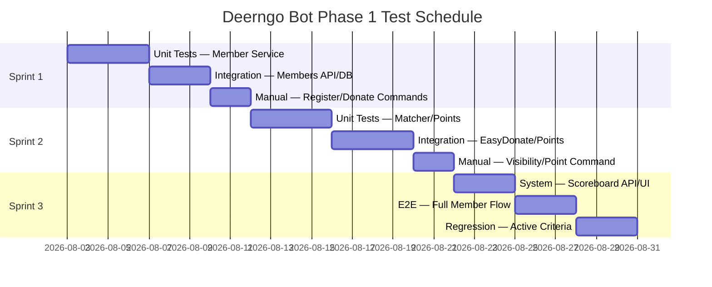

# Test Plan

> **Project:** Deerngo Bot — Viewer Relationship Management (VRM)
> **Version:** 0.2 | **Status:** Draft
> **Last Updated:** 2026-08-02
>
> **Scope change:** YouTube subscriber polling and automatic subscriber capture are superseded. The active plan covers explicit member registration, donation ingestion, exact matching, points, visibility, and scoreboard behavior.

---

## Document Control

| Field | Value |
|-------|-------|
| Document Owner | QA Engineer |
| Approvals | PO, SA / Dev, QA |

---

## 1. Introduction

### 1.1 Purpose

This plan defines the test approach for 62 active acceptance criteria across 10 active user stories and 4 epics.

### 1.2 Scope

| In Scope | Out of Scope |
|---------|-------------|
| Member registration and re-registration | YouTube subscriber polling and OAuth |
| streamer.bot command integration | Admin console |
| EasyDonate webhook and API fallback | Fuzzy `pg_trgm` matching |
| Normalized exact matching and cutoff | Automatic historical point backfill |
| Point transaction/idempotency | Phase 2 gamification |
| Visibility and privacy-aware point response | Deep performance/load testing (Phase 2) |
| Public scoreboard API/page filtering | Disaster recovery testing (separate plan) |

### 1.3 Project Context

| Aspect | Detail |
|--------|--------|
| System | Viewer Relationship Management for @Deer_NGO |
| Backend | Go / Fiber / sqlx — port :8008 |
| Frontend | Next.js / Tailwind / DaisyUI — port :3008 |
| Database | PostgreSQL 18, isolated `deerngo_test` |
| Automation | streamer.bot on Windows |
| Donation Source | EasyDonate webhook + API fallback |
| Public Access | Cloudflare Tunnel → scoreboard and configured webhook route |

---

## 2. Test Strategy

### 2.1 Test Levels

| Level | Type | Automation | Coverage Target | Tools |
|-------|------|-----------|----------------|-------|
| Unit | White-box | 100% | ≥80% service layer | Go testing + testify |
| Integration | Gray-box | 80% | Member/donation/points endpoints and transactions | httptest + test PostgreSQL |
| System | Black-box | 60% | Active functional requirements | Docker Compose + curl/Postman |
| E2E | Black-box | 40% | Register → donation → points → scoreboard | Docker Compose + scripts |
| Manual | Exploratory | 0% | streamer.bot, live chat, Cloudflare, UI | Live/test environment |

### 2.2 Test Techniques

| Technique | Application |
|-----------|------------|
| Equivalence Partitioning | User IDs, handles, donor names, amounts, webhook payloads |
| Boundary Value Analysis | Handle 1/100 chars, amount >0, 100-point bands, pagination 1/100 |
| Decision Table | New/same/new-handle/conflicting registration; public/private/inactive point responses |
| State Transition | Member active → inactive; donation pending → matched/not_eligible/unmatched |
| Concurrency Testing | Duplicate webhook and simultaneous point application |
| Error Guessing | Empty fields, invalid path token, duplicate reference, 429, backend unavailable |
| Privacy Inspection | Public response field allowlist and log redaction |

### 2.3 Test Approach by Epic

| Epic | Strategy | Key Risks |
|------|----------|-----------|
| E-01 Member Registration | Unit/integration tests for normalization, idempotency, active uniqueness, re-registration transaction | Duplicate active user/handle; old points accidentally transferred |
| E-02 Bot Commands | Manual streamer.bot tests plus API contract tests | Actual chat identity; public chat response wording; backend offline |
| E-03 Points Engine | Integration tests for webhook/API ingestion, cutoff, exact match, transaction and idempotency | Wrong member attribution; duplicate points; provider contract mismatch |
| E-04 Scoreboard | API field/filter tests plus frontend rendering/responsive checks | Private/inactive/zero-point leakage; ranking/pagination |

---

## 3. Test Environment

| Environment | Purpose | URL | Data |
|------------|---------|-----|------|
| Local Docker | Developer/QA unit and integration | `localhost:8008`, `localhost:3008` | Synthetic members/donations |
| Homelab LAN | E2E and streamer.bot integration | `192.168.1.121:8008`, `:3008` | Synthetic or approved test data |
| Tunnel smoke | Public scoreboard/webhook route | Configured HTTPS hostname | Approved smoke data only |

### 3.1 Test Database

| Item | Detail |
|------|--------|
| Database | `deerngo_test` |
| Extensions | `uuid-ossp`; no `pg_trgm` required for active matching |
| Seed Data | Active public, active private, inactive members + synthetic donations |
| Reset | `TRUNCATE` + reseed before test cycles |
| Privacy | Never use real client donor names/messages in fixtures |

### 3.2 Mock Strategy

| External Dependency | Mock Approach |
|--------------------|---------------|
| EasyDonate API | Mock HTTP client: new donations, duplicate reference, empty, 429, provider error |
| EasyDonate webhook | httptest: valid documented payload, invalid path, invalid fields, duplicate |
| streamer.bot | Manual Windows integration; HTTP requests can be contract-tested separately |
| YouTube API | Not in active MVP; no polling tests |

---

## 4. Test Schedule

---

## 5. Entry & Exit Criteria

| Phase | Entry Criteria | Exit Criteria |
|-------|---------------|--------------|
| Unit | Code compiled and interfaces stable | ≥80% service coverage; tests pass |
| Integration | Unit tests pass; test DB available | Members, visibility, points, webhook, sync, and DB constraints pass |
| System | Integration pass; deployment environment stable | All 43 🔴 Must Have ACs verified |
| E2E | System pass; provider payload known | Register → donation → points → scoreboard path passes |
| Regression | Defects fixed or accepted by PO | All active criteria covered; no open critical defects |

---

## 6. Defect Management

| Severity | Definition | Response |
|---------|------------|----------|
| 🔴 Critical | Data loss, security breach, system crash, wrong/double points | Immediate PO + Dev escalation |
| 🟡 High | Major feature broken with no acceptable workaround | Same-day triage |
| 🟢 Medium | Workaround exists or non-critical data/UI issue | Next sprint |
| ⚪ Low | Cosmetic/documentation improvement | Backlog |

---

## 7. Risk & Mitigations

| Risk | Probability | Impact | Mitigation |
|------|-----------|--------|-----------|
| streamer.bot not testable in CI | High | Medium | Manual checklist and recorded live-stream evidence |
| EasyDonate payload/security differs from assumed docs | Medium | High | Provider dashboard/test-event verification before production |
| Duplicate webhook/API event | Medium | Critical | Unique `reference_no` and transaction guard |
| Incorrect handle match | Medium | High | Exact normalization only; active-handle uniqueness |
| Manual handle-change point transfer error | Medium | High | Inactive old row, new zero-point row, transaction + note |
| Public data leakage | Medium | High | Response allowlist and automated privacy tests |
| Tunnel/backend downtime | Low | Medium | Health checks and API fallback reconciliation |

---

## 8. Test Data Strategy

### 8.1 Seed Data

| Data Type | Records | Purpose |
|-----------|---------|---------|
| Active public member | `testviewer1`, 500 points | Exact points and scoreboard |
| Active private member | `privateviewer`, 563 points | Banded point response and hidden scoreboard |
| Active zero-point member | `newviewer`, 0 points | Registration and scoreboard exclusion |
| Inactive member | `oldviewer`, 700 points | Hidden matching/query/scoreboard |
| Donations | Synthetic references and amounts | Cutoff, exact match, duplicate, unmatched |

### 8.2 Mock Scenarios

| Scenario | Mock | Validates |
|----------|------|-----------|
| New registration | Valid user ID + `@Viewer123` | AC-001a / AC-002a |
| Same registration | Same user ID/handle | AC-001b / AC-002b |
| Handle change | Same user ID/new handle | AC-001c / AC-002c |
| Active handle conflict | Different ID/same handle | AC-001d / AC-002d |
| Donor formatting | `@Deer123`, ` deer123 `, `DEER123` | AC-021a/b |
| Pre-registration donation | Donation time before registration | AC-021d |
| Duplicate provider event | Same `referenceNo` twice | AC-020b / AC-021g |
| Provider rate limit | 429 + Retry-After | AC-020d |
| Invalid webhook | Bad path/amount/required field | AC-020g |
| Public data inspection | API response fixture | AC-031f |

---

## 9. Active Traceability Summary

| User Story | ACs | 🔴 | 🟡 | Test Cases | Epic |
|------------|-----|-----|-----|-----------|------|
| US-001 | 7 | 7 | 0 | TC-M001–M007 | E-01 |
| US-002 | 6 | 5 | 1 | TC-M008–M013 | E-01 |
| US-010 | 4 | 2 | 2 | TC-M014–M017 | E-02 |
| US-011 | 6 | 6 | 0 | TC-M018–M023 | E-02 |
| US-012 | 7 | 6 | 1 | TC-M024–M030 | E-02 |
| US-020 | 7 | 5 | 2 | TC-M031–M037 | E-03 |
| US-021 | 7 | 6 | 1 | TC-M038–M044 | E-03 |
| US-022 | 6 | 6 | 0 | TC-M045–M050 | E-03 |
| US-030 | 6 | 0 | 6 | TC-M051–M056 | E-04 |
| US-031 | 6 | 0 | 6 | TC-M057–M062 | E-04 |
| **Total** | **62** | **43** | **19** | **TC-M001–M062** | |

Superseded US-003/TC-012–TC-018 are retained only in historical QA records and are not part of active regression.

---

## 10. Quality Metrics

| Metric | Target | Measurement |
|--------|--------|------------|
| 🔴 AC coverage | 100% (43/43) | Active traceability |
| 🟡 AC coverage | 100% (19/19) before release | Active traceability |
| Service-layer coverage | ≥80% | Go cover |
| Point correctness | 100% eligible donations applied exactly once | Reconciliation |
| Public data compliance | 100% sampled responses pass allowlist | API tests |
| Regression pass rate | 100% active criteria | Test report |

---

## Related Documents

| Document | Relationship |
|----------|-------------|
| [[013_acceptance_criteria]] | Primary active criteria |
| [[012_user_stories]] | Stories mapped to tests |
| [[022_API_specification]] | API contract |
| [[023_database_schema_DDL]] | DB integrity |
| [[042_test_cases]] | Detailed case execution |
| [[043_defect_report]] | Defect tracking |
| [[045_coverage_report]] | Coverage summary |

---

> **Template Standard:** Based on SWEBOK v4 and ISO/IEC/IEEE 29119
> **Usage:** Current test contract for the member-based Phase 1 MVP.
