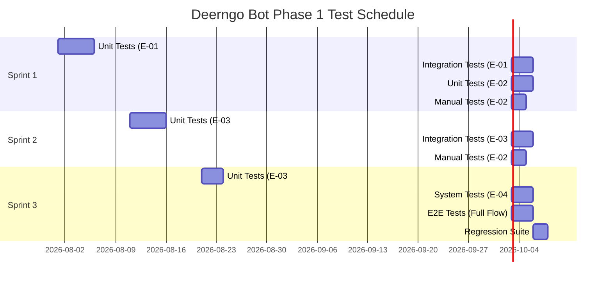
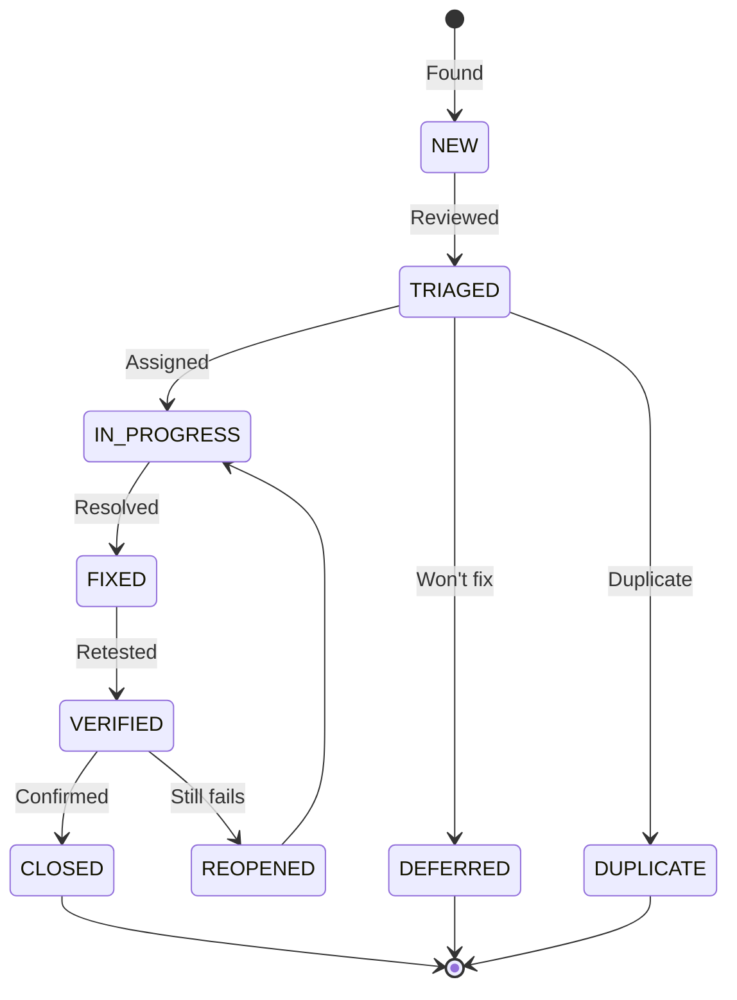

# Test Plan

> **Project:** Deerngo Bot — Viewer Relationship Management (VRM)
> **Version:** 0.1 | **Status:** Draft
> **Last Updated:** 2026-07-30

---

## Document Control

| Field | Value |
|-------|-------|
| Document Owner | QA Engineer |
| Approvals | PO, SA / Designer Persona, QA Engineer |

### Approvals

| Role | Name | Signature | Date |
|------|------|-----------|------|
| Product Owner | | | |
| Solution Architect | | | |
| QA Engineer | | | |

---

## 1. Introduction

### 1.1 Purpose

This plan defines the testing approach, scope, resources, schedule, and deliverables for the Deerngo Bot Phase 1 MVP. It governs verification of 54 acceptance criteria across 11 user stories and 4 epics.

### 1.2 Scope

| In Scope | Out of Scope |
|---------|-------------|
| Functional testing — subscriber capture, bot commands, points engine, scoreboard | Performance / load testing — separate plan for Phase 2 |
| API contract testing — 4 endpoints + 1 webhook | Security penetration testing — OWASP Top 10 deep-dive |
| Integration testing — EasyDonate API, YouTube API, PostgreSQL | Disaster recovery testing |
| Database integrity testing — triggers, constraints, upserts | streamer.bot internal logic (black-box, Windows-only) |
| Fuzzy matching accuracy — pg_trgm similarity | Phase 2 features (leaderboard recognition, milestones) |
| Regression testing — critical path automation | |

### 1.3 Project Context

| Aspect | Detail |
|--------|--------|
| System | Viewer Relationship Management (VRM) for @Deer_NGO YouTube channel |
| Backend | Go 1.24+ / Fiber v3 / sqlx — port :8008 |
| Frontend | Next.js 15+ / Tailwind 4+ / DaisyUI 5+ — port :3008 |
| Database | PostgreSQL 18 (shared homelab, `deerngo` DB) |
| Automation | streamer.bot (Windows, local PC) |
| Donation Source | EasyDonate API (easydonate.app/deerngo0) |
| Public Access | Cloudflare Tunnel → scoreboard only |

---

## 2. Test Strategy

### 2.1 Test Levels

| Level | Type | Automation | Coverage Target | Tools |
|-------|------|-----------|----------------|-------|
| Unit | White-box | 100% | ≥ 80% service layer | Go `testing` + `testify` |
| Integration | Gray-box | 80% | All 4 endpoints + webhook + scheduler logic | Go `httptest` + test PostgreSQL + Docker Compose |
| System | Black-box | 60% | All functional requirements | Docker Compose + curl / Postman |
| E2E | Black-box | 40% | Happy path per epic (webhook → matching → scoreboard) | Docker Compose + test scripts |
| Manual | Exploratory | 0% | streamer.bot integration, Cloudflare Tunnel, live chat | Live environment per-stream |

### 2.2 Test Techniques

| Technique | Application |
|-----------|------------|
| **Equivalence Partitioning** | Input validation (youtube_handle, donor_name, amount_thb) |
| **Boundary Value Analysis** | Handle length (1, 100 chars), amount (>0), pagination (page 1, limit 50/100) |
| **Decision Table** | Matching engine outcomes (exact, fuzzy, anonymous, multiple, no-match) |
| **State Transition** | Donation match_status: pending → matched / unmatched / manual_review |
| **Error Guessing** | Duplicate upserts, expired OAuth, rate limits, empty payloads, special chars in handles |

### 2.3 Test Approach by Epic

| Epic | Strategy | Key Risks |
|------|----------|-----------|
| **E-01 Subscriber Capture** | Unit tests for upsert logic + timestamp preservation; integration tests for API endpoint + scheduler | Data integrity on dual-source upsert; YouTube API quota exhaustion |
| **E-02 Bot Commands** | Manual tests via streamer.bot (command detection, response format); integration tests for Go API calls | streamer.bot is external black-box; response latency <2s |
| **E-03 Points Engine** | Unit tests for name matching (pg_trgm); integration tests for donation sync + point calculation trigger | Fuzzy matching false positives; idempotent webhook processing |
| **E-04 Scoreboard** | System tests for API endpoint + frontend rendering; manual responsive design check | 0-point exclusion; empty state UX |

---

## 3. Test Environment

| Environment | Purpose | URL | Data |
|------------|---------|-----|------|
| **Local Docker** | Developer + QA unit/integration testing | `localhost:8008` (API), `localhost:3008` (Web) | Seed data (3 subscribers, 4 donations) |
| **Homelab LAN** | System + E2E testing | `192.168.1.121:8008` (API), `:3008` (Web) | Synthetic test data |
| **Production (via Tunnel)** | Smoke test, manual verification | `https://deerngo-viewer-score.panomete.com` | Live data |

### 3.1 Test Database

| Item | Detail |
|------|--------|
| Database | `deerngo_test` (isolated from production `deerngo`) |
| Extensions | `pg_trgm`, `uuid-ossp` |
| Seed Data | 3 test subscribers + 4 test donations (3 matched, 1 unmatched) |
| Reset | `TRUNCATE` + re-seed before each test cycle |

### 3.2 Mock Strategy

| External Dependency | Mock Approach |
|-------------------|---------------|
| YouTube Data API | Mock HTTP client (Go `httptest`) — returns controlled subscriber lists |
| EasyDonate API | Mock HTTP client — returns controlled donation lists + error scenarios |
| streamer.bot | Manual testing only — real Windows app, not mockable in CI |

---

## 4. Test Schedule

---

## 5. Test Resources

| Role | Name | Responsibility |
|------|------|---------------|
| QA Engineer | QA | Test planning, test case authoring, defect tracking, regression |
| Developer | Dev | Unit test implementation, bug fixes, TDD |
| Product Owner | PO | UAT sign-off, acceptance criteria validation |

> **Note:** Phase 1 is a small team (1 QA, 1 Dev, 1 PO). QA handles all test levels except unit tests (Dev owns those via TDD).

---

## 6. Entry & Exit Criteria

| Phase | Entry Criteria | Exit Criteria |
|-------|---------------|--------------|
| **Unit** | Code complete, PR merged | ≥ 80% service layer coverage, all unit tests pass |
| **Integration** | Unit tests pass, Docker Compose services deployed | All 4 endpoints + webhook verified, DB constraints validated |
| **System** | Integration tests pass, homelab environment stable | All 🔴 (31) acceptance criteria verified |
| **E2E** | System tests pass | Happy path per epic passes end-to-end |
| **Regression** | All defects fixed | No 🔴 Critical / 🟡 High defects open |

---

## 7. Defect Management

### 7.1 Severity Definitions

| Severity | Definition | Response Time | Resolution Time | Escalation |
|---------|-----------|-------------|----------------|-----------|
| 🔴 **Critical** | Data loss, security breach, system crash, points miscalculation | 1 hour | 4 hours | PO + Dev |
| 🟡 **High** | Major feature broken, no workaround (bot command fails, API 500) | 4 hours | 1 day | Dev |
| 🟢 **Medium** | Feature broken but workaround exists, cosmetic data issues | 1 day | 3 days | — |
| ⚪ **Low** | Minor cosmetic, documentation, logging improvements | 3 days | Next sprint | — |

### 7.2 Defect Lifecycle

---

## 8. Risk & Mitigations

| Risk | Probability | Impact | Mitigation |
|------|-----------|--------|-----------|
| **streamer.bot not testable in CI** | High | Medium | Manual test checklist per stream; document known behaviors |
| **YouTube API quota exhaustion during tests** | Low | High | Mock YouTube API in unit/integration tests; real API only for manual smoke |
| **EasyDonate API rate limiting during test cycles** | Medium | Medium | Mock EasyDonate API; respect Retry-After header in tests |
| **pg_trgm similarity threshold too loose/tight** | Medium | High | Boundary test with similarity scores 0.69, 0.70, 0.71; tune threshold based on results |
| **Dual-source upsert data conflict** | Medium | High | Dedicated test cases for timestamp preservation (AC-001d, AC-003c) |
| **Test environment drift from production** | Medium | Medium | Use Docker Compose with identical config; isolated `deerngo_test` DB |
| **HMAC webhook signature verification false negative** | Low | Critical | Test with valid, invalid, and missing signatures |

---

## 9. Test Data Strategy

### 9.1 Seed Data (from DB Schema §7)

| Data Type | Records | Key Test Scenarios |
|-----------|---------|-------------------|
| Subscribers | 3 (`@testviewer1`, `@testviewer2`, `@deer_fan`) | Upsert, handle normalization, display_name fallback |
| Donations | 4 (3 matched, 1 unmatched) | Match engine, idempotent sync, 0-point exclusion |
| OAuth Tokens | 1 (YouTube refresh token) | Token refresh flow, 401 handling |

### 9.2 Mock Data Scenarios

| Scenario | Mock Response | Test Validates |
|----------|-------------|----------------|
| YouTube API — new subscribers | 5 new subscriber records | AC-003a: happy path creation |
| YouTube API — upsert existing | 3 subscribers (2 existing, 1 new) | AC-003b: idempotent upsert |
| YouTube API — 403 quota exceeded | `{"error": {"code": 403, "message": "quotaExceeded"}}` | AC-003e: graceful skip |
| YouTube API — 401 token expired | `{"error": {"code": 401, "message": "Unauthorized"}}` | AC-003f: operator alert |
| EasyDonate — new donations | 3 donation records | AC-020a: happy path sync |
| EasyDonate — duplicate donation | Same `easydonate_id` as existing | AC-020b: idempotent skip |
| EasyDonate — 429 rate limit | `429` + `Retry-After: 60` header | AC-020c: backoff + retry |
| Webhook — valid signature | Correct HMAC-SHA256 | Donation stored with `match_status=pending` |
| Webhook — invalid signature | Wrong HMAC | 401 rejection |

---

## 10. Traceability Matrix (Summary)

| User Story | ACs | 🔴 | 🟡 | Test Cases | Epic |
|------------|-----|-----|-----|-----------|------|
| US-001 | 6 | 4 | 2 | TC-001 → TC-006 | E-01 |
| US-002 | 5 | 3 | 2 | TC-007 → TC-011 | E-01 |
| US-003 | 7 | 5 | 2 | TC-012 → TC-018 | E-01 |
| US-010 | 4 | 2 | 2 | TC-019 → TC-022 | E-02 |
| US-011 | 4 | 3 | 1 | TC-023 → TC-026 | E-02 |
| US-012 | 4 | 3 | 1 | TC-027 → TC-030 | E-02 |
| US-020 | 5 | 3 | 2 | TC-031 → TC-035 | E-03 |
| US-021 | 6 | 4 | 2 | TC-036 → TC-041 | E-03 |
| US-022 | 5 | 4 | 1 | TC-042 → TC-046 | E-03 |
| US-030 | 5 | 0 | 5 | TC-047 → TC-051 | E-04 |
| US-031 | 5 | 0 | 5 | TC-052 → TC-056 | E-04 |
| **Total** | **54** | **31** | **23** | **56** | |

> Full test case details in [[042_test_cases]]

---

## 11. Quality Metrics

| Metric | Target | Measurement |
|--------|--------|------------|
| 🔴 AC Coverage | 100% (31/31) | Traceability matrix |
| 🟡 AC Coverage | ≥ 80% (≥ 18/23) | Traceability matrix |
| Unit Test Coverage (service layer) | ≥ 80% | Go `cover` tool |
| Defect Escape Rate | < 5% | Post-release defects / total defects |
| Test Case Pass Rate | ≥ 95% | Test execution summary |
| Regression Pass Rate | 100% | CI pipeline |

---

## Related Documents

| Document | Relationship |
|----------|-------------|
| [[013_acceptance_criteria]] | Primary test case source — 54 BDD criteria |
| [[012_user_stories]] | User stories mapped to test cases |
| [[022_API_specification]] | API contract for integration testing |
| [[023_database_schema_DDL]] | Database integrity verification |
| [[029_architecture_overview]] | System architecture for E2E test planning |
| [[042_test_cases]] | Detailed test cases |
| [[043_defect_report]] | Defect tracking |

---

> **Template Standard:** Based on SWEBOK v4, ISO/IEC/IEEE 29119
> **Usage:** This plan is the *contract* for testing Deerngo Bot Phase 1. Everyone knows what's tested, when, and by whom.
