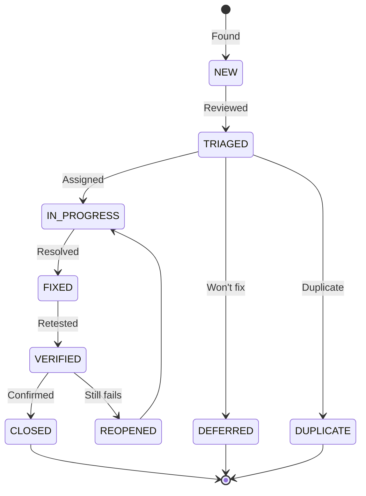

# Defect Report

> **Project:** Deerngo Bot — Viewer Relationship Management (VRM)
> **Version:** 0.1 | **Status:** Draft
> **Last Updated:** 2026-07-30

---

## 1. Purpose

Standardized defect reporting — capturing all information needed to reproduce, fix, and verify defects. This document also tracks **spec-derived findings** (requirements gaps identified during QA review before code exists).

## 2. Defect Lifecycle

## 3. Defect Template

| Field | Value |
|-------|-------|
| **Defect ID** | DEF-XXX |
| **Title** | Brief, descriptive title |
| **Severity** | 🔴 Critical / 🟡 High / 🟢 Medium / ⚪ Low |
| **Priority** | 🔴 P1 / 🟡 P2 / 🟢 P3 / ⚪ P4 |
| **Status** | New / Triaged / In Progress / Fixed / Verified / Closed |
| **Module** | E-01 Subscriber / E-02 Bot / E-03 Points / E-04 Scoreboard |
| **Type** | Functional / Integration / Data / Security / Spec Gap |
| **Reported By** | QA Engineer |
| **Assigned To** | Dev / PO |
| **Reported Date** | 2026-07-30 |
| **Target Fix** | Sprint X |
| **Test Case** | TC-XXX |
| **Requirement** | AC-XXX / US-XXX |

### Description

> Clear description of the defect — what happened vs what was expected.

### Steps to Reproduce

| Step | Action | Expected Result | Actual Result |
|------|--------|----------------|--------------|
| 1 | Step 1 | Expected | Actual |

### Environment

| Field | Value |
|-------|-------|
| OS | Windows 11 / Linux (Docker) |
| Go Version | 1.24+ |
| PostgreSQL | 18 |
| Environment | Local Docker / Homelab LAN |

### Evidence

| Type | Description |
|------|-----------|
| Screenshot / Log | URL or text |

---

## 4. Pre-Existing Spec Findings (Requirements Gaps)

> These findings were identified during QA review of spec documents (013, 022, 023) before code exists. They are **requirements gaps**, not code bugs. Flag to PO for resolution.

---

### DEF-S001: display_name Fallback Contradiction

| Field | Value |
|-------|-------|
| **Defect ID** | DEF-S001 |
| **Title** | AC-001f says display_name falls back to handle, but API spec marks it required |
| **Severity** | 🟢 Medium |
| **Priority** | 🟢 P3 |
| **Status** | ⬜ New |
| **Type** | Spec Gap |
| **Module** | E-01 Subscriber |
| **Reported By** | QA Engineer |
| **Assigned To** | PO |
| **Reported Date** | 2026-07-30 |
| **Requirement** | AC-001f vs API Spec §4.1 |

**Description:**

AC-001f states: *"A subscriber event arrives with youtube_handle but no display_name... The record is created with display_name = youtube_handle (fallback)."*

However, the API Specification (§4.1) defines `display_name` as **Required** with validation rule: `"Required, string, 1–255 chars"` → returns `VALIDATION_ERROR` if missing.

These contradict each other. If the API rejects empty `display_name`, AC-001f cannot pass. If the API allows empty `display_name`, the validation rule is wrong.

**Resolution (2026-07-30):**
**PO Decision:** Option B — `display_name` is required. AC-001f to be removed/rewritten. API Spec stays strict. TC-006 updated to expect 400 Bad Request.

---

### DEF-S002: Pagination Limit Not Capped in API Spec

| Field | Value |
|-------|-------|
| **Defect ID** | DEF-S002 |
| **Title** | Scoreboard API `limit` parameter has max 100 in spec but no enforcement documented |
| **Severity** | ⚪ Low |
| **Priority** | ⚪ P4 |
| **Status** | ⬜ New |
| **Type** | Spec Gap |
| **Module** | E-04 Scoreboard |
| **Reported By** | QA Engineer |
| **Assigned To** | Dev |
| **Reported Date** | 2026-07-30 |
| **Requirement** | API Spec §4.3 |

**Description:**

The API spec states `limit` has `max 100` in the description, but no validation rule or error response is defined for when a client sends `limit=500`. The spec should define whether the server clamps to 100 silently or returns a 400 error.

**Recommendation:** Add validation rule: `limit` must be 1–100. Values >100 are clamped to 100 (or return 400). Document in API spec.

---

### DEF-S003: Viewer Points Trigger Race Condition Risk

| Field | Value |
|-------|-------|
| **Defect ID** | DEF-S003 |
| **Title** | `sync_viewer_points()` trigger may double-count if same donation matched twice |
| **Severity** | 🟡 High |
| **Priority** | 🟡 P2 |
| **Status** | ⬜ New |
| **Type** | Spec Gap |
| **Module** | E-03 Points Engine |
| **Reported By** | QA Engineer |
| **Assigned To** | Dev |
| **Reported Date** | 2026-07-30 |
| **Requirement** | DB Schema §5.2 |

**Description:**

The `sync_viewer_points()` trigger fires `AFTER UPDATE ON donations WHEN (OLD.match_status IS DISTINCT FROM NEW.match_status)`. The trigger adds `NEW.amount_thb` to `viewer_points.total_points`.

If a donation is updated multiple times (e.g., `pending → matched → manual_review → matched`), the trigger would fire twice on transitions to `matched`, double-counting the donation amount.

The matching engine must ensure idempotency — either:
1. Only update `match_status` when it actually changes to `matched` for the first time, or
2. The trigger should check if the previous status was already `matched` before adding points.

**Recommendation:** Dev to add guard in trigger: `IF OLD.match_status != 'matched' AND NEW.match_status = 'matched' THEN ...` (already partially handled by `IS DISTINCT FROM`, but needs explicit check).

---

### DEF-S004: No Test Case for Rate Limiting (Fiber Middleware)

| Field | Value |
|-------|-------|
| **Defect ID** | DEF-S004 |
| **Title** | Rate limiting (100 req/min) defined in API spec but no acceptance criteria cover it |
| **Severity** | 🟢 Medium |
| **Priority** | 🟢 P3 |
| **Status** | ⬜ New |
| **Type** | Spec Gap |
| **Module** | All |
| **Reported By** | QA Engineer |
| **Assigned To** | PO |
| **Reported Date** | 2026-07-30 |
| **Requirement** | API Spec §5 |

**Description:**

The API spec defines rate limiting: "100 requests/minute per IP (Fiber middleware)" and webhook tier at "200 requests/minute." However, no acceptance criteria in 013 cover rate limiting behavior. No test cases exist for:
- Exceeding 100 req/min → 429 response
- Per-IP tracking correctness
- Webhook tier (200/min) separate from default tier

**Resolution (2026-07-30):**
**PO Decision:** Option A — Add rate limiting ACs now. TC-057 and TC-058 added to test cases.

---

### DEF-S005: HMAC Secret Key Rotation Not Addressed

| Field | Value |
|-------|-------|
| **Defect ID** | DEF-S005 |
| **Title** | No procedure defined for HMAC secret key rotation for EasyDonate webhook |
| **Severity** | 🟡 High |
| **Priority** | 🟡 P2 |
| **Status** | ⬜ New |
| **Type** | Spec Gap |
| **Module** | E-03 Points Engine |
| **Reported By** | QA Engineer |
| **Assigned To** | PO + Dev |
| **Reported Date** | 2026-07-30 |
| **Requirement** | API Spec §4.4, ADR-012 |

**Description:**

The webhook verification flow (API Spec §4.4) uses `HMAC-SHA256(body, secret_key)` where `secret_key` is from an environment variable. No documentation addresses:
1. How the secret key is initially generated/shared with EasyDonate
2. What happens if the key needs to be rotated (security incident, compromise)
3. Whether EasyDonate supports multiple active keys during rotation

This is a security operations gap that should be addressed before go-live.

**Resolution (2026-07-30):**
**PO Decision:** Option A — Document key rotation now. TC-059 added to test cases. Key gen, sharing, and rotation procedure to be documented before go-live.

---

### DEF-S006: No Error Response Schema for Webhook 401

| Field | Value |
|-------|-------|
| **Defect ID** | DEF-S006 |
| **Title** | Webhook 401 response doesn't follow standard error format |
| **Severity** | ⚪ Low |
| **Priority** | ⚪ P4 |
| **Status** | ⬜ New |
| **Type** | Spec Gap |
| **Module** | E-03 Points Engine |
| **Reported By** | QA Engineer |
| **Assigned To** | Dev |
| **Reported Date** | 2026-07-30 |
| **Requirement** | API Spec §4.4 |

**Description:**

The webhook error response for invalid signature (§4.4) uses `"code": "WEBHOOK_INVALID"` with HTTP 401. However, the common error codes table (§3) maps `WEBHOOK_INVALID` to 401, which is correct, but the error response structure has a typo — it uses `\"WEBHOOK_INVALID\"` (escaped quotes in the spec example).

More importantly, the spec should clarify whether EasyDonate expects a specific response format on failure (some webhook systems expect `200` with error in body, not HTTP error codes, to prevent retries).

**Recommendation:** Verify EasyDonate's webhook retry behavior. If they retry on 4xx, consider returning 200 with `{"skipped": true, "reason": "Invalid signature"}`.

---

## 5. Defect Register

| ID | Title | Severity | Type | Module | Status | Assigned | Reported | Fixed |
|----|-------|---------|------|--------|--------|---------|---------|-------|
| DEF-S001 | display_name fallback contradiction | 🟢 Medium | Spec Gap | E-01 | ✅ Resolved | PO | 2026-07-30 | 2026-07-30 |
| DEF-S002 | Pagination limit not capped | ⚪ Low | Spec Gap | E-04 | ⬜ New | Dev | 2026-07-30 | — |
| DEF-S003 | Viewer points trigger double-count risk | 🟡 High | Spec Gap | E-03 | ⬜ New | Dev | 2026-07-30 | — |
| DEF-S004 | Rate limiting has no ACs | 🟢 Medium | Spec Gap | All | ✅ Resolved | PO | 2026-07-30 | 2026-07-30 |
| DEF-S005 | HMAC key rotation not addressed | 🟡 High | Spec Gap | E-03 | ✅ Resolved | PO+Dev | 2026-07-30 | 2026-07-30 |
| DEF-S006 | Webhook 401 response format | ⚪ Low | Spec Gap | E-03 | ⬜ New | Dev | 2026-07-30 | — |

> **Note:** DEF-S001, S004, S005 resolved per PO decisions in MM04. Code-level defects will be added during test execution.

---

## 6. Defect Metrics

| Metric | Value | Target | Status |
|--------|:-----:|--------|:------:|
| Total defects found | 6 | — | — |
| Spec gaps (pre-code) | 6 | — | — |
| Code defects | 0 | — | — |
| Critical defects | 0 | 0 at release | 🟢 |
| Defects fixed | 3 | — | — |
| Defects remaining | 3 | < 5 | 🟢 |
| Avg fix time — Critical | — | < 24h | — |
| Defect reopen rate | — | < 10% | — |

> Metrics updated 2026-07-30. DEF-S001, S004, S005 resolved via PO decisions (MM04).

---

## 7. Severity Definitions

| Severity | Definition | Response Time | Resolution Time |
|---------|-----------|-------------|----------------|
| 🔴 **Critical** | System crash, data loss, security breach, points miscalculation | 1 hour | 4 hours |
| 🟡 **High** | Major feature broken, no workaround, trigger race condition | 4 hours | 1 day |
| 🟢 **Medium** | Feature broken with workaround, spec contradiction | 1 day | 3 days |
| ⚪ **Low** | Minor issue, cosmetic, documentation gap | 3 days | Next sprint |

---

## Related Documents

| Document | Relationship |
|----------|-------------|
| [[041_test_plan]] | Defect management process defined here |
| [[042_test_cases]] | Tests that found defects |
| [[013_acceptance_criteria]] | ACs referenced by defects |
| [[022_API_specification]] | API spec referenced by spec gaps |

---

> **Template Standard:** Based on SWEBOK v4, ISO/IEC/IEEE 29119
> **Usage:** A good defect report is *reproducible*. If the developer can't reproduce it, they can't fix it. Steps, environment, evidence.
