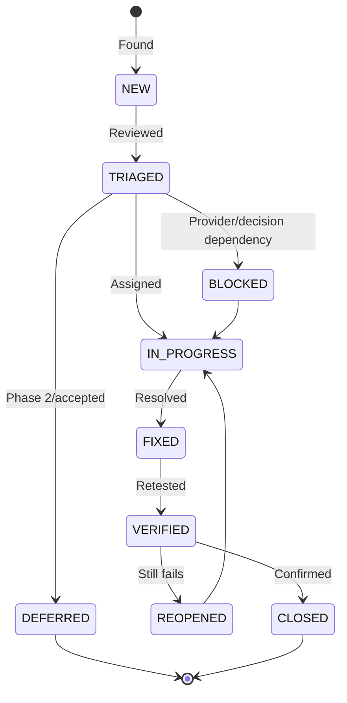

# Defect Report — Active Scope Gaps

> **Project:** Deerngo Bot — Viewer Relationship Management (VRM)
> **Version:** 0.2 | **Status:** Draft
> **Last Updated:** 2026-08-02
>
> The original subscriber-based findings are retained as historical context. The active defect/gap set below follows the explicit member-registration MVP.

---

## 1. Purpose

Track specification gaps, security gates, and defects that must be resolved before release. These are not claims that code has failed; implementation status must be established through real test execution.

## 2. Defect Lifecycle

---

## 3. Active Findings

### DEF-S007: EasyDonate Webhook Contract Not Verified

| Field | Value |
|-------|-------|
| Defect ID | DEF-S007 |
| Title | Provider payload/authentication assumptions require dashboard/test-event verification |
| Severity | 🟠 High |
| Priority | 🔴 P1 |
| Status | Blocked — provider verification |
| Type | Integration / Spec Gap |
| Module | E-03 Points |
| Owner | Dev/DevOps |
| Requirement | US-020 / AC-020a/g |
| Issue | `https://github.com/oat431/deerngo-bot/issues/18` |

**Description:** Public provider documentation does not confirm HMAC, `X-EasyDonate-Signature`, or every payload field used in earlier drafts.

**Required resolution:** Trigger a safe provider test event, record exact field names/types and supported authentication/retry behavior without secrets, and update API/security/tests before production webhook deployment. If no signing/custom auth exists, use the approved unpredictable path-token fallback with strict validation, body limits, rate limits, and `referenceNo` idempotency.

### DEF-S008: Manual Point Correction Procedure Required

| Field | Value |
|-------|-------|
| Defect ID | DEF-S008 |
| Title | Handle-change points remain manual until admin console exists |
| Severity | 🟠 High |
| Priority | 🟡 P2 |
| Status | Open — procedure/documentation |
| Type | Data Integrity / Operational Gap |
| Module | E-01/E-03 |
| Owner | PO/DevOps |
| Requirement | AC-001c / R-005/R-008 |
| Issue | `https://github.com/oat431/deerngo-bot/issues/19` |

**Description:** A changed handle creates a new active member with 0 points and retains the old inactive member's points. The owner/back-office worker must transfer/correct points manually in a transaction and record before/after/reason.

**Required resolution:** Test the procedure in a non-production database and document rollback/least privilege. No admin console is required in Phase 1.

### DEF-S009: Privacy/Public Display Gate

| Field | Value |
|-------|-------|
| Defect ID | DEF-S009 |
| Title | Public handle/score behavior needs owner-approved notice and removal route |
| Severity | 🟠 High |
| Priority | 🔴 P1 |
| Status | Open — release gate |
| Type | Privacy / Compliance |
| Module | E-04 Scoreboard |
| Owner | PO/Owner/Dev |
| Requirement | OBJ-04 / AC-001f / AC-031f |

**Description:** A public handle plus contribution score may be personal data. The product must not store display names and must exclude private/inactive/zero-point members, but the owner still needs an approved notice, visibility behavior, retention, and removal/opt-out procedure.

**Required resolution:** Confirm notice wording and owner/operator process before public scoreboard release. This is product/privacy work, not legal certification.

### DEF-S010: Active Regression Baseline Replaced

| Field | Value |
|-------|-------|
| Defect ID | DEF-S010 |
| Title | Original subscriber test cases no longer match active requirements |
| Severity | 🟡 Medium |
| Priority | 🔴 P1 |
| Status | Resolved — new baseline drafted |
| Type | Test/Spec Gap |
| Module | All |
| Owner | QA/PO |
| Requirement | 62 active ACs |

**Resolution:** Active test set is now TC-M001–TC-M062. Original subscriber tests remain historical and are excluded from active regression.

---

## 4. Historical Findings / Superseded

| ID | Historical Finding | Status |
|----|--------------------|--------|
| DEF-S001 | Display-name fallback contradiction | Superseded when display names were removed from member model |
| DEF-S002 | Scoreboard limit enforcement ambiguity | Carried forward: API must define 1–100 behavior |
| DEF-S003 | Viewer-points trigger double-count risk | Superseded by transactional `members.total_points` + `points_applied_at` guard |
| DEF-S004 | Rate-limit AC missing | Carried forward as security/test requirement |
| DEF-S005 | HMAC key rotation gap | Superseded/unverified until provider confirms HMAC; provider contract issue is DEF-S007 |
| DEF-S006 | Webhook error response ambiguity | Carried forward to provider contract verification |

## 5. Defect Template

| Field | Value |
|-------|-------|
| Defect ID | DEF-XXX |
| Title | Brief, descriptive title |
| Severity | 🔴 Critical / 🟠 High / 🟡 Medium / ⚪ Low |
| Priority | P1 / P2 / P3 / P4 |
| Status | New / Triaged / In Progress / Fixed / Verified / Closed / Blocked |
| Module | E-01 / E-02 / E-03 / E-04 |
| Type | Functional / Integration / Data / Security / Privacy / Spec Gap |
| Reported By | QA |
| Assigned To | Dev / PO / DevOps |
| Reported Date | YYYY-MM-DD |
| Target Fix | Sprint |
| Test Case | TC-MXXX |
| Requirement | AC-XXX / US-XXX |

## Related Documents

| Document | Relationship |
|----------|-------------|
| [[041_test_plan]] | Active test strategy |
| [[042_test_cases]] | Active execution cases |
| [[045_coverage_report]] | Coverage status |
| [[022_API_specification]] | Provider/member API contract |
| [[061_security_test_report]] | Security gates |
| [[071_risk_register]] | Runtime risks |
| `07_pm/072_MM07_po-to-dev-qa-member-registration-mvp_20260802.md` | Scope handoff |

---

> **Template Standard:** Based on SWEBOK v4 and ISO/IEC/IEEE 29119
> **Usage:** Keep active blockers current; do not close a finding without evidence or an explicit PO-approved deferral.
---

