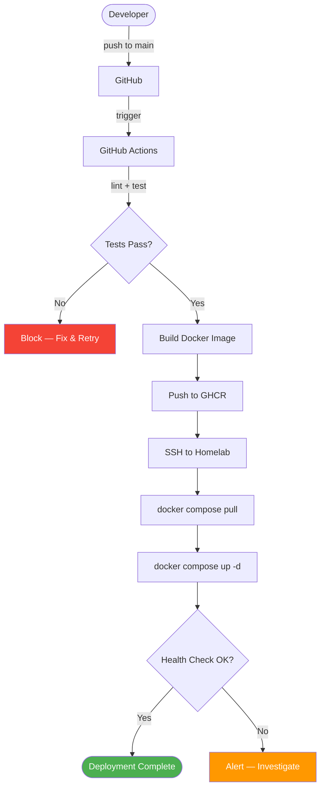

# Deployment Plan

> **Project:** Deerngo Bot — Viewer Relationship Management (VRM)
> **Version:** 0.1 | **Status:** Draft
> **Last Updated:** 2026-07-30

---

## Document Control

| Field | Value |
|-------|-------|
| Document Owner | DevOps |
| Deployment Target | Homelab Server (Ubuntu, Docker) |
| Deployment Method | Docker Compose + GHCR images |

### Revision History

| Version | Date | Author | Change Description |
|---------|------|--------|--------------------|
| 0.1 | 2026-07-30 | DevOps | Initial deployment plan — CI/CD auto-deploy + manual fallback |

---

## 1. Purpose

> Step-by-step deployment procedures for Deerngo Bot — how code gets from `main` branch to running containers on the homelab server. Covers both automated (CI/CD) and manual deployment paths, plus rollback.

---

## 2. Deployment Overview

| Field | Detail |
|-------|--------|
| Deployment Method | CI/CD (primary) + Manual SSH (fallback) |
| Target Server | Homelab (`remote.panomete.com`, Ubuntu) |
| Container Runtime | Docker 29.6.2 + Compose v5.3.1 |
| Network | `db-network` (shared with `local-postgres`, `local-valkey`) |
| Downtime | Zero (container restart, < 5s gap) |
| Public Access | Cloudflare Tunnel → `deerngo-viewer-score.panomete.com` |
| Rollback | Re-deploy previous GHCR image tag |

---

## 3. Deployment Paths

### 3.1 Automated (CI/CD) — Primary



### 3.2 Manual — Fallback

Used when CI/CD is broken, or for emergency hotfixes.

```bash
# SSH into homelab
ssh flowero@remote.panomete.com

# Navigate to platform directory
cd ~/platform

# Pull latest images
docker compose -f docker-compose.deerngo.yml pull

# Restart containers
docker compose -f docker-compose.deerngo.yml up -d

# Verify
docker ps | grep deerngo
curl http://localhost:8008/api/v1/health
curl http://localhost:3008
```

### 3.3 First-Time Deployment (Bootstrap)

```bash
# SSH into homelab
ssh flowero@remote.panomete.com

# Create platform directory if not exists
mkdir -p ~/platform

# Copy docker-compose.deerngo.yml to ~/platform/
# (from repo or manually created)

# Copy .env file with secrets
# DATABASE_URL, EASYDONATE_WEBHOOK_SECRET, YOUTUBE_CHANNEL_ID

# Ensure db-network exists
docker network ls | grep db-network

# Ensure PostgreSQL has the deerngo database
docker exec -it local-postgres psql -U postgres -c "CREATE DATABASE deerngo;"

# Enable pg_trgm extension
docker exec -it local-postgres psql -U postgres -d deerngo -c "CREATE EXTENSION IF NOT EXISTS pg_trgm;"

# Pull and start
cd ~/platform
docker compose -f docker-compose.deerngo.yml pull
docker compose -f docker-compose.deerngo.yml up -d

# Run initial migration
docker exec deerngo-bot ./deerngo-bot migrate up

# Verify
curl http://localhost:8008/api/v1/health
curl http://localhost:3008
```

---

## 4. Pre-Deployment Checklist

| # | Check | Owner | Auto/Manual | Status |
|---|-------|-------|-------------|--------|
| 1 | All CI tests pass on `main` | CI | Auto | ☐ |
| 2 | Docker image builds successfully | CI | Auto | ☐ |
| 3 | Database migrations tested locally | Dev | Manual | ☐ |
| 4 | No breaking API changes (or frontend updated too) | Dev | Manual | ☐ |
| 5 | `.env` variables up to date on homelab | DevOps | Manual | ☐ |
| 6 | Rollback image tag noted | DevOps | Manual | ☐ |

---

## 5. Deployment Steps (Detailed)

### 5.1 Automated Deployment (CI/CD)

| Step | Action | Where | Duration | Verification |
|------|--------|-------|---------|-------------|
| 1 | Push to `main` | GitHub | — | Commit visible |
| 2 | CI runs lint + tests | GitHub Actions | < 5 min | Green checkmark |
| 3 | Docker image built + pushed to GHCR | GitHub Actions | < 3 min | Image visible at `ghcr.io/deerngo/deerngo-bot` |
| 4 | SSH deploy: `docker compose pull && up -d` | Homelab | < 2 min | Container running |
| 5 | Health check (`curl /api/v1/health`) | CI | < 10s | `{"status":"ok"}` |
| 6 | Done | — | — | New version live |

### 5.2 Manual Deployment

```bash
# 1. SSH to homelab
ssh flowero@remote.panomete.com

# 2. Check current running version
docker inspect deerngo-bot --format '{{.Config.Image}}'
docker inspect deerngo-web --format '{{.Config.Image}}'

# 3. Pull latest images
cd ~/platform
docker compose -f docker-compose.deerngo.yml pull

# 4. Restart (rolling — one at a time for zero-downtime)
docker compose -f docker-compose.deerngo.yml up -d deerngo-bot
sleep 5
curl -sf http://localhost:8008/api/v1/health && echo "Backend OK"

docker compose -f docker-compose.deerngo.yml up -d deerngo-web
sleep 5
curl -sf http://localhost:3008 && echo "Frontend OK"

# 5. Verify both containers
docker ps | grep deerngo
docker logs --tail 20 deerngo-bot
docker logs --tail 20 deerngo-web

# 6. Verify public access
curl -I https://deerngo-viewer-score.panomete.com
```

---

## 6. Post-Deployment Verification

| # | Check | Command | Expected | Status |
|---|-------|---------|---------|--------|
| 1 | Backend health | `curl http://localhost:8008/api/v1/health` | `{"status":"ok"}` | ☐ |
| 2 | Frontend loads | `curl http://localhost:3008` | HTML response (200) | ☐ |
| 3 | Database connected | `docker exec deerngo-bot env | grep DATABASE_URL` | Connection string present | ☐ |
| 4 | Container healthy | `docker ps --filter name=deerngo` | Both `Up` and `healthy` | ☐ |
| 5 | Public URL accessible | `curl -I https://deerngo-viewer-score.panomete.com` | `200 OK` | ☐ |
| 6 | No error logs | `docker logs --tail 50 deerngo-bot 2>&1 | grep -i error` | Empty (no errors) | ☐ |

---

## 7. Rollback Plan

### 7.1 When to Rollback

- Health check fails after deploy
- Error rate spike in logs
- Public scoreboard unreachable
- Bot commands not responding

### 7.2 Rollback Steps

```bash
# 1. SSH to homelab
ssh flowero@remote.panomete.com

# 2. Find previous image tag
docker images ghcr.io/deerngo/deerngo-bot --format "{{.Tag}}\t{{.CreatedAt}}" | head -5
docker images ghcr.io/deerngo/deerngo-web --format "{{.Tag}}\t{{.CreatedAt}}" | head -5

# 3. Edit docker-compose to pin previous tag
cd ~/platform
# Change:  image: ghcr.io/deerngo/deerngo-bot:latest
# To:      image: ghcr.io/deerngo/deerngo-bot:sha-abc1234

# 4. Restart with previous version
docker compose -f docker-compose.deerngo.yml up -d

# 5. Verify
curl http://localhost:8008/api/v1/health
curl http://localhost:3008
```

### 7.3 Database Rollback

```bash
# Only if migration was run and needs to be reverted
docker exec deerngo-bot ./deerngo-bot migrate down

# Verify migration status
docker exec deerngo-bot ./deerngo-bot migrate status
```

> **Warning:** Database rollbacks are destructive. Only rollback DB if the migration caused data issues. If in doubt, keep the DB forward and rollback only the application.

---

## 8. Database Migration Strategy

| Scenario | Action | Risk |
|----------|--------|------|
| Add new table | Run migration before deploy | Low — no existing data affected |
| Add new column (nullable) | Run migration before deploy | Low — backward compatible |
| Add new column (NOT NULL) | Run migration with default value | Medium — test locally first |
| Alter existing column | Run migration, test rollback | High — potential data loss |
| Drop column | Deploy code first (stop using column), migrate later | High — two-phase required |

### Migration Commands

```bash
# Apply migrations
docker exec deerngo-bot ./deerngo-bot migrate up

# Rollback last migration
docker exec deerngo-bot ./deerngo-bot migrate down

# Check migration status
docker exec deerngo-bot ./deerngo-bot migrate status
```

---

## 9. Environment Variables

| Variable | Where Set | Description |
|----------|----------|-------------|
| `DATABASE_URL` | Homelab `.env` | PostgreSQL connection string |
| `PORT` | `docker-compose.deerngo.yml` | Backend listen port (8008) |
| `EASYDONATE_WEBHOOK_SECRET` | Homelab `.env` | HMAC-SHA256 secret for webhook |
| `YOUTUBE_CHANNEL_ID` | Homelab `.env` | YouTube channel ID |
| `SCOREBOARD_ORIGIN` | `docker-compose.deerngo.yml` | CORS origin |
| `NEXT_PUBLIC_API_URL` | `docker-compose.deerngo.yml` | Backend URL for frontend |

> **Security:** Secrets are in `~/platform/.env` on the homelab server. Never committed to Git. Only `DevOps` / server owner manages these.

---

## 10. Communication Plan

| When | Who | Channel | Message |
|------|-----|---------|---------|
| Before deploy (manual) | Self | — | Note current running version |
| After deploy | Self | — | Verify all checks, update changelog |
| If rollback needed | Self | — | Document what failed and why |

> **Note:** Single-developer project — formal communication plan is minimal. Document decisions in commit messages and release notes.

---

## Related Documents

| Document | Relationship |
|----------|-------------|
| [[051_CICD_pipeline_configuration]] | Automated pipeline (primary deploy path) |
| [[053_release_notes]] | What changed in each release |
| [[054_operations_manual_runbook]] | Operational procedures |
| [[032_BE_build_scripts]] | Backend Dockerfile + Makefile |
| [[032_FE_build_scripts]] | Frontend Dockerfile + npm scripts |

---

> **Template Standard:** Based on SWEBOK v4
> **Usage:** Never deploy without a rollback plan. Every deploy is reversible.
