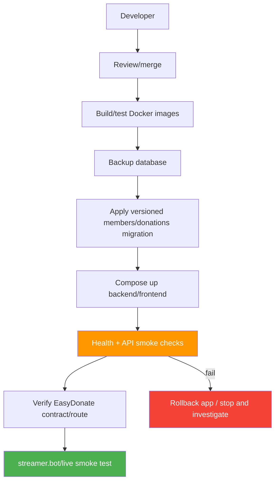

# Deployment Plan

> **Project:** Deerngo Bot — Viewer Relationship Management (VRM)
> **Version:** 0.2 | **Status:** Draft
> **Last Updated:** 2026-08-02
>
> **Scope change:** The active MVP deploys explicit member registration and member-based points. YouTube subscriber polling/OAuth is not deployed.

---

## 1. Purpose

Deployment procedures for the Go backend, Next.js scoreboard, PostgreSQL migrations, EasyDonate webhook route, and streamer.bot LAN integration.

## 2. Deployment Overview

| Field | Detail |
|-------|--------|
| Deployment Method | Manual Docker Compose for Phase 1; CI/CD later |
| Target | Homelab Docker server |
| Runtime | Docker Compose on `db-network` |
| Backend | `deerngo-bot` :8008 |
| Frontend | `deerngo-web` :3008 |
| Database | Existing PostgreSQL 18 / `deerngo` |
| Public Access | Cloudflare Tunnel → scoreboard and intentionally configured EasyDonate webhook route |
| Rollback | Application image rollback; DB restore/migration rollback only after review |
| External Runtime | streamer.bot on streamer's Windows PC calls backend over LAN |

## 3. Deployment Path



## 4. First-Time/Schema Deployment

```bash
ssh <operator>@<homelab-host>
mkdir -p ~/platform ~/backups
cd ~/platform

# Verify shared network and existing PostgreSQL
docker network inspect db-network
docker exec local-postgres psql -U postgres -d deerngo -c 'SELECT version();'

# Backup before migration
docker exec local-postgres pg_dump -U postgres -d deerngo \
  > ~/backups/deerngo_$(date +%Y%m%d_%H%M%S).sql

# Place compose file and restricted environment configuration.
# Required values are provided through the secret-management process, not chat/Git.
# DATABASE_URL, EASYDONATE_API_KEY, EASYDONATE_WEBHOOK_PATH_TOKEN,
# SCOREBOARD_ORIGIN, NEXT_PUBLIC_API_URL

# Apply the built application and migration
docker compose -f docker-compose.deerngo.yml pull
docker compose -f docker-compose.deerngo.yml up -d deerngo-bot
docker exec deerngo-bot ./deerngo-bot migrate up
docker compose -f docker-compose.deerngo.yml up -d deerngo-web
```

Do not enable YouTube OAuth, `YOUTUBE_CHANNEL_ID`, `subscribers`, `viewer_points`, or `pg_trgm` solely for the revised MVP.

## 5. Environment Variables

| Variable | Location | Required | Description |
|----------|----------|:--------:|-------------|
| `DATABASE_URL` | Restricted homelab secret | ✅ | PostgreSQL connection |
| `PORT` | Compose/env | — | Default 8008 |
| `EASYDONATE_API_KEY` | Restricted homelab secret | For fallback | Backend-only provider API key |
| `EASYDONATE_WEBHOOK_PATH_TOKEN` | Restricted homelab secret | For webhook | Long random path token if no provider auth |
| `EASYDONATE_WEBHOOK_SECRET` | Restricted secret | ❌ | Only if provider explicitly confirms signing |
| `SCOREBOARD_ORIGIN` | Compose/env | — | Frontend origin for CORS |
| `NEXT_PUBLIC_API_URL` | Frontend compose/env | ✅ | Backend URL |

Never add API keys, path tokens, client secrets, refresh tokens, or database credentials to GitHub, images, logs, or public docs.

## 6. Pre-Deployment Checklist

| # | Check | Owner | Status |
|---|-------|-------|:------:|
| 1 | Active requirements/API/DDL versions are aligned | PO/Dev | ☐ |
| 2 | `members`/`donations` migration passes in test DB | Dev/QA | ☐ |
| 3 | Backup completed and restore path known | DevOps | ☐ |
| 4 | Unit/integration tests pass | Dev/QA | ☐ |
| 5 | No active code depends on old subscriber/OAuth path | Dev | ☐ |
| 6 | EasyDonate test payload/security is verified | Dev/DevOps | ☐ |
| 7 | Webhook path/token configured safely | DevOps | ☐ |
| 8 | CORS/body-limit/rate-limit/log redaction configured | Dev | ☐ |
| 9 | Cloudflare route exposes only scoreboard/webhook | DevOps | ☐ |
| 10 | Manual correction procedure tested in non-production DB | PO/DevOps | ☐ |
| 11 | stream.bot action payloads match API contract | Dev | ☐ |

## 7. Deployment Steps

```bash
# 1. Confirm current images and migration status
docker inspect deerngo-bot --format '{{.Config.Image}}'
docker exec deerngo-bot ./deerngo-bot migrate status

# 2. Backup
docker exec local-postgres pg_dump -U postgres -d deerngo \
  > ~/backups/deerngo_predeploy_$(date +%Y%m%d_%H%M%S).sql

# 3. Pull and start backend
docker compose -f docker-compose.deerngo.yml pull deerngo-bot
docker compose -f docker-compose.deerngo.yml up -d deerngo-bot

# 4. Migrate and verify backend
docker exec deerngo-bot ./deerngo-bot migrate up
curl -sf http://localhost:8008/healthz
docker logs --tail 50 deerngo-bot

# 5. Start/refresh frontend
docker compose -f docker-compose.deerngo.yml pull deerngo-web
docker compose -f docker-compose.deerngo.yml up -d deerngo-web
curl -sf http://localhost:3008

# 6. Verify public route
curl -I https://deerngo-viewer-score.panomete.com
```

## 8. Post-Deployment Smoke Tests

| Check | Expected |
|-------|----------|
| `/healthz` | 200 healthy |
| `POST /api/v1/members/register` synthetic test | 201/200 according to state |
| Same-handle registration | No duplicate/no point mutation |
| Visibility API | Public/private updates active member |
| Valid synthetic webhook | Stored once; no duplicate on repeat |
| Exact synthetic donation | 1 THB = 1 point once if after registration |
| Pre-registration synthetic donation | No points |
| Scoreboard | Only active/public/points>0 handle+points |
| Public JSON | No display name/user ID/raw donor data |
| streamer.bot action | Register/donate/point/public/private behavior verified |

Use synthetic or explicitly approved test data. Do not send real secrets or real donor details into logs.

## 9. Rollback Plan

### Application Rollback

```bash
# Pin previous known-good image tags in the restricted compose configuration.
docker compose -f docker-compose.deerngo.yml up -d deerngo-bot deerngo-web
curl -sf http://localhost:8008/healthz
curl -sf http://localhost:3008
```

### Database Rollback

- Prefer rolling the application back while keeping a forward-compatible database.
- Do not run destructive migration down in production without backup, impact review, and PO/DevOps approval.
- Restore from the pre-deploy backup only after stopping writes and verifying the incident scope.

## 10. Migration Strategy

| Change | Action | Risk |
|--------|--------|------|
| Add `members`/revised `donations` | Additive migration after backup | Medium |
| Stop old subscriber code | Deploy code that no longer reads old tables | Low/Medium |
| Remove old tables | Separate later migration after verification | High |
| Change point fields | Forward migration with compatibility review | High |
| Add admin console later | New authenticated routes/tables | Medium |

No automatic subscriber-to-member or historical-point migration is performed by this Phase 1 deployment.

## 11. Release Gate

Release is approved only when:

- active ACs pass
- provider contract is verified
- backup/restore path is known
- privacy response allowlist passes
- first live-stream smoke test passes
- owner approves the public scoreboard behavior

## Related Documents

| Document | Relationship |
|----------|-------------|
| [[054_operations_manual_runbook]] | Routine operations and corrections |
| [[051_CICD_pipeline_configuration]] | Future/legacy pipeline details; must not override manual Phase 1 decision |
| [[022_API_specification]] | API contract |
| [[023_database_schema_DDL]] | Migration/data model |
| [[061_security_test_report]] | Security release gates |
| `external_plan/phase1-deerngo-bot-mvp.md` | Sprint-level implementation plan |

---

> **Template Standard:** Based on SWEBOK v4
> **Usage:** Deployment source of truth for the revised member-based MVP. Verify all provider behavior from current official sources before production.
---
