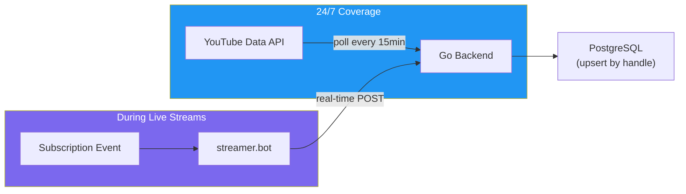

# Meeting Minutes — PO → Designer Handoff: Deerngo Bot Phase 1

> **Date:** 2026-07-29
> **Type:** Requirements Handoff
> **From:** PO Persona
> **To:** Designer Persona
> **Status:** ✅ Phase 1 requirements complete. Ready for design.

---

## 1. Purpose

> Record completion of Phase 1 requirements elicitation for Deerngo Bot VRM and hand off to Designer for wireframes, architecture design, and UI/UX. The PO has produced Business Objectives, User Stories, and Acceptance Criteria — now the Designer needs to translate these into technical design documents.

---

## 2. What PO Produced

### Spec Documents (Phase 1 Requirements)

| Document | Path | Status | Key Metrics |
|----------|------|--------|-------------|
| Business Objectives | `external_spec/deerngo_bot/01_requirement/011_business_objective.md` | ✅ v0.1 Draft | 4 SMART objectives, 5 KPIs |
| User Stories | `external_spec/deerngo_bot/01_requirement/012_user_stories.md` | ✅ v0.1 Draft | 11 stories, 4 epics, 41 points |
| Acceptance Criteria | `external_spec/deerngo_bot/01_requirement/013_acceptance_criteria.md` | ✅ v0.1 Draft | 53 BDD criteria (31🔴, 22🟡) |
| Overview | `external_overview/Deer Ngo Bot.md` | ✅ Updated | Architecture diagram, tech stack |

### Requirements Summary

| Metric | Value |
|--------|-------|
| Business Objectives | 4 (OBJ-01 → OBJ-04) |
| Epics | 4 (Register, Bot Commands, Points Engine, Scoreboard) |
| User Stories | 11 |
| Story Points | 41 |
| Acceptance Criteria | 53 (31 🔴 Must Have, 22 🟡 Should Have) |
| Sprint Plan | Sprint 1 (Register + Donate), Sprint 2 (Points + Bot), Sprint 3 (Scoreboard) |

---

## 3. Key Architecture Decisions (from Grill Session)

| Decision ID | Decision | Rationale | Impact |
|------------|---------|-----------|--------|
| DEC-001 | **Go backend** | Lightweight, fast, stakeholder comfortable with it | Tech stack |
| DEC-002 | **PostgreSQL 18** | Existing homelab infrastructure | Database |
| DEC-003 | **React/Next.js frontend** | Nice UI for public scoreboard | Frontend |
| DEC-004 | **Local Windows deployment** | Same PC as streamer.bot (localhost) | Deployment |
| DEC-005 | **Hybrid subscriber capture** | YouTube API polling (24/7) + streamer.bot (real-time during live) | Architecture |
| DEC-006 | **Fuzzy name matching** | Donation name → YouTube handle (case-insensitive, strip @) | Points logic |
| DEC-007 | **EasyDonate webhook primary** | Push donation events; REST API as fallback | Data pipeline |

### Hybrid Subscriber Capture (Critical Design Decision)

**Why hybrid:** Subscribers can join at any time (not just during live streams). YouTube API polling ensures 24/7 coverage. streamer.bot provides real-time capture during live. Upsert logic deduplicates.

---

## 4. Integration Points (What Designer Needs to Know)

### External Services

| Service | Integration Type | Key Details |
|---------|-----------------|-------------|
| **streamer.bot** | HTTP Server (port 7474) | `POST /DoAction` for chat responses. WebSocket (port 8681) for events. 31 YouTube triggers. |
| **YouTube Data API v3** | REST API + OAuth 2.0 | `GET /youtube/v3/subscriptions` for subscriber polling. 10,000 quota units/day. |
| **EasyDonate** | Webhook + REST API | Webhook for donation events. REST API for history/fallback. 60 req/min rate limit. Auth: API key + OAuth 2.0. |
| **PostgreSQL 18** | TCP connection | Existing homelab. Tables: subscribers, donations, viewer_points. |

### API Endpoints (Go Backend)

| Endpoint | Method | Purpose | Called By |
|----------|--------|---------|-----------|
| `/api/v1/subscribers` | POST | Register subscriber (from streamer.bot) | streamer.bot |
| `/api/v1/points/{handle}` | GET | Query viewer's point balance | streamer.bot (for `:deer: point` command) |
| `/api/v1/scoreboard` | GET | Ranked list of viewers by points | React frontend |
| `/api/v1/webhooks/easydonate` | POST | Receive donation webhook events | EasyDonate |
| Internal: YouTube API poller | — | Polls every 15 min | Go backend (cron) |

---

## 5. Phase 1 Scope — What Designer Must Deliver

### 🔴 Must Have (Design Documents)

| #   | Document                           | Template Path                                     | What It Covers                                     |
| --- | ---------------------------------- | ------------------------------------------------- | -------------------------------------------------- |
| 1   | **Architecture Decision Records**  | `02_design/021_architecture_decision_records.md`  | DEC-001 → DEC-007 formalized                       |
| 2   | **API Specification**              | `02_design/022_API_specification.md`              | All 4 REST endpoints + EasyDonate webhook contract |
| 3   | **Database Schema (DDL)**          | `02_design/023_database_schema_DDL.md`            | subscribers, donations, viewer_points tables       |
| 4   | **ERD**                            | `02_design/024_ERD.md`                            | Entity relationships                               |
| 5   | **Software Architecture Document** | `02_design/025_software_architecture_document.md` | Component diagram, data flow, deployment model     |
| 6   | **Architecture Overview**          | `02_design/029_architecture_overview.md`          | High-level overview for stakeholders               |

### 🟡 Should Have (Design Documents)

| # | Document | Template Path | What It Covers |
|---|----------|--------------|----------------|
| 7 | **Wireframes (Lo-Fi)** | `02_design/026_wireframes_lofi.md` | Scoreboard page layout |
| 8 | **Style Guide** | `02_design/028_style_guide.md` | UI components, colors, typography |

### 🟢 Optional (If Time Permits)

| # | Document | Template Path | What It Covers |
|---|----------|--------------|----------------|
| 9 | **Interactive Prototype** | `02_design/027_interactive_prototype.md` | Clickable scoreboard prototype |

---

## 6. Design Questions for Designer to Resolve

| # | Question | Context | Suggested Approach |
|---|----------|---------|-------------------|
| 1 | **Database schema for fuzzy matching** | How to store and query fuzzy name matches efficiently? | PostgreSQL `pg_trgm` extension or application-level Levenshtein distance |
| 2 | **YouTube OAuth token refresh** | Token expires — how to handle automatic refresh? | Go `oauth2` library with token store in PostgreSQL |
| 3 | **Scoreboard pagination strategy** | Frontend pagination vs API pagination? | API-side pagination (cursor or offset) |
| 4 | **EasyDonate webhook verification** | How to verify webhook authenticity? | HMAC signature or shared secret |
| 5 | **Local deployment + public access** | How to expose scoreboard from local Windows PC? | Cloudflare Tunnel, ngrok, or port forwarding |
| 6 | **streamer.bot HTTP action configuration** | How to configure streamer.bot to call Go API? | HTTP Request sub-action with JSON payload |

---

## 7. Technical Constraints (Designer Must Respect)

| Constraint | Detail |
|-----------|--------|
| **Deployment** | Local Windows machine (same PC as streamer.bot) |
| **Database** | PostgreSQL 18 (existing homelab, shared with Panomete) |
| **Backend** | Go service — single binary, no framework dependency |
| **Frontend** | React/Next.js — public read-only, no auth |
| **streamer.bot** | Runs on same machine, localhost communication (ports 7474, 8681) |
| **EasyDonate API** | 60 req/min rate limit, API key auth |
| **YouTube API** | 10,000 quota units/day, OAuth 2.0 required |
| **Public access** | Scoreboard must be accessible via internet (tunnel/port forwarding) |

---

## 8. Decisions Needed from Designer

| Decision ID | Question | Options |
|:-----------:|---------|---------|
| DEC-D01 | Database ORM or raw SQL for Go? | GORM / sqlc / raw `database/sql` |
| DEC-D02 | Go web framework? | Gin / Echo / Chi / stdlib `net/http` |
| DEC-D03 | Scoreboard UI framework? | Tailwind CSS / shadcn/ui / Material UI |
| DEC-D04 | How to expose local scoreboard to internet? | Cloudflare Tunnel / ngrok / Tailscale Funnel |
| DEC-D05 | EasyDonate webhook verification method? | HMAC-SHA256 / shared secret header / IP whitelist |

---

## 9. Action Items

| Action ID | Action | Owner | Priority | Depends On |
|-----------|--------|:-----:|:--------:|:----------:|
| D-001 | Review all PO spec documents (011, 012, 013) | Designer | 🔴 | — |
| DEC-D01 → D-005 | Make design decisions (see Section 8) | Designer | 🔴 | D-001 |
| D-002 | Produce Architecture Decision Records (021) | Designer | 🔴 | DEC-D01 → D-005 |
| D-003 | Produce Database Schema DDL (023) | Designer | 🔴 | DEC-D01 |
| D-004 | Produce ERD (024) | Designer | 🔴 | D-003 |
| D-005 | Produce API Specification (022) | Designer | 🔴 | DEC-D01, D-003 |
| D-006 | Produce Software Architecture Document (025) | Designer | 🔴 | D-002 |
| D-007 | Produce Architecture Overview (029) | Designer | 🔴 | D-006 |
| D-008 | Produce Wireframes for Scoreboard (026) | Designer | 🟡 | — |
| D-009 | Handoff to Dev with complete design package | Designer | 🔴 | D-002 → D-007 |

---

## 10. Documents Produced This Session

| Document | Path | Purpose |
|----------|------|---------|
| Business Objectives | `external_spec/deerngo_bot/01_requirement/011_business_objective.md` | SMART objectives, KPIs, risks |
| User Stories | `external_spec/deerngo_bot/01_requirement/012_user_stories.md` | 11 stories, 4 epics, 41 points |
| Acceptance Criteria | `external_spec/deerngo_bot/01_requirement/013_acceptance_criteria.md` | 53 BDD criteria |
| Overview | `external_overview/Deer Ngo Bot.md` | Architecture diagram, tech stack |
| This Meeting Minute | `external_spec/meeting_minute/MM01_po-to-designer_20260729.md` | PO → Designer handoff |

---

## 11. Handoff Summary

### What Designer Gets

1. **Complete requirements** — 4 objectives, 11 user stories, 53 acceptance criteria
2. **Architecture decisions** — 7 decisions made (Go, PostgreSQL, React, local deploy, hybrid capture, fuzzy matching, EasyDonate webhook)
3. **Integration map** — streamer.bot (ports 7474, 8681), YouTube Data API, EasyDonate API
4. **API contract sketch** — 4 endpoints defined with request/response shapes
5. **Sprint plan** — 3 sprints, clear story sequencing
6. **Research findings** — streamer.bot capabilities, EasyDonate API details

### What Designer Needs to Produce

1. **Architecture Decision Records** (021) — formalize DEC-001 → DEC-007
2. **API Specification** (022) — OpenAPI/contract for all endpoints
3. **Database Schema DDL** (023) — PostgreSQL table definitions
4. **ERD** (024) — entity relationships
5. **Software Architecture Document** (025) — component diagram, data flow
6. **Architecture Overview** (029) — stakeholder-friendly summary
7. **Wireframes** (026, 🟡) — scoreboard page layout

### What Designer Needs to Decide

1. Go ORM/library choice (DEC-D01)
2. Go web framework (DEC-D02)
3. Scoreboard UI framework (DEC-D03)
4. Public access method (DEC-D04)
5. Webhook verification method (DEC-D05)

---

## Related Documents

| Document | Relationship |
|----------|-------------|
| [[011_business_objective]] | Business objectives driving design |
| [[012_user_stories]] | Stories to be designed |
| [[013_acceptance_criteria]] | ACs to verify design completeness |
| [[Deer Ngo Bot Overview]] | Architecture overview |

---

> **Status:** Phase 1 requirements complete. PO hands off to Designer for architecture and UI/UX design.
> **Cross-persona handoff:** PO defines WHAT to build. Designer defines HOW to build it. Dev implements.
