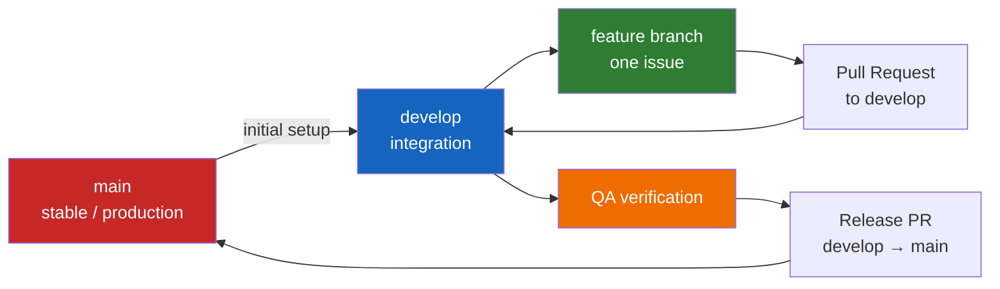

# Meeting Minutes — PO → Dev: Deerngo Bot Development Workflow

> **Date:** 2026-07-31
> **Type:** Development Workflow Handoff
> **From:** PO Persona
> **To:** Dev Persona
> **Status:** ✅ Ready for implementation

---

## 1. Purpose

> Define the development workflow Dev must follow while implementing Deerngo Bot Phase 1. This handoff does not replace the requirements, design, QA, security, or DevOps documents. It explains how to work from the GitHub backlog, how to branch and merge, how to verify work, and how to hand work to QA and PO.

---

## 2. Source of Truth and Document Priority

When documents appear to disagree, use this order of authority:

1. **Acceptance Criteria** — defines whether the story is accepted.
2. **API Specification / Database Schema** — defines technical contracts and data constraints.
3. **Architecture and Construction Documents** — defines implementation conventions.
4. **GitHub Issue** — tracks the implementation task, sprint, status, and PR linkage.
5. **Phase Plan** — provides sequencing and estimates; it must not silently override an acceptance criterion.

If a conflict blocks implementation, stop the affected work, comment on the GitHub issue, and tag PO rather than inventing behavior.

---

## 3. Repository Ownership

| Repository | Owner | Responsibilities | Port |
|------------|-------|------------------|:----:|
| [`oat431/deerngo-bot`](https://github.com/oat431/deerngo-bot) | Backend | Go API, PostgreSQL access, migrations, YouTube scheduler, EasyDonate sync/webhook, matching engine, points API, scoreboard API, streamer.bot integration contract | 8008 |
| [`oat431/deerngo-web`](https://github.com/oat431/deerngo-web) | Frontend | Next.js public scoreboard, API client, loading/empty/error states, responsive UI, Tailwind/DaisyUI implementation | 3008 |

### Cross-Repository Boundary

- The backend owns the API contract.
- The frontend consumes the backend scoreboard contract; it does not duplicate points or matching logic.
- The frontend US-030 issue depends on backend US-031.
- Do not create a third application repository for Phase 1.

---

## 4. GitHub Backlog Created by PO

### Backend — `oat431/deerngo-bot`

| Story | GitHub Issue | Milestone | Points |
|-------|--------------|-----------|:------:|
| US-001 — Hybrid subscriber capture | [#1](https://github.com/oat431/deerngo-bot/issues/1) | Sprint 1 — Foundation & Donate | 5 |
| US-002 — Subscriber registration API | [#2](https://github.com/oat431/deerngo-bot/issues/2) | Sprint 1 — Foundation & Donate | 2 |
| US-003 — YouTube polling scheduler | [#3](https://github.com/oat431/deerngo-bot/issues/3) | Sprint 1 — Foundation & Donate | 5 |
| US-010 — streamer.bot donate command | [#4](https://github.com/oat431/deerngo-bot/issues/4) | Sprint 1 — Foundation & Donate | 2 |
| US-011 — Point command integration | [#5](https://github.com/oat431/deerngo-bot/issues/5) | Sprint 2 — Points Engine | 3 |
| US-012 — streamer.bot actions | [#6](https://github.com/oat431/deerngo-bot/issues/6) | Sprint 2 — Points Engine | 3 |
| US-020 — EasyDonate donation sync | [#7](https://github.com/oat431/deerngo-bot/issues/7) | Sprint 2 — Points Engine | 5 |
| US-021 — Donor-name matching | [#8](https://github.com/oat431/deerngo-bot/issues/8) | Sprint 2 — Points Engine | 5 |
| US-022 — Points calculation/query API | [#9](https://github.com/oat431/deerngo-bot/issues/9) | Sprint 3 — Scoreboard & Hardening | 3 |
| US-031 — Scoreboard API | [#10](https://github.com/oat431/deerngo-bot/issues/10) | Sprint 3 — Scoreboard & Hardening | 3 |

### Frontend — `oat431/deerngo-web`

| Story | GitHub Issue | Milestone | Points |
|-------|--------------|-----------|:------:|
| US-030 — Public scoreboard page | [#1](https://github.com/oat431/deerngo-web/issues/1) | Sprint 3 — Scoreboard & Hardening | 5 |

### Issue Rules

- Every implementation branch must reference one GitHub issue.
- Every PR must include `Closes #N` or `Refs #N` as appropriate.
- Keep acceptance criteria as checkboxes in the issue and tick them only after evidence exists.
- Add implementation notes, test evidence, and known limitations to the issue before requesting review.

---

## 5. Branch and Pull Request Workflow

### 5.1 Branch Model



### 5.2 Current Branch State

At the time of this handoff, GitHub reports only `main` in both repositories. Before starting feature work:

- [ ] Create and push `develop` in `oat431/deerngo-bot`.
- [ ] Create and push `develop` in `oat431/deerngo-web`.
- [ ] Protect `main` and require pull requests if repository settings permit.
- [ ] Do not commit implementation work directly to `main`.

### 5.3 Branch Naming

Use the issue number in every branch name so the branch is traceable:

| Work Type | Pattern | Example |
|-----------|---------|---------|
| Feature | `feat/issue-{N}-{short-name}` | `feat/issue-1-subscriber-hybrid` |
| Bug fix | `fix/issue-{N}-{short-name}` | `fix/issue-8-matcher-threshold` |
| Test | `test/issue-{N}-{short-name}` | `test/issue-3-youtube-poller` |
| Documentation | `docs/issue-{N}-{short-name}` | `docs/issue-6-streamerbot-actions` |
| CI/build | `ci/issue-{N}-{short-name}` | `ci/issue-12-github-actions` |

### 5.4 Standard Branch-to-PR Flow

```bash
# Work in the selected repository.
git fetch origin
git checkout develop
git pull --ff-only origin develop

# Use the GitHub issue number in the branch name.
git checkout -b feat/issue-2-subscriber-api

# Implement, test, and inspect the diff.
git status
git diff --check

# Use a Conventional Commit.
git add <specific-files>
git commit -m "feat(subscribers): add registration endpoint"

# Push the feature branch.
git push -u origin feat/issue-2-subscriber-api

# Open a PR targeting develop.
gh pr create \
  --base develop \
  --title "feat(subscribers): implement US-002 registration API" \
  --body-file .github/pull_request_template.md
```

### 5.5 Pull Request Requirements

Every PR must contain:

- [ ] Linked GitHub issue.
- [ ] Short summary of the implementation.
- [ ] Acceptance criteria addressed.
- [ ] Tests added or updated.
- [ ] Commands run and their results.
- [ ] Migration/configuration changes called out explicitly.
- [ ] Security impact reviewed (secrets, input validation, SQL, HMAC, logging).
- [ ] Docker/deployment impact called out if applicable.
- [ ] Screenshots or responsive evidence for frontend changes.
- [ ] No secrets, tokens, `.env` files, or production data committed.

### 5.6 Merge Rules

- PR target: `develop`.
- Merge method: squash merge unless PO/Dev agrees otherwise.
- Required checks must pass before merge.
- Delete the feature branch after merge.
- A sprint release PR from `develop` to `main` is created only after QA regression and PO acceptance.
- Never force-push `main`.

---

## 6. Commit Convention

Use the shared convention in `03_construction/034_SHARED_commit_messages_changelog.md`:

```text
<type>(<scope>): <imperative description>

Optional body explaining why.

Closes #<issue-number>
```

### Approved Types and Scopes

| Repository | Examples |
|------------|----------|
| Backend | `feat(subscribers)`, `feat(youtube)`, `feat(donations)`, `feat(matcher)`, `feat(points)`, `feat(webhook)`, `feat(scoreboard)`, `fix(db)`, `test(points)`, `ci(docker)` |
| Frontend | `feat(scoreboard)`, `feat(api)`, `fix(components)`, `style(styles)`, `test(scoreboard)`, `chore(docker)` |

Rules:

- Use imperative mood: `add`, not `added`.
- Keep the first line concise and no longer than 72 characters where practical.
- Keep commits atomic and logically reviewable.
- Do not commit WIP commits to `develop` or `main`; squash them in the PR.

---

## 7. Development Sequence

### Sprint 1 — Foundation and Donate

Work in this order unless a dependency requires a small earlier slice:

1. US-002 / Issue [#2] — subscriber API and validation.
2. US-003 / Issue [#3] — YouTube polling scheduler.
3. US-001 / Issue [#1] — shared upsert and hybrid deduplication.
4. US-010 / Issue [#4] — streamer.bot donate action and reproducible configuration.

**Sprint 1 exit evidence:** API tests, scheduler mock tests, migration result, Docker health check, and streamer.bot command evidence.

### Sprint 2 — Points Engine and Bot Commands

1. US-020 / Issue [#7] — EasyDonate webhook, sync, idempotency, and retry behavior.
2. US-021 / Issue [#8] — fuzzy donor-name matching.
3. US-022 / Issue [#9] — points calculation/query endpoint as a prerequisite for the point command.
4. US-011 / Issue [#5] — point command integration.
5. US-012 / Issue [#6] — final streamer.bot action configuration and failure handling.

> **Planning inconsistency to resolve:** The current GitHub milestone places US-022 in Sprint 3, but the phase-plan task table places the points API in Sprint 2 and US-011 depends on it. Dev must not leave the point command blocked. PO/Dev should either move Issue #9 to Sprint 2 or explicitly approve an earlier implementation slice while retaining the milestone.

### Sprint 3 — Scoreboard and Hardening

1. US-031 / Issue [#10] — paginated scoreboard API, zero-point exclusion, rate limiting, and pagination cap.
2. US-030 / `deerngo-web` Issue [#1] — public responsive scoreboard page.
3. Run full regression and prepare the release PR.

---

## 8. Quality Gates Before PR

### Backend — `deerngo-bot`

Run from the repository root:

```bash
go test ./...
go vet ./...
go build ./cmd/server
git diff --check
```

Also verify, as applicable:

- [ ] Database migrations apply cleanly and can roll back in the test database.
- [ ] Handler validation matches API Specification §3/§4.
- [ ] SQL uses parameterized queries through sqlx.
- [ ] HMAC comparisons use constant-time verification.
- [ ] OAuth refresh/access tokens and webhook secrets never appear in logs.
- [ ] Points updates are idempotent; DEF-S003 double-count behavior is covered.
- [ ] Health endpoint and Docker healthcheck pass.

### Frontend — `deerngo-web`

Run from the repository root using the repository's package manager and scripts:

```bash
bun install --frozen-lockfile
bun run lint
bun run typecheck
bun run build
```

Also verify, as applicable:

- [ ] `NEXT_PUBLIC_API_URL` is configurable.
- [ ] Scoreboard uses the backend US-031 contract.
- [ ] Loading, empty, API-error, and populated states are covered.
- [ ] Mobile layout and keyboard navigation are checked.
- [ ] No authentication is introduced in Phase 1.
- [ ] No private donation data is displayed.

### QA Handoff

After a story or sprint PR merges to `develop`:

1. Update the GitHub issue with the commit/PR link.
2. Provide QA with the deployed commit/image or local test instructions.
3. QA executes mapped test cases from `04_testing/042_test_cases.md`.
4. Fix failures on a new `fix/issue-{N}-...` branch.
5. Do not mark the issue complete until its AC checkboxes and QA evidence are complete.

---

## 9. Environment and Secrets Rules

| Environment | Use | Rule |
|-------------|-----|------|
| Local development | Developer machine | `.env`/`.env.local` may be used locally but must remain ignored |
| Test database | Automated/integration tests | Use isolated test data/database; never production data |
| Homelab production | Docker on homelab | Secrets supplied through deployment environment/secret store, never Git |
| streamer.bot PC | Live integration | Configure the LAN backend URL; do not hard-code secrets in actions |

Required secret handling:

- Never commit `DATABASE_URL` with real credentials.
- Never commit `EASYDONATE_WEBHOOK_SECRET`, YouTube refresh tokens, GitHub tokens, or SSH keys.
- Update `.env.example` when a new variable is introduced.
- Document secret rotation impact in the issue and operations runbook.

---

## 10. DevOps Workflow Boundary

Dev owns implementation changes in the application repositories. DevOps owns infrastructure changes and deployment support.

| Change | Dev Responsibility | DevOps Responsibility |
|--------|--------------------|-----------------------|
| Go/Next.js source | Implement and test | — |
| Migrations | Write and test migration | Run/approve production migration procedure |
| Dockerfile changes | Propose and test locally | Review production image/deploy impact |
| `db-network`/homelab compose | Coordinate required variables/ports | Maintain host deployment compose |
| Cloudflare Tunnel | Report required hostname/path | Configure and verify tunnel |
| GitHub Actions | Ensure commands are runnable | Maintain workflow/secrets/deploy runner |
| HMAC key rotation | Implement safe reload behavior and document app impact | Execute operational rotation and secret update |

### Deployment Conflict Flag

Two documents currently describe different Phase 1 deployment behavior:

- `external_plan/phase1-deerngo-bot-mvp.md`: manual deployment for Phase 1; CI/CD deferred.
- `05_devops/051_CICD_pipeline_configuration.md`: push to `main` triggers GHCR build and auto-deploy.

Until DevOps reconciles this, Dev must treat deployment as **manual and approval-controlled**, must not assume a push to `main` is safe, and must not change production without an explicit deployment confirmation.

---

## 11. Definition of Done for a Development Issue

A GitHub story issue is complete only when:

- [ ] Implementation is merged into `develop` through a PR.
- [ ] All story acceptance criteria are checked with evidence.
- [ ] Automated tests pass; required manual tests are recorded.
- [ ] Relevant QA test cases are executed or scheduled with a clear blocker.
- [ ] Documentation, migrations, environment examples, and runbook updates are included where applicable.
- [ ] Security review items are addressed.
- [ ] No known regression is introduced.
- [ ] Issue has links to the PR, test evidence, and deployment/verification result.

### Phase 1 Release DoD

- [ ] All 11 user stories implemented.
- [ ] All 54 acceptance criteria pass.
- [ ] All 59 test cases are green or have an explicitly approved exception.
- [ ] Regression suite passes.
- [ ] First live-stream test completes successfully.
- [ ] PO confirms MVP acceptance before `develop` is released to `main`.

---

## 12. Open Items for Dev/DevOps Coordination

| ID | Item | Owner | Priority | Status |
|----|------|:-----:|:--------:|:------:|
| WF-001 | Create/push `develop` branches in both GitHub repositories | Dev | 🔴 | ⬜ Open |
| WF-002 | Reconcile US-022 milestone versus Sprint 2 dependency for US-011 | PO + Dev | 🔴 | ⬜ Open |
| WF-003 | Reconcile manual Phase 1 deployment plan versus CI/CD auto-deploy document | DevOps + PO | 🔴 | ⬜ Open |
| WF-004 | Confirm GitHub branch protection and required status checks | DevOps | 🟡 | ⬜ Open |
| WF-005 | Confirm exact frontend package-manager/script names against repository `package.json` | Dev | 🟡 | ⬜ Open |
| WF-006 | Confirm production API URL/CORS behavior for browser-based scoreboard calls | Dev + DevOps | 🔴 | ⬜ Open |

---

## 13. Action Items

| Action ID | Action | Owner | Due Date | Status | Related Decision |
|-----------|--------|:-----:|----------|:------:|------------------|
| DEV-WF-001 | Create and push `develop` branches in both repositories | Dev | Before first feature branch | ⬜ Open | DEC-WF-001 |
| DEV-WF-002 | Start Sprint 1 from US-002, US-003, US-001, then US-010 | Dev | Sprint 1 | ⬜ Open | DEC-WF-002 |
| DEV-WF-003 | Use one traceable feature branch and PR per issue | Dev | Every issue | ⬜ Open | DEC-WF-002 |
| DEV-WF-004 | Run repository quality gates before opening each PR | Dev | Every PR | ⬜ Open | DEC-WF-003 |
| DEV-WF-005 | Update issue checkboxes and attach test evidence before closure | Dev | Every issue | ⬜ Open | DEC-WF-004 |
| DEV-WF-006 | Reconcile US-022 scheduling with PO before point-command implementation | PO + Dev | Before Sprint 2 | ⬜ Open | DEC-WF-005 |
| DEV-WF-007 | Resolve deployment trigger conflict before first production deployment | DevOps + PO | Before release PR | ⬜ Open | DEC-WF-006 |
| DEV-WF-008 | Hand merged sprint work to QA using mapped TC ranges | Dev | End of each sprint | ⬜ Open | — |

---

## 14. Documents Dev Must Use

| Document | Path | Use |
|----------|------|-----|
| User Stories | `01_requirement/012_user_stories.md` | Story intent, points, sprint, objectives |
| Acceptance Criteria | `01_requirement/013_acceptance_criteria.md` | Definition of behavior and acceptance |
| API Specification | `02_design/022_API_specification.md` | Endpoint contracts and response shapes |
| Database Schema | `02_design/023_database_schema_DDL.md` | Tables, constraints, indexes, triggers |
| Architecture Overview | `02_design/029_architecture_overview.md` | Components, ports, and data flow |
| Backend README | `03_construction/031_BE_README.md` | Backend setup and project structure |
| Frontend README | `03_construction/031_FE_README.md` | Frontend setup and project structure |
| Build Scripts | `03_construction/032_BE_build_scripts.md`, `032_FE_build_scripts.md` | Commands and build expectations |
| Coding Standards | `03_construction/035_BE_coding_standards.md`, `035_FE_coding_standards.md` | Construction conventions |
| Security Standards | `06_security/062_coding_standards_security.md` | Secure implementation rules |
| Test Cases | `04_testing/042_test_cases.md` | Detailed verification steps |
| Regression Suite | `04_testing/044_regression_test_suite.md` | Smoke/core/full release gates |
| Phase Plan | `external_plan/phase1-deerngo-bot-mvp.md` | Sprint scope and dependencies |
| GitHub Issues | Repository issue links in Section 4 | Active task status and evidence |

---

## Related Documents

| Document | Relationship |
|----------|-------------|
| [[071_risk_register]] | Project risks and mitigations |
| [[072_MM02_designer-to-dev-uxpo_20260729]] | Previous design handoff to Dev/UX/PO |
| [[072_MM03_sa-to-qa_20260730]] | Construction handoff to QA |
| [[072_MM04_qa-to-po_20260730]] | QA decisions and resolved spec gaps |
| [[phase1-deerngo-bot-mvp]] | Sprint implementation plan |
| [[034_SHARED_commit_messages_changelog]] | Shared commit convention |
| [[051_CICD_pipeline_configuration]] | CI/CD pipeline definition |
| [[052_deployment_plan]] | Deployment and rollback procedures |
| [[061_security_test_report]] | Security assessment and controls |

---

> **Status:** PO development-workflow handoff complete. Dev may begin after creating `develop` branches and resolving the two explicitly flagged workflow conflicts.
> **Cross-persona handoff:** PO defines what and how completion is measured. Dev implements and supplies evidence. QA verifies. DevOps controls infrastructure and deployment.
> **Meeting ID:** MM05
> **File:** `07_pm/072_MM05_po-to-dev-development-workflow_20260731.md`
