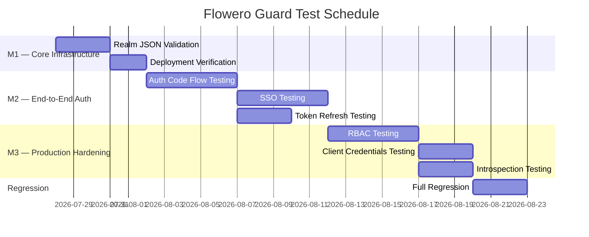

# Test Plan — Flowero Guard

> **Project:** Flowero Guard
> **Version:** 1.0 | **Status:** Draft
> **Last Updated:** 2026-07-26

---

## Document Control

| Field | Value |
|-------|-------|
| Document Owner | QA Engineer |
| Approvals | PO (Product Owner), Dev / SA Persona, QA Engineer |

### Approvals

| Role | Name | Signature | Date |
|------|------|-----------|------|
| Product Owner | PO (Product Owner) | | |
| Technical Lead | Dev / SA Persona | | |
| QA Lead | QA Engineer | | |

---

## 1. Introduction

### 1.1 Purpose

> This plan defines the testing approach, scope, resources, schedule, and deliverables for Flowero Guard — the Keycloak-based OAuth 2.0 / OpenID Connect identity provider for the Panomete Platform. Since Flowero Guard is a config-only service (no compiled application code), testing focuses on configuration validation, OAuth2/OIDC flow verification, integration with consuming services, and deployment correctness.

### 1.2 Scope

| In Scope | Out of Scope |
|---------|-------------|
| Realm JSON validation (`panomete-realm.json`) | Performance/load testing — separate plan |
| OAuth2 Authorization Code flow | Penetration testing — covered in 061_security_test_report |
| OAuth2 Client Credentials flow | Social login (not in MVP) |
| OAuth2 Refresh Token flow | MFA/2FA (not in MVP) |
| Token introspection endpoint | LDAP federation (not in MVP) |
| JWKS endpoint availability and correctness | User self-registration (disabled by design) |
| SSO across platform services | Keycloak source code testing |
| RBAC enforcement via JWT claims | Distributed caching (KC_CACHE=local) |
| User management (admin-created users) | Disaster recovery testing |
| Docker deployment and startup verification | |
| Realm persistence across restarts | |
| Nginx proxy routing to Guard | |
| Gate JWT local validation (integration) | |

## 2. Test Strategy

> Since Flowero Guard is Keycloak deployed via Docker with a realm JSON configuration, there is no unit-level code to test. Testing is entirely integration and system-level.

| Level | Type | Automation | Coverage Target |
|-------|------|-----------|----------------|
| Configuration Validation | White-box | 100% | All realm JSON fields verified |
| Integration (OAuth2 flows) | Black-box | 90% | All OAuth2 grant types + error paths |
| System (SSO, RBAC) | Black-box | 80% | All user stories US-001 through US-006 |
| UAT | Black-box | 0% | All business scenarios (PO sign-off) |
| Regression | Black-box | 100% | All critical OAuth flows |
| Deployment | Smoke | 100% | Health, OIDC discovery, JWKS, admin console |

## 3. Test Environment

| Environment | Purpose | URL | Data |
|------------|---------|-----|------|
| Homelab (Production) | Primary test target | `https://auth.panomete.com` | Real admin + test users |
| Local (Developer) | Local realm change testing | `http://localhost:8080` | Synthetic users (KC_DB=dev-file) |
| CI Pipeline | Realm JSON validation | N/A (GitHub Actions) | Static validation only |

### Environment Configuration

| Component | Technology | Details |
|-----------|-----------|---------|
| Identity Provider | Keycloak 26.7.0 (Quarkus) | `flowero-guard` container on port 8001 |
| Database | PostgreSQL 18 (shared) | `local-postgres:5432`, database `keycloak` |
| Edge Proxy | Nginx | `auth.panomete.com` → `127.0.0.1:8001` |
| TLS | Cloudflare Tunnel | Terminates TLS, forwards HTTP to Nginx |
| API Gateway | Flowero Gate | Caches JWKS, validates JWTs locally |
| Network | Docker `db-network` | `shared-network` for inter-container comms |

## 4. Test Schedule

## 5. Test Resources

| Role | Name | Responsibility |
|------|------|---------------|
| QA Lead | QA Engineer | Test planning, execution, defect reporting |
| Platform Admin | PO (Product Owner) | Environment access, user provisioning, UAT sign-off |
| Developer | Dev / SA Persona | Realm configuration fixes, Docker/deployment issues |
| DevOps | DevOps Persona | Pipeline configuration, deployment support |

## 6. Entry & Exit Criteria

| Phase | Entry Criteria | Exit Criteria |
|-------|---------------|--------------|
| Configuration Validation | `panomete-realm.json` committed to repo | JSON valid, all required roles present, no secrets |
| Integration (OAuth2) | Guard deployed, OIDC discovery returns 200, JWKS accessible | All grant types produce valid JWTs, error codes correct |
| System (SSO/RBAC) | OAuth2 integration tests pass, Gate caching JWKS | SSO works across 2+ services, RBAC enforced correctly |
| UAT | System tests pass | PO sign-off on all user stories (US-001 to US-006) |
| Regression | All defects from prior phases fixed | No critical/high defects, all 30 acceptance criteria pass |

## 7. Defect Management

| Severity | Response Time | Resolution Time | Escalation |
|---------|-------------|----------------|-----------|
| 🔴 Critical | 1 hour | 4 hours | PO + Dev / SA Persona |
| 🟡 High | 4 hours | 1 day | Dev / SA Persona |
| 🟢 Medium | 1 day | 3 days | — |
| ⚪ Low | 3 days | Next sprint | — |

### Severity Classification for Flowero Guard

| Severity | Examples |
|---------|----------|
| 🔴 Critical | Guard container won't start; JWKS endpoint unreachable; token endpoint returns no tokens; SSO completely broken; admin console inaccessible |
| 🟡 High | Specific OAuth2 flow broken (e.g., refresh token fails); RBAC roles missing from JWT; client credentials grant returns wrong claims |
| 🟢 Medium | Token expiry misconfigured; redirect URI warning; introspection returns incomplete claims |
| ⚪ Low | Cosmetic issue in login page theme; minor log warnings; documentation mismatch |

## 8. Risk & Mitigations

| Risk | Probability | Impact | Mitigation |
|------|-----------|--------|-----------|
| Guard container fails to start (Liquibase/DB) | Medium | High | Verify PostgreSQL connectivity before testing; have rollback procedure (see 052_deployment_plan) |
| Realm JSON import fails silently | Medium | High | Always verify realm exists in Admin Console after deployment; check container logs |
| JWKS endpoint unreachable from Gate | Low | High | Test both internal (`localhost:8001`) and external (`auth.panomete.com`) endpoints |
| Cloudflare/Nginx routing changes | Low | High | Include Nginx routing in smoke tests; monitor with Flowero Discover |
| Test users locked out by brute force protection | Medium | Medium | Use dedicated test accounts; reset lockout via Admin Console if needed |
| Keycloak version incompatibility | Low | Medium | Pin image version; test realm import after every Keycloak upgrade |

## 9. Test Tools

| Tool | Purpose | How Used |
|------|---------|----------|
| `curl` | API testing (OAuth2 endpoints) | Token requests, JWKS fetch, introspection calls |
| `jq` | JSON parsing | Decode JWT payloads, parse OIDC discovery, validate realm JSON |
| `docker` | Container management | Logs inspection, restart, exec for kcadm.sh |
| Keycloak Admin Console | Configuration verification | Realm settings, user management, client registration |
| `kcadm.sh` | Keycloak CLI admin tool | Realm export, user CRUD, event queries |
| Postman / Insomnia | OAuth2 flow testing | Authorization code flow visualization, token management |
| Browser DevTools | SSO/session testing | Cookie inspection, redirect chain analysis, network tab |
| GitHub Actions | CI realm JSON validation | Automated `jq` + role presence checks on PR |

## 10. Deliverables

| Deliverable | Document | Status |
|------------|----------|--------|
| Test Plan | 041_test_plan.md | ✅ This document |
| Test Cases | 042_test_cases.md | ✅ Created |
| Defect Report | 043_defect_report.md | ✅ Created |
| Regression Suite | 044_regression_test_suite.md | ✅ Created |
| Coverage Report | 045_coverage_report.md | ✅ Created |
| Security Test Report | 061_security_test_report.md | ✅ Created |

---

## Related Documents

| Document | Relationship |
|----------|-------------|
| [[042_test_cases]] | Detailed test cases for all OAuth2 flows |
| [[043_defect_report]] | Defect tracking and metrics |
| [[044_regression_test_suite]] | Regression suite definition |
| [[045_coverage_report]] | Coverage analysis |
| [[061_security_test_report]] | Security-focused testing |
| [[013_acceptance_criteria]] | 30 BDD acceptance criteria these tests verify |
| [[022_API_specification]] | Endpoints under test |
| [[052_deployment_plan]] | Deployment procedures tested against |

---

> **Template Standard:** Based on SWEBOK v4, ISO/IEC/IEEE 29119
> **Usage:** This test plan governs all Flowero Guard testing. Since Guard is config-only, testing validates configuration, flows, and integration — not compiled code.
