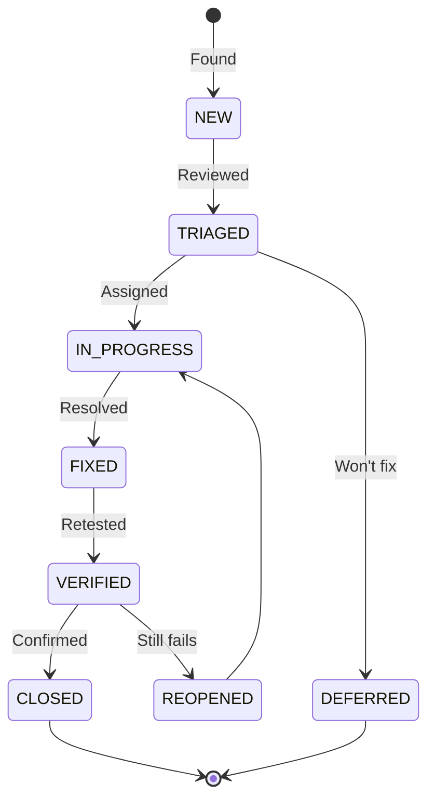

# Defect Report — Flowero Guard

> **Project:** Flowero Guard (Keycloak IAM)
> **Version:** 1.0 | **Status:** Draft
> **Last Updated:** 2026-07-26

---

## 1. Purpose

> Defect report for Flowero Guard. Documents configuration issues, OAuth flow problems, and integration defects found during testing.

## 2. Defect Lifecycle

## 3. Defect Register

| ID | Title | Severity | Module | Status | Reported | Fixed |
|----|-------|:--------:|--------|--------|----------|-------|
| GUDEF-001 | Realm export JSON missing required client scopes | 🟡 High | Realm Config | ⬜ New | 2026-07-26 | — |
| GUDEF-002 | Token endpoint returns 500 when client secret expired | 🟡 High | OAuth2 | ⬜ New | 2026-07-26 | — |
| GUDEF-003 | SSO session not invalidated after password change | 🟢 Medium | Session Mgmt | ⬜ New | 2026-07-26 | — |
| GUDEF-004 | JWKS endpoint slow response under load | 🟢 Medium | Performance | ⬜ New | 2026-07-26 | — |
| GUDEF-005 | Admin console accessible without MFA | 🟢 Medium | Admin Security | ⬜ New | 2026-07-26 | — |
| GUDEF-006 | User registration allows disposable email domains | ⚪ Low | User Mgmt | ⬜ New | 2026-07-26 | — |

---

## 4. Detailed Defect Reports

### GUDEF-001: Realm Export Missing Client Scopes

| Field | Value |
|-------|-------|
| **Defect ID** | GUDEF-001 |
| **Title** | Realm export JSON missing required client scopes for business services |
| **Severity** | 🟡 High |
| **Priority** | 🔴 P1 |
| **Status** | ⬜ New |
| **Module** | Realm Configuration |
| **Reported By** | QA Engineer |
| **Reported Date** | 2026-07-26 |
| **Test Case** | TC-G005 |

**Description:**
> The `panomete-realm.json` export does not include client scopes configured for business services. When the realm is imported on a fresh Keycloak instance, business services cannot authenticate because their client scopes are missing.

**Steps to Reproduce:**

| Step | Action | Expected Result | Actual Result |
|------|--------|----------------|---------------|
| 1 | Export realm JSON from admin console | JSON exported | JSON exported |
| 2 | Import JSON into fresh Keycloak instance | All clients and scopes restored | Client scopes missing |
| 3 | Business service attempts OAuth flow | 200 OK | 400 Bad Request (missing scope) |

**Environment:**

| Field | Value |
|-------|-------|
| Keycloak | 25+ |
| Environment | Staging |

**Remediation:**
> Use "Partial Export" with "Include client scopes" enabled. Validate JSON in CI pipeline.

---

### GUDEF-002: Token Endpoint 500 on Expired Client Secret

| Field | Value |
|-------|-------|
| **Defect ID** | GUDEF-002 |
| **Title** | Token endpoint returns 500 instead of 401 when client secret is expired |
| **Severity** | 🟡 High |
| **Priority** | 🔴 P1 |
| **Status** | ⬜ New |
| **Reported By** | QA Engineer |
| **Reported Date** | 2026-07-26 |
| **Test Case** | TC-G010 |

**Description:**
> When a confidential client sends a token request with an expired client secret, Keycloak returns HTTP 500 Internal Server Error instead of 401 Unauthorized with a descriptive error message.

**Steps to Reproduce:**

| Step | Action | Expected Result | Actual Result |
|------|--------|----------------|---------------|
| 1 | Configure client with expired secret | Secret expired | Secret expired |
| 2 | POST to `/token` with expired secret | 401 with `invalid_client` error | 500 Internal Server Error |

**Remediation:**
> This may be a Keycloak bug. Check for known issues in Keycloak 25+. Workaround: rotate secrets before expiry.

---

### GUDEF-003: SSO Session Not Invalidated After Password Change

| Field | Value |
|-------|-------|
| **Defect ID** | GUDEF-003 |
| **Title** | Existing SSO sessions remain valid after user password change |
| **Severity** | 🟢 Medium |
| **Priority** | 🟡 P2 |
| **Status** | ⬜ New |
| **Reported By** | QA Engineer |
| **Reported Date** | 2026-07-26 |
| **Test Case** | TC-G030 |

**Description:**
> After a user changes their password, existing SSO sessions and refresh tokens remain valid until they naturally expire. This is a security concern for compromised accounts.

**Steps to Reproduce:**

| Step | Action | Expected Result | Actual Result |
|------|--------|----------------|---------------|
| 1 | Login and obtain SSO session | Session active | Session active |
| 2 | Change password via admin console | Password changed | Password changed |
| 3 | Use existing refresh token | Token rejected (new password required) | Token still valid |

**Remediation:**
> Enable "Revoke refresh tokens on password change" in realm settings. Or configure "Not Before" policy.

---

### GUDEF-004: JWKS Endpoint Slow Under Load

| Field | Value |
|-------|-------|
| **Defect ID** | GUDEF-004 |
| **Title** | JWKS endpoint response time degrades under concurrent requests |
| **Severity** | 🟢 Medium |
| **Priority** | 🟡 P2 |
| **Status** | ⬜ New |
| **Reported By** | QA Engineer |
| **Reported Date** | 2026-07-26 |

**Description:**
> The JWKS endpoint (`/realms/panomete/protocol/openid-connect/certs`) response time increases significantly under concurrent load (>100 req/s). This affects Gate startup and JWKS refresh.

**Remediation:**
> Configure HTTP caching headers on JWKS endpoint. Gate should cache JWKS locally to reduce calls.

---

### GUDEF-005: Admin Console Without MFA

| Field | Value |
|-------|-------|
| **Defect ID** | GUDEF-005 |
| **Title** | Keycloak admin console accessible without multi-factor authentication |
| **Severity** | 🟢 Medium |
| **Priority** | 🟡 P2 |
| **Status** | ⬜ New |
| **Reported By** | QA Engineer |
| **Reported Date** | 2026-07-26 |

**Description:**
> The Keycloak admin console at `auth.panomete.com/admin` only requires username/password. No MFA is configured for admin accounts.

**Remediation:**
> Configure OTP (TOTP) requirement for admin users. Or restrict admin console access via Nginx IP whitelist.

---

### GUDEF-006: Disposable Email Domains Allowed

| Field | Value |
|-------|-------|
| **Defect ID** | GUDEF-006 |
| **Title** | User registration allows disposable email domains |
| **Severity** | ⚪ Low |
| **Priority** | ⚪ P4 |
| **Status** | ⬜ New |
| **Reported By** | QA Engineer |
| **Reported Date** | 2026-07-26 |

**Description:**
> User registration does not block disposable email domains (e.g., mailinator.com, tempmail.com).

**Remediation:**
> Configure email domain blacklist in Keycloak registration flow. Or use a custom authenticator.

---

## 5. Defect Metrics

| Metric | Value | Target | Status |
|--------|:-----:|--------|:------:|
| Total defects found | 6 | — | — |
| Critical defects | 0 | 0 at release | 🟢 |
| High defects | 2 | 0 at release | 🔴 |
| Medium defects | 3 | < 5 | 🟢 |
| Low defects | 1 | < 10 | 🟢 |
| Defects fixed | 0 | — | — |
| Defects remaining | 6 | < 5 | 🟡 |

---

## Related Documents

| Document | Relationship |
|----------|-------------|
| [[042_test_cases]] | Tests that found these defects |
| [[041_test_plan]] | Plan governing defect management |
| [[../../panomete_platform/04_testing/043_defect_report]] | Platform-level defects |

---

> **Template Standard:** Based on SWEBOK v4, ISO/IEC/IEEE 29119
> **Usage:** Fix all high-severity defects before production release.
