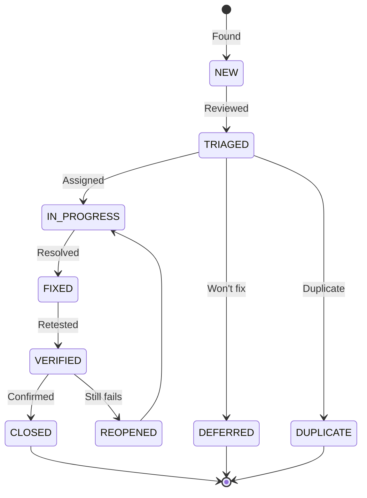

# Defect Report — Panomete Platform

> **Project:** Panomete Platform
> **Version:** 1.0 | **Status:** Draft
> **Last Updated:** 2026-07-26

---

## 1. Purpose

> Standardized defect reporting for cross-service and platform-level defects found during integration and E2E testing.

## 2. Defect Lifecycle

## 3. Defect Register

| ID | Title | Severity | Module | Status | Assigned | Reported | Fixed |
|----|-------|:--------:|--------|--------|----------|----------|-------|
| PDEF-001 | Gate returns 502 when business service not yet registered in Eureka | 🟡 High | Gateway / Discovery | ⬜ New | — | 2026-07-26 | — |
| PDEF-002 | Guard JWKS cache not refreshed after Keycloak key rotation | 🟡 High | Auth / Gateway | ⬜ New | — | 2026-07-26 | — |
| PDEF-003 | Rate limit counters lost when Valkey restarts | 🟢 Medium | Gateway / Rate Limiting | ⬜ New | — | 2026-07-26 | — |
| PDEF-004 | Discover dashboard shows stale entries after service crash | 🟢 Medium | Discovery | ⬜ New | — | 2026-07-26 | — |
| PDEF-005 | Nginx 502 during Guard startup (race condition) | 🟢 Medium | Edge / Guard | ⬜ New | — | 2026-07-26 | — |
| PDEF-006 | CORS preflight returns 401 for authenticated routes | 🟡 High | Gateway / CORS | ⬜ New | — | 2026-07-26 | — |
| PDEF-007 | Gate JWT claim headers not forwarded for client_credentials grant | 🟢 Medium | Gateway / Auth | ⬜ New | — | 2026-07-26 | — |
| PDEF-008 | Eureka self-preservation mode prevents timely deregistration | ⚪ Low | Discovery | ⬜ New | — | 2026-07-26 | — |

---

## 4. Detailed Defect Reports

### PDEF-001: Gate returns 502 when business service not yet registered

| Field | Value |
|-------|-------|
| **Defect ID** | PDEF-001 |
| **Title** | Gate returns 502 Bad Gateway when business service is starting up but not yet registered in Eureka |
| **Severity** | 🟡 High |
| **Priority** | 🔴 P1 |
| **Status** | ⬜ New |
| **Module** | Gateway / Discovery |
| **Reported By** | QA Engineer |
| **Reported Date** | 2026-07-26 |
| **Test Case** | PLAT-TC-103 |
| **Requirement** | US-204 |

**Description:**
> When a business service container is starting but has not yet completed Eureka registration (typically 10-30 seconds after boot), Gate returns 502 Bad Gateway instead of a more informative error. The client has no way to distinguish between "service starting" and "service down."

**Steps to Reproduce:**

| Step | Action | Expected Result | Actual Result |
|------|--------|----------------|---------------|
| 1 | Start a new business service container | Container starts | Container starts |
| 2 | Immediately call Gate API for that service | 503 Service Unavailable with retry hint | 502 Bad Gateway |
| 3 | Wait 30 seconds, call again | 200 OK | 200 OK |

**Environment:**

| Field | Value |
|-------|-------|
| Environment | Staging (homelab) |
| Gate Version | Spring Cloud Gateway 2025.1.2 |
| Java | 25 |
| OS | Ubuntu, kernel 7.0.0 |

**Evidence:**
> Gate logs show `No instances available for tiny-mchwa` from LoadBalancer. Circuit breaker not engaged because Eureka returns empty list rather than connection error.

**Remediation Suggestion:**
> Configure Gate's circuit breaker to return 503 with `Retry-After` header when Eureka returns no instances. Add fallback controller response for "service not yet available."

---

### PDEF-002: JWKS cache not refreshed after key rotation

| Field | Value |
|-------|-------|
| **Defect ID** | PDEF-002 |
| **Title** | Gate's JWKS cache is not refreshed when Keycloak rotates signing keys |
| **Severity** | 🟡 High |
| **Priority** | 🔴 P1 |
| **Status** | ⬜ New |
| **Reported By** | QA Engineer |
| **Reported Date** | 2026-07-26 |
| **Test Case** | PLAT-TC-005 (variant) |
| **Requirement** | ADR-007 |

**Description:**
> After Keycloak rotates its signing keys (e.g., during upgrade or manual rotation), Gate continues using the cached JWKS from startup. All tokens signed with the new key are rejected until Gate is restarted.

**Steps to Reproduce:**

| Step | Action | Expected Result | Actual Result |
|------|--------|----------------|---------------|
| 1 | Rotate Keycloak signing keys | New keys active | New keys active |
| 2 | Obtain new JWT from Keycloak | Token signed with new key | Token signed with new key |
| 3 | Call Gate API with new token | 200 (JWKS refreshed) | 401 (old JWKS cached) |
| 4 | Restart Gate | — | 200 (JWKS re-fetched) |

**Remediation Suggestion:**
> Configure Spring Security's `JwkSetUriReactiveJwtDecoder` with a cache TTL (e.g., 5 minutes) or implement a JWKS refresh endpoint. Alternatively, on 401 with valid signature structure, trigger JWKS re-fetch.

---

### PDEF-003: Rate limit counters lost on Valkey restart

| Field | Value |
|-------|-------|
| **Defect ID** | PDEF-003 |
| **Title** | Rate limit counters reset when Valkey container restarts |
| **Severity** | 🟢 Medium |
| **Priority** | 🟡 P2 |
| **Status** | ⬜ New |
| **Reported By** | QA Engineer |
| **Reported Date** | 2026-07-26 |
| **Test Case** | PLAT-TC-203 |
| **Requirement** | ADR-008 |

**Description:**
> When Valkey restarts (e.g., crash, update), all rate limit counters are lost. Clients that were being rate-limited can immediately resume full request rates. This is a transient security gap.

**Steps to Reproduce:**

| Step | Action | Expected Result | Actual Result |
|------|--------|----------------|---------------|
| 1 | Send requests exceeding rate limit | 429 returned | 429 returned |
| 2 | Restart Valkey container | Valkey restarts | Valkey restarts |
| 3 | Send same requests immediately | 429 (counters persisted) | 200 (counters lost) |

**Remediation Suggestion:**
> Enable Valkey RDB persistence (`save 60 1000`) or AOF (`appendonly yes`) for rate limit keys. Alternatively, accept this as a known limitation for a homelab environment.

---

### PDEF-004: Discover dashboard shows stale entries

| Field | Value |
|-------|-------|
| **Defect ID** | PDEF-004 |
| **Title** | Eureka dashboard shows services as UP after container crash |
| **Severity** | 🟢 Medium |
| **Priority** | 🟡 P2 |
| **Status** | ⬜ New |
| **Reported By** | QA Engineer |
| **Reported Date** | 2026-07-26 |
| **Test Case** | PLAT-TC-102 |
| **Requirement** | US-102 |

**Description:**
> When a service container crashes (not graceful shutdown), Eureka continues showing it as UP for up to 90 seconds due to self-preservation mode. During this window, Gate may route traffic to a dead service.

**Steps to Reproduce:**

| Step | Action | Expected Result | Actual Result |
|------|--------|----------------|---------------|
| 1 | `docker kill flowero-gate` (force kill) | Container dies | Container dies |
| 2 | Check Eureka dashboard immediately | Gate shown as DOWN | Gate shown as UP |
| 3 | Wait 90 seconds | Gate removed from registry | Gate still UP (self-preservation) |

**Remediation Suggestion:**
> Configure Docker health checks to detect crashes faster. Consider reducing Eureka's eviction timeout or disabling self-preservation for single-instance deployments.

---

### PDEF-005: Nginx 502 during Guard startup

| Field | Value |
|-------|-------|
| **Defect ID** | PDEF-005 |
| **Title** | Nginx returns 502 during Keycloak startup race condition |
| **Severity** | 🟢 Medium |
| **Priority** | 🟢 P3 |
| **Status** | ⬜ New |
| **Reported By** | QA Engineer |
| **Reported Date** | 2026-07-26 |
| **Test Case** | PLAT-TC-401 |
| **Requirement** | Deployment Plan §5 |

**Description:**
> During platform startup, if Nginx receives a request for `auth.panomete.com` before Guard has finished booting (Keycloak takes 15-30 seconds), Nginx returns 502 Bad Gateway.

**Steps to Reproduce:**

| Step | Action | Expected Result | Actual Result |
|------|--------|----------------|---------------|
| 1 | Stop all platform services | All stopped | All stopped |
| 2 | Start Guard, immediately request `auth.panomete.com` | 503 with retry or loading page | 502 Bad Gateway |

**Remediation Suggestion:**
> Add Nginx `proxy_next_upstream` with retry, or configure Docker Compose health check to delay Nginx routing until Guard is ready.

---

### PDEF-006: CORS preflight returns 401

| Field | Value |
|-------|-------|
| **Defect ID** | PDEF-006 |
| **Title** | CORS OPTIONS preflight requests to authenticated routes return 401 |
| **Severity** | 🟡 High |
| **Priority** | 🔴 P1 |
| **Status** | ⬜ New |
| **Reported By** | QA Engineer |
| **Reported Date** | 2026-07-26 |
| **Test Case** | PLAT-TC-205 |
| **Requirement** | US-201 |

**Description:**
> Browser CORS preflight (OPTIONS) requests to `/api/v1/**` routes are being authenticated by Spring Security, returning 401. The browser never sends the JWT on preflight requests, so the preflight fails and the actual request is blocked.

**Steps to Reproduce:**

| Step | Action | Expected Result | Actual Result |
|------|--------|----------------|---------------|
| 1 | Send `OPTIONS /api/v1/users/me` with CORS headers | 200 with CORS headers | 401 Unauthorized |

**Remediation Suggestion:**
> Ensure `CorsWebFilter` is ordered before `SecurityWebFilterChain`, or add OPTIONS to permitted path matchers in `SecurityConfig`.

---

### PDEF-007: Client credentials grants missing claim headers

| Field | Value |
|-------|-------|
| **Defect ID** | PDEF-007 |
| **Title** | `JwtClaimHeaderFilter` does not forward claims for client_credentials tokens |
| **Severity** | 🟢 Medium |
| **Priority** | 🟡 P2 |
| **Status** | ⬜ New |
| **Reported By** | QA Engineer |
| **Reported Date** | 2026-07-26 |
| **Test Case** | PLAT-TC-006 |
| **Requirement** | US-005 |

**Description:**
> When a service uses client_credentials grant (no `email` or `sub` user claim), `JwtClaimHeaderFilter` does not inject `X-User-Id` or `X-User-Email`. Downstream services cannot identify the calling service.

**Steps to Reproduce:**

| Step | Action | Expected Result | Actual Result |
|------|--------|----------------|---------------|
| 1 | Obtain token via client_credentials grant | Token received | Token received |
| 2 | Call Gate API with token | `X-Client-Id` header forwarded | No identifying headers |

**Remediation Suggestion:**
> Extend `JwtClaimHeaderFilter` to also extract `client_id` claim and forward as `X-Client-Id` header for service-to-service calls.

---

### PDEF-008: Eureka self-preservation delays deregistration

| Field | Value |
|-------|-------|
| **Defect ID** | PDEF-008 |
| **Title** | Eureka self-preservation mode prevents timely service deregistration |
| **Severity** | ⚪ Low |
| **Priority** | ⚪ P4 |
| **Status** | ⬜ New |
| **Reported By** | QA Engineer |
| **Reported Date** | 2026-07-26 |
| **Test Case** | PLAT-TC-105 |
| **Requirement** | US-101 |

**Description:**
> In a small deployment (3 services), network jitter can trigger Eureka's self-preservation mode, preventing stale entries from being evicted. This is expected behavior but may cause confusion.

**Remediation Suggestion:**
> Document this as expected behavior. Consider `eureka.server.enable-self-preservation=false` for the homelab environment.

---

## 5. Defect Metrics

| Metric | Value | Target | Status |
|--------|:-----:|--------|:------:|
| Total defects found | 8 | — | — |
| Critical defects | 0 | 0 at release | 🟢 |
| High defects | 3 | 0 at release | 🔴 |
| Medium defects | 4 | < 5 | 🟢 |
| Low defects | 1 | < 10 | 🟢 |
| Defects fixed | 0 | — | — |
| Defects remaining | 8 | < 5 | 🔴 |

## 6. Severity Definitions

| Severity | Definition | Response | Resolution |
|----------|-----------|----------|------------|
| 🔴 **Critical** | Platform completely unusable; all services down | 1 hour | 4 hours |
| 🟡 **High** | Major cross-service functionality broken; no workaround | 4 hours | 1 day |
| 🟢 **Medium** | Feature broken but workaround exists | 1 day | 3 days |
| ⚪ **Low** | Minor issue; cosmetic or edge case | 3 days | Next sprint |

---

## Related Documents

| Document | Relationship |
|----------|-------------|
| [[042_test_cases]] | Tests that found these defects |
| [[041_test_plan]] | Plan governing defect management |
| [[../flowero_gate/04_testing/043_defect_report]] | Gate-specific defects |
| [[../flowero_discover/04_testing/043_defect_report]] | Discover-specific defects |
| [[../flowero_guard/04_testing/043_defect_report]] | Guard-specific defects |

---

> **Template Standard:** Based on SWEBOK v4, ISO/IEC/IEEE 29119
> **Usage:** Platform-level defects affect multiple services. Route fixes to the appropriate service team.
