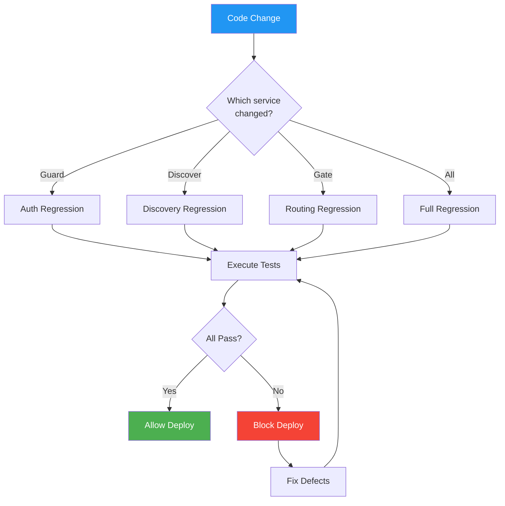

# Regression Test Suite — Panomete Platform

> **Project:** Panomete Platform
> **Version:** 1.0 | **Status:** Draft
> **Last Updated:** 2026-07-26

---

## 1. Purpose

> Platform-level regression testing ensures that changes to any foundation service (Guard, Discover, Gate) don't break cross-service interactions or platform-wide functionality.

## 2. Regression Strategy

| Scope | When | Tests | Duration |
|-------|------|:-----:|:--------:|
| Smoke | Every deployment | 8 | < 5 min |
| Targeted | Affected modules | Variable | < 30 min |
| Full Regression | Pre-release | 25 | < 2 hours |

## 3. Regression Suite Composition

| Category | Tests | Automation | Priority |
|----------|:-----:|:----------:|:--------:|
| Critical Paths (Auth + Routing) | 8 | 100% | 🔴 Always run |
| Service Discovery | 5 | 80% | 🔴 Always run |
| Security Controls | 6 | 80% | 🔴 Always run |
| Infrastructure | 6 | 60% | 🟡 Pre-release |
| **Total** | **25** | **84%** | |

## 4. Smoke Tests (Every Deployment)

| # | Test ID | Test Name | Expected | Automated |
|---|---------|-----------|----------|:---------:|
| 1 | SMOKE-001 | Guard health check | `GET :8001/health/ready` → 200 | ✅ |
| 2 | SMOKE-002 | Discover health check | `GET :8999/actuator/health` → `{"status":"UP"}` | ✅ |
| 3 | SMOKE-003 | Gate health check | `GET :8000/actuator/health` → `{"status":"UP"}` | ✅ |
| 4 | SMOKE-004 | Gate rejects unauthenticated request | `GET /api/v1/**` without JWT → 401 | ✅ |
| 5 | SMOKE-005 | Gate accepts valid JWT | `GET /api/v1/**` with JWT → not 401/403 | ✅ |
| 6 | SMOKE-006 | All services registered in Eureka | Eureka dashboard shows Guard + Gate as UP | ✅ |
| 7 | SMOKE-007 | Nginx routes to all subdomains | `auth`, `discovery`, `api` subdomains respond | ✅ |
| 8 | SMOKE-008 | Existing services unaffected | AdGuard, Portainer still accessible | ✅ |

## 5. Critical Path Regression

### 5.1 Authentication Critical Path

| # | Test ID | Test Name | Traces To |
|---|---------|-----------|-----------|
| 1 | REG-AUTH-001 | Full login → API call → logout | PLAT-TC-001 |
| 2 | REG-AUTH-002 | SSO across multiple services | PLAT-TC-002 |
| 3 | REG-AUTH-003 | Expired token rejected | PLAT-TC-003 |
| 4 | REG-AUTH-004 | Token refresh produces valid new token | PLAT-TC-007 |
| 5 | REG-AUTH-005 | RBAC enforcement through Gate | PLAT-TC-008 |

### 5.2 Routing Critical Path

| # | Test ID | Test Name | Traces To |
|---|---------|-----------|-----------|
| 6 | REG-ROUTE-001 | All business API routes configured | PLAT-TC-201 |
| 7 | REG-ROUTE-002 | Rate limiting via Valkey | PLAT-TC-203 |
| 8 | REG-ROUTE-003 | Gate forwards JWT claims as headers | PLAT-TC-209 |

### 5.3 Discovery Critical Path

| # | Test ID | Test Name | Traces To |
|---|---------|-----------|-----------|
| 9 | REG-DISC-001 | All services register with Discover | PLAT-TC-101 |
| 10 | REG-DISC-002 | Gate resolves routes via Discover | PLAT-TC-103 |
| 11 | REG-DISC-003 | Service deregistration on shutdown | PLAT-TC-102 |

### 5.4 Security Critical Path

| # | Test ID | Test Name | Traces To |
|---|---------|-----------|-----------|
| 12 | REG-SEC-001 | No direct access to internal ports | PLAT-TC-301 |
| 13 | REG-SEC-002 | Secrets not in git | PLAT-TC-303 |
| 14 | REG-SEC-003 | JWT contains required claims | PLAT-TC-304 |
| 15 | REG-SEC-004 | UFW firewall rules correct | PLAT-TC-307 |
| 16 | REG-SEC-005 | Keycloak admin console protected | PLAT-TC-308 |
| 17 | REG-SEC-006 | Docker network isolation | PLAT-TC-306 |

### 5.5 Infrastructure Regression

| # | Test ID | Test Name | Traces To |
|---|---------|-----------|-----------|
| 18 | REG-INFRA-001 | Docker Compose startup order | PLAT-TC-401 |
| 19 | REG-INFRA-002 | Full platform restart recovery | PLAT-TC-402 |
| 20 | REG-INFRA-003 | PostgreSQL backup and restore | PLAT-TC-403 |
| 21 | REG-INFRA-004 | Rollback procedure | PLAT-TC-404 |
| 22 | REG-INFRA-005 | Existing services unaffected | PLAT-TC-405 |
| 23 | REG-INFRA-006 | Resource limits enforced | PLAT-TC-406 |

### 5.6 Degraded Mode Regression

| # | Test ID | Test Name | Traces To |
|---|---------|-----------|-----------|
| 24 | REG-DEG-001 | Gate works with Guard temporarily down | PLAT-TC-005 |
| 25 | REG-DEG-002 | Gate handles Valkey unavailability | PLAT-TC-210 |

## 6. Regression Triggers

| Trigger | Suite | Automation |
|---------|-------|:----------:|
| PR to main | Smoke (8 tests) | GitHub Actions |
| Merge to main | Smoke + Critical Path | GitHub Actions |
| Nightly | Full Regression | Scheduled |
| Pre-release | Full Regression | Manual trigger |
| Hotfix | Smoke + Critical Path | GitHub Actions |
| Service restart | Smoke | Runbook script |

## 7. Regression Execution

## 8. Regression Metrics

| Metric | Target | Current | Status |
|--------|--------|:-------:|:------:|
| Regression pass rate | ≥ 95% | — | ⬜ |
| Regression execution time | < 2 hours | — | ⬜ |
| Regression coverage | 100% critical paths | — | ⬜ |
| Defects caught by regression | > 50% | — | ⬜ |

## 9. Flaky Test Management

| Test | Issue | Frequency | Action |
|------|-------|:---------:|--------|
| PLAT-TC-105 | Eureka self-preservation timing varies | 15% | Increase wait time to 120s |
| PLAT-TC-204 | Latency measurement depends on load | 10% | Run 100 iterations, use p95 |

---

## Related Documents

| Document | Relationship |
|----------|-------------|
| [[042_test_cases]] | Full test case details |
| [[041_test_plan]] | Test plan governing regression |
| [[../05_devops/051_CICD_pipeline_configuration]] | CI/CD integration |

---

> **Template Standard:** Based on SWEBOK v4
> **Usage:** Run smoke tests on every deploy. Run full regression before releases. Fix flaky tests immediately.
