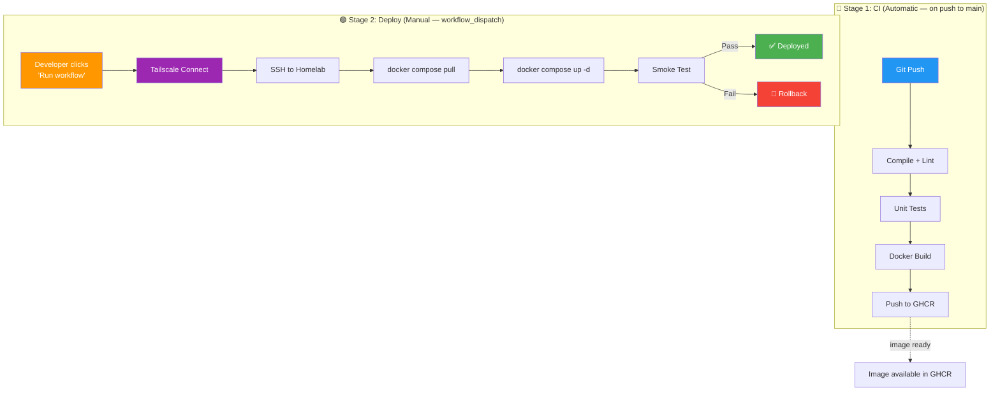

# CI/CD Pipeline Configuration — Panomete Platform

> **Project:** Panomete Platform
> **Version:** 0.2 | **Status:** Draft — Updated per MM08 (PO Decision DEC-007: manual deploy)
> **Last Updated:** 2026-07-24
> **Scope:** Phase 2 — CI/CD pipeline for Guard, Discover, Gate

---

## 1. Purpose

> Defines the CI/CD pipeline for the Panomete Platform. CI runs automatically on every push (compile + test + build + push to GHCR). Deploy to homelab is **manual** — triggered via GitHub Actions `workflow_dispatch`. Per PO decision DEC-007.

---

## 2. Pipeline Overview — Two-Stage Model



> **Key change from v0.1:** Deploy is no longer automatic. CI builds and pushes images. A human triggers deploy via `workflow_dispatch` when ready. This is the PO-approved safety model for a single-developer homelab.

---

## 3. The Tailscale Problem

> ⚠️ **Critical infrastructure detail:** The homelab server (`remote.panomete.com`) resolves to a Tailscale IP (`100.73.143.25`). GitHub Actions runners are on public internet and **cannot reach Tailscale IPs directly**.

### Solution: Tailscale GitHub Action

The deploy workflow uses [`tailscale/github-action`](https://github.com/tailscale/github-action) to temporarily join the runner to the Tailnet. Once connected, SSH to `remote.panomete.com` works normally.

```
GitHub Actions Runner (public internet)
  → tailscale/github-action (joins Tailnet using auth key)
  → SSH to remote.panomete.com (now reachable: 100.73.143.25)
  → docker compose pull && up -d
  → Tailscale disconnects automatically when job ends
```

**Required:** A **Tailscale Auth Key** (stored as GitHub secret `TS_API_TOKEN`). User generates this from the Tailscale admin console.

---

## 4. Repository Structure

```
panomete-platform/
├── .github/
│   └── workflows/
│       ├── ci.yml                      # CI: compile + test + build + push (automatic)
│       ├── deploy-guard.yml            # Deploy Guard (manual: workflow_dispatch)
│       ├── deploy-discover.yml         # Deploy Discover (manual: workflow_dispatch)
│       └── deploy-gate.yml             # Deploy Gate (manual: workflow_dispatch)
├── flowero-guard/                      # Keycloak realm config + Dockerfile
├── flowero-discover/                   # Eureka server source
├── flowero-gate/                       # Gateway source
├── docker-compose.platform.yml         # Platform compose (all services)
├── .env.example                        # Template for secrets (never real .env)
└── README.md
```

> Per-service deploy workflows allow deploying one service at a time without touching others.

---

## 5. Pipeline Configuration

### 5.1 CI Workflow — Automatic (on push to main)

```yaml
# .github/workflows/ci.yml
name: CI

on:
  push:
    branches: [main]
  pull_request:
    branches: [main]

env:
  REGISTRY: ghcr.io
  IMAGE_PREFIX: ${{ github.repository_owner }}

jobs:
  # ── Validate Keycloak Realm JSON ──
  validate-realm:
    name: Validate Realm JSON
    runs-on: ubuntu-latest
    if: github.event_name == 'push'
    steps:
      - uses: actions/checkout@v4
      - name: Validate JSON syntax
        run: jq . flowero-guard/panomete-realm.json > /dev/null
      - name: Verify realm name
        run: |
          REALM=$(jq -r '.realm' flowero-guard/panomete-realm.json)
          [ "$REALM" = "panomete" ] || (echo "❌ Realm must be 'panomete'" && exit 1)

  # ── Build + Test Java Services ──
  build-test:
    name: Build & Test
    needs: validate-realm
    if: always() && needs.validate-realm.result != 'failure'
    runs-on: ubuntu-latest
    strategy:
      matrix:
        service: [flowero-discover, flowero-gate]
    steps:
      - uses: actions/checkout@v4

      - name: Set up JDK 25
        uses: actions/setup-java@v4
        with:
          java-version: '25'
          distribution: 'temurin'
          cache: gradle

      - name: Compile
        run: cd ${{ matrix.service }} && ./gradlew compileJava -q

      - name: Lint (Checkstyle)
        run: cd ${{ matrix.service }} && ./gradlew checkstyleMain -q

      - name: Unit Tests
        run: cd ${{ matrix.service }} && ./gradlew test -q

  # ── Build + Push Docker Images to GHCR ──
  push-images:
    name: Push Docker Images
    needs: build-test
    if: github.event_name == 'push' && github.ref == 'refs/heads/main'
    runs-on: ubuntu-latest
    strategy:
      matrix:
        include:
          - service: flowero-discover
          - service: flowero-gate
          - service: flowero-guard
    steps:
      - uses: actions/checkout@v4

      - name: Set up Docker Buildx
        uses: docker/setup-buildx-action@v3

      - name: Log in to GHCR
        uses: docker/login-action@v3
        with:
          registry: ${{ env.REGISTRY }}
          username: ${{ github.actor }}
          password: ${{ secrets.GITHUB_TOKEN }}

      - name: Build & Push
        uses: docker/build-push-action@v5
        with:
          context: ${{ matrix.service }}
          push: true
          tags: |
            ${{ env.REGISTRY }}/${{ env.IMAGE_PREFIX }}/${{ matrix.service }}:latest
            ${{ env.REGISTRY }}/${{ env.IMAGE_PREFIX }}/${{ matrix.service }}:${{ github.sha }}
```

### 5.2 Deploy Workflow — Manual (workflow_dispatch)

> Template below shows `deploy-gate.yml`. Identical pattern for Guard and Discover — change the service name and health check URL.

```yaml
# .github/workflows/deploy-gate.yml
name: Deploy Gate

on:
  workflow_dispatch:
    inputs:
      image_tag:
        description: 'Image tag to deploy (default: latest)'
        required: false
        default: 'latest'

env:
  REGISTRY: ghcr.io
  IMAGE_PREFIX: ${{ github.repository_owner }}
  SERVICE: flowero-gate

jobs:
  deploy:
    name: Deploy to Homelab
    runs-on: ubuntu-latest
    environment: homelab
    steps:
      - uses: actions/checkout@v4

      # ── Step 1: Connect to Tailscale ──
      - name: Connect to Tailscale
        uses: tailscale/github-action@v3
        with:
          auth-key: ${{ secrets.TS_AUTH_KEY }}
          hostname: github-actions-deploy

      # ── Step 2: Deploy via SSH ──
      - name: Deploy via SSH
        uses: appleboy/ssh-action@v1
        with:
          host: remote.panomete.com
          username: flowero
          key: ${{ secrets.HOMELAB_SSH_KEY }}
          script: |
            cd ~/platform
            export IMAGE_TAG=${{ github.event.inputs.image_tag }}
            export IMAGE=${{ env.REGISTRY }}/${{ env.IMAGE_PREFIX }}/${{ env.SERVICE }}:$IMAGE_TAG

            # Pull the specific image
            docker compose -f docker-compose.platform.yml pull ${{ env.SERVICE }}

            # Rolling restart this service only
            docker compose -f docker-compose.platform.yml up -d ${{ env.SERVICE }}
            sleep 10

      # ── Step 3: Smoke Test ──
      - name: Smoke Test
        uses: appleboy/ssh-action@v1
        with:
          host: remote.panomete.com
          username: flowero
          key: ${{ secrets.HOMELAB_SSH_KEY }}
          script: |
            # Service-specific health check
            curl -sf http://localhost:8000/actuator/health || exit 1
            echo "✅ Gate healthy"

      # ── Step 4: Rollback on Failure ──
      - name: Rollback on Failure
        if: failure()
        uses: appleboy/ssh-action@v1
        with:
          host: remote.panomete.com
          username: flowero
          key: ${{ secrets.HOMELAB_SSH_KEY }}
          script: |
            cd ~/platform
            # Revert to previous image (needs image retention policy)
            docker compose -f docker-compose.platform.yml rollback ${{ env.SERVICE }} || \
            echo "⚠️ Manual rollback required — check Portainer"
```

### 5.3 Deploy Health Check URLs (per service)

| Service | Health Check Command |
|---------|---------------------|
| Guard | `curl -sf http://localhost:8001/health/ready` |
| Discover | `curl -sf http://localhost:8999/actuator/health` |
| Gate | `curl -sf http://localhost:8000/actuator/health` |

---

## 6. GitHub Secrets Required

| Secret | Purpose | Who Creates |
|--------|---------|-------------|
| `TS_AUTH_KEY` | Tailscale auth key — joins runner to Tailnet | User (Tailscale admin console → Settings → Keys → Generate Auth Key) |
| `HOMELAB_SSH_KEY` | SSH private key for server access | User (`ssh-keygen`, add public key to `authorized_keys`) |
| `GITHUB_TOKEN` | GHCR push access | Automatic (provided by GitHub Actions) |

> **Tailscale Auth Key setup:** Go to https://login.tailscale.com/admin/settings/keys → Generate Auth Key → check "Ephemeral" (auto-removes node after job) → copy key → add to GitHub repo secrets as `TS_AUTH_KEY`.

---

## 7. Pipeline Stages

| Stage | Trigger | Purpose | Duration (est.) | Failure Action |
|-------|---------|---------|:---:|----------------|
| Validate Realm | Push to main | Check realm JSON syntax | < 10 sec | Block pipeline |
| Compile | Push to main | Java 25 compilation | < 30 sec | Block pipeline |
| Lint | Push to main | Checkstyle | < 20 sec | Block pipeline |
| Unit Test | Push to main | JUnit 5 | < 2 min | Block pipeline |
| Docker Build + Push | Push to main | Build + push to GHCR | < 3 min | Block (no image to deploy) |
| **Deploy** | **Manual** (`workflow_dispatch`) | Tailscale + SSH + docker compose | < 2 min | Alert + rollback |
| Smoke Test | After deploy | Health endpoint check | < 10 sec | Trigger rollback |
| Rollback | On smoke test failure | Revert to previous image | < 1 min | Notify via Discord |

---

## 8. Environment Configuration

| Environment | Branch | Auto-Deploy | Approval | URL |
|-------------|--------|:---:|:---:|-----|
| Development | `develop` | No (manual) | No | Local Docker |
| Homelab (Prod) | `main` | **No — manual trigger** | Developer clicks "Run workflow" | `*.panomete.com` |

> Per DEC-007: CI runs automatically (build + test + push image). Deploy requires manual `workflow_dispatch` trigger. Safety-first for single-developer homelab.

---

## 9. Secrets Management

| Secret | Location | Used By | Rotation |
|--------|----------|---------|----------|
| `TS_AUTH_KEY` | GitHub Actions secrets | Deploy job (Tailscale) | On expiry (ephemeral keys auto-clean) |
| `HOMELAB_SSH_KEY` | GitHub Actions secrets | Deploy job (SSH) | On team change |
| `POSTGRES_PASSWORD` | Homelab `.env` file | Guard (JDBC) | Quarterly |
| `KC_DB_PASSWORD` | Homelab `.env` file | Guard (DB) | Quarterly |
| `VALKEY_PASSWORD` | Homelab `.env` file | Gate (rate limiting) | On change |
| `KEYCLOAK_GATEWAY_SECRET` | Homelab `.env` file | Gate (OAuth2 client) | On change |
| `POST_LOGIN_REDIRECT_URL` | Homelab `.env` file | Gate (login flow) | On change |

> **Rule:** Secrets never in git. The `.env` file lives at `~/platform/.env` on the homelab. GitHub Actions uses repo secrets for CI/CD only.

---

## 10. Docker Registry (GHCR)

| Field | Value |
|-------|-------|
| Registry | GitHub Container Registry (GHCR) |
| URL | `ghcr.io/<owner>/<service>` |
| Auth | `GITHUB_TOKEN` (automatic in Actions) |
| Tags | `latest` (rolling) + `<git-sha>` (immutable) |
| Cleanup | Keep last 10 images per service |
| Visibility | Private (requires auth to pull) |

> **Server pull auth:** The homelab must authenticate to GHCR to pull private images:
> ```bash
> echo "$GITHUB_PAT" | docker login ghcr.io -u oat431 --password-stdin
> ```
> Use a GitHub Personal Access Token with `read:packages` scope.

---

## 11. Quality Gates

A pull request cannot merge to `main` unless:

- [ ] CI pipeline passes (compile + lint + test)
- [ ] Keycloak realm JSON is valid (if changed)
- [ ] Docker images build successfully
- [ ] Code review approved (when team grows)

A deployment cannot proceed unless:

- [ ] CI pipeline passed on `main`
- [ ] Docker image exists in GHCR
- [ ] Developer manually triggers `workflow_dispatch`
- [ ] Smoke test passes after deploy (auto-rollback if not)

---

## 12. Keycloak Realm Import (Special Case)

> Guard is config-only — no Java to compile. CI validates the realm JSON instead.

1. **Realm JSON** (`flowero-guard/panomete-realm.json`) is version-controlled
2. **Guard's Dockerfile** copies the realm JSON and uses `--import-realm`
3. **CI validates JSON** with `jq` (syntax check + realm name check)
4. **CI builds** Guard Docker image (realm JSON baked in)
5. **Deploy** pulls the image — Keycloak imports the realm on first boot

---

## Related Documents

| Document | Relationship |
|----------|-------------|
| [[052_deployment_plan]] | Step-by-step deployment procedure |
| [[053_release_notes]] | What shipped in each release |
| [[054_operations_manual_runbook]] | How to operate and troubleshoot |
| `panomete_platform/02_design/025_software_architecture_document` | Deployment topology (SAD §6) |
| [[MM08_phase2-po-decisions_20260724]] | PO decision DEC-007 (manual deploy) |

---

> **Template Standard:** Based on SWEBOK v4, ISO/IEC 20000
> **Usage:** CI is automatic. Deploy is manual. Tailscale bridges GitHub Actions to the private homelab network.
